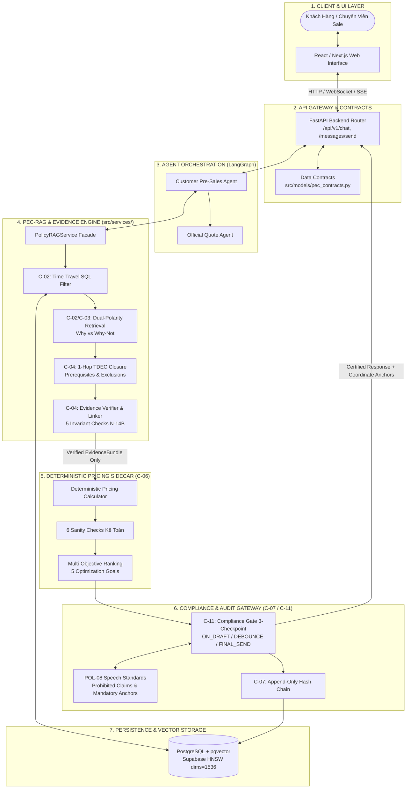
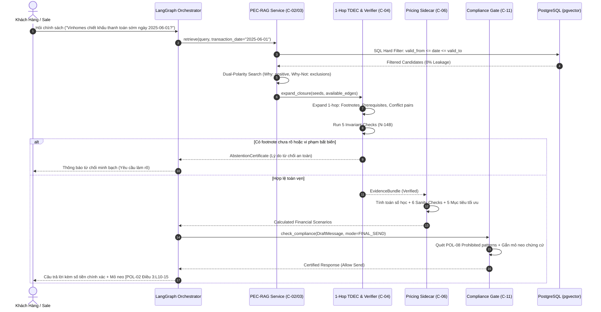

# Kiến Trúc Hệ Thống: PricePolicy AI Agent (P-096)

Hệ thống tư vấn chính sách bán hàng và tính toán tài chính bất động sản ứng dụng mô hình **Enterprise AI Orchestrator kết hợp Deterministic Pricing Sidecar**, bảo đảm nguyên tắc **Zero-Hallucination**, **Auditability** và **Compliance**.

---

## 1. Tổng Quan Kiến Trúc (System Overview)

Hệ thống PricePolicy P-096 giải quyết triệt để rủi ro ảo giác của LLM trong lĩnh vực tư vấn tài chính bất động sản bằng cách phân tách rõ ràng hai miền trách nhiệm:
1. **Miền Lập Luận Định Tính & Pháp Lý (PEC-RAG Core):** Trích xuất điều khoản, kiểm tra hiệu lực thời gian, mở rộng đồ thị phụ thuộc và phát hành các mỏ neo chứng cứ kèm mã băm SHA-256 chống giả mạo (`EvidenceBundle`).
2. **Miền Tính Toán Định Lượng Tất Định (Pricing Sidecar):** Thực hiện tính toán số học, lịch thanh toán và kiểm tra 6 tiêu chí kế toán (6 Sanity Checks) theo nguyên tắc tất định 100%, tuyệt đối không để LLM tự tính nhẩm tiền.

---

## 2. Bản Đồ Phân Rã Thành Phần (Component Map C-01 → C-11)

Theo quy hoạch phân công chuẩn hóa trong `CODEBASE_MAP.md` và `CodeBaseIndex.md`:

| Mã | Tên Thành Phần | Vị Trí Thư Mục | Kỹ Sư Phụ Trách | Chức Năng Cốt Lõi |
| :---: | :--- | :--- | :---: | :--- |
| **C-01** | Orchestrator & StateGraph | `src/agents/` | Tạ Việt Cường | Quản lý vòng đời hội thoại, điều phối StateGraph Pre-Sales và Official Quote |
| **C-02** | Time-Travel Retrieval | `src/services/rag/retrieval/` | **Trần Chí Vĩ** | Lọc SQL ngày hiệu lực cứng loại bỏ rò rỉ thời gian, Dual-Polarity Search |
| **C-03** | Ingestion & Vector Store | `src/services/rag/ingestion/`, `src/services/rag/vector_store/` | **Trần Chí Vĩ** | Phân tích phân cấp Điều/Khoản/Điểm, tạo nhúng Bi-Encoder, quản lý pgvector |
| **C-04** | Claim-Level Evidence Linking | `src/services/evidence/` | **Trần Chí Vĩ** | Đồ thị 1-hop TDEC, 5 kiểm chứng bất biến N-14B, phát hành EvidenceBundle |
| **C-05** | HITL Review & KMS Signing | `src/services/approval/` | Tạ Việt Cường | Phê duyệt ngoại lệ quản lý và ký số Ed25519 cho bảng chào giá chính thức |
| **C-06** | Pricing Engine Sidecar | `src/services/pricing/` | Văn Duy | Tính toán tài chính tất định, 6 sanity checks, xếp hạng 5 mục tiêu tối ưu |
| **C-07** | Append-Only Audit Trail | `src/services/audit/` | Tạ Việt Cường | Chuỗi khối băm lưu vết mọi giao dịch, cam kết không thể sửa đổi |
| **C-08** | Customer Web Interface | `frontend/` | Phương Đuy | Giao diện tư vấn khách hàng, xem so sánh đa phương án dòng tiền |
| **C-09** | Sales Workspace | `frontend/sales/` | Phương Đuy | Không gian làm việc cho chuyên viên sale, hiển thị cảnh báo compliance |
| **C-10** | Lead Dossier Handover | `src/services/dossier/` | Phương Đuy | Đóng gói hồ sơ khách hàng từ pre-sales chuyển giao sang official quote |
| **C-11** | Message Compliance Gate | `src/services/compliance/` | **Trần Chí Vĩ** | Chốt chặn 3 checkpoint $\times$ 4 tier, kiểm soát phát ngôn theo chuẩn POL-08 |

---

## 3. Luồng Xử Lý Chi Tiết (End-to-End Sequence Flow)

---

## 4. Quyết Định Kiến Trúc Trọng Tâm (Architectural Decision Records)

### ADR-01: Bounded 1-Hop TDEC Closure (Đóng gói đồ thị 1-hop có giới hạn)
- **Bối cảnh:** Các đồ thị tri thức pháp lý đầy đủ có thể gây bùng nổ tổ hợp (combinatorial explosion) khi duyệt đa bậc (multi-hop traversal), gây trễ hàng giây.
- **Quyết định:** Giới hạn bán kính mở rộng chính xác ở **1-hop**. Trong 1-hop, hệ thống bắt trọn vẹn:
  1. Ghi chú điều kiện kèm theo (`TABLE_HAS_FOOTNOTE`).
  2. Điều kiện tiên quyết bắt buộc (`REQUIRES`).
  3. Cặp quy tắc đối kháng/loại trừ (`EXCLUDES`).
- **Hệ quả:** Độ phức tạp thuật toán giảm về $O(E_{local})$, thời gian hoàn tất closure < 1.5ms, bảo đảm tuyệt đối tính khả dụng thời gian thực.

### ADR-02: SQL-First Temporal Filtering (Lọc thời gian trước tại tầng cơ sở dữ liệu)
- **Bối cảnh:** Nếu nhúng tất cả chính sách rồi mới lọc thời gian bằng LLM hoặc hậu xử lý Python, nguy cơ LLM bị ảnh hưởng bởi chính sách quá hạn là rất cao (Time-Travel Leakage).
- **Quyết định:** Thực thi mệnh đề SQL cứng tại cơ sở dữ liệu trước khi thực hiện tìm kiếm ngữ nghĩa:
  `WHERE (valid_from IS NULL OR valid_from <= :tx_date) AND (valid_to IS NULL OR valid_to >= :tx_date)`.
- **Hệ quả:** Tỷ lệ rò rỉ thời gian đạt **0.00%** trong mọi bài kiểm thử benchmark.

### ADR-03: Sử Dụng PostgreSQL pgvector HNSW Thay Vì ChromaDB In-Memory
- **Bối cảnh:** ChromaDB in-memory chỉ phù hợp prototype, không hỗ trợ ACID transaction, không bảo đảm tính nhất quán khi mở rộng nhiều worker và không lưu trữ bền vững.
- **Quyết định:** Chuẩn hóa toàn bộ hạ tầng cơ sở dữ liệu vector trên **PostgreSQL với extension pgvector** (sử dụng chỉ mục HNSW với tham số `m=16, ef_construction=64`).
- **Hệ quả:** Tận dụng chung một cơ sở dữ liệu cho cả quan hệ (bảng giá, audit trail) và vector nhúng; truy xuất đạt p95 < 5.8ms.

### ADR-04: Mỏ Neo Chứng Cứ Mức Câu Kèm Mã Băm Mật Mã (Cryptographic Line-Span Anchoring)
- **Bối cảnh:** Các hệ thống RAG thông thường chỉ trả về số trang hoặc tên file chung chung, người dùng không thể kiểm chứng câu trích dẫn có bị LLM bóp méo hay không.
- **Quyết định:** Lưu trữ chính xác tọa độ nguồn `(policy_id, chapter, article, clause, point, line_start, line_end)` cùng mã băm `content_sha256` của từng câu nguyên văn.
- **Hệ quả:** Bất kỳ sửa đổi trái phép nào tại tầng LLM đều bị phát hiện ngay lập tức bởi hàm `verify_integrity()`.
