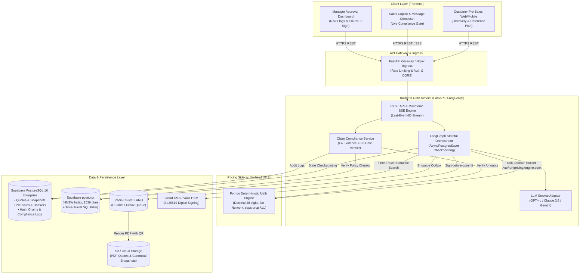
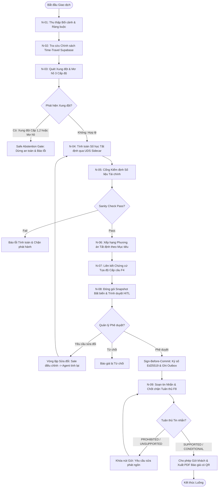
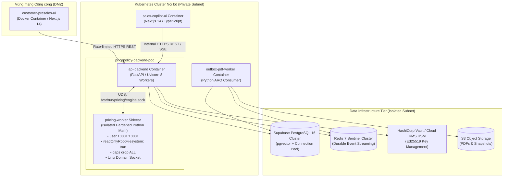

# Architecture Document

## System Overview

**PricePolicy AI Agent** là Nền tảng Trợ lý Định giá, Tối ưu hóa Phương án Tài chính & Quản trị Tuân thủ Bán hàng Toàn diện (Full-Funnel Commercial Intelligence & Compliance Platform) cho hệ sinh thái Bất động sản VLandFuture. Hệ thống vận hành khép kín hai đầu giá trị:
1. **Đầu phễu (Pre-Sales):** Cung cấp giao diện Web cho Khách hàng tự do tương tác khai phá nhu cầu (Discovery Agent F1), trích xuất ràng buộc tài chính chuẩn hóa (Constraint Extraction F2), tính toán và so sánh các kế hoạch tài chính tham khảo (Deterministic Optimizer F3, F5) kèm liên kết chứng cứ cấp câu minh bạch (Claim-Level Evidence Linking F4).
2. **Cuối phễu (Official Quote & Governance):** Bàn giao hồ sơ Lead có cấu trúc (Sales Handover Dossier F6, F7); điều phối định giá chính thức bằng đồ thị trạng thái LangGraph kết hợp truy vấn chính sách Time-Travel qua Supabase pgvector; ủy quyền 100% phép tính cho Python Math Engine tất định (Hardened Sidecar); áp dụng cổng phê duyệt kiểm soát con người ký số Ed25519 (HITL Approval Gate); và chốt chặn phát ngôn tuân thủ thời gian thực trước khi gửi tin nhắn cho khách hàng (Evidence-Backed Message Composer & Compliance Gate F8).

---

## Architecture Diagram

---

## Components

### 1. Frontend (Next.js 14 / React & TypeScript)
- **Purpose:** Cung cấp trải nghiệm đa vai trò chuyên biệt hóa cho Khách hàng mua nhà, Nhân viên kinh doanh tuyến đầu và Quản lý bán hàng.
- **Key Features:**
  - *Customer Pre-Sales Web/Mobile:* Giao diện trò chuyện khám phá nhu cầu tài chính cá nhân hóa, xem bảng so sánh 1–3 phương án tham khảo có watermark bảo lưu pháp lý `NOT AN OFFICIAL QUOTE`, tương tác với các mỏ neo chứng cứ `[1]`, `[2]` để tra cứu điều khoản chính sách.
  - *Sales Copilot Workspace:* Bàn làm việc số nhận Lead Dossier bàn giao (F6), khởi tạo Báo giá chính thức (F7), theo dõi tiến trình tính toán và phân tích chính sách thời gian thực qua Server-Sent Events (SSE).
  - *Sales Message Composer (F8):* Khung soạn thảo tin nhắn tập trung kết hợp Agent Generator và Verifier, phản hồi trạng thái tuân thủ 4 mức thời gian thực (`SUPPORTED`, `CONDITIONAL`, `UNSUPPORTED`, `PROHIBITED`) kèm cơ chế debounce 500ms khi gõ và khóa cứng nút Gửi nếu phát hiện cam kết sai lệch.
  - *Manager Approval Dashboard:* Giao diện duyệt báo giá tập trung, hiển thị hệ thống cờ rủi ro tự động (Đỏ/Vàng/Xanh), bảng đối soát chính sách và ký số phê duyệt Ed25519.
- **State Management:** TanStack React Query (Server State Cache & Optimistic Updates), Zustand (Client Session State), SSE Event Stream Client tự động phục hồi kết nối qua header `Last-Event-ID`.

### 2. Backend (FastAPI / Python 3.11+)
- **Purpose:** Tiếp nhận yêu cầu, thực thi xác thực phân quyền, bảo đảm tính lũy nghiệm (Idempotency), điều phối đồ thị nghiệp vụ LangGraph và vận hành dịch vụ kiểm soát tuân thủ phát ngôn.
- **API Design:** RESTful API chuẩn OpenAPI 3.1 + Server-Sent Events (SSE) streaming đơn điệu toàn cục (`{quote_id}:v{quote_version}:{event_seq:06d}`).
- **Authentication & RBAC:** OAuth2 / JWT bearer tokens kết hợp phân quyền 4 vai trò rõ ràng: `CUSTOMER`, `SALES_EXECUTIVE`, `SALES_MANAGER`, `POLICY_ADMIN`. Cưỡng chế nguyên tắc phân tách trách nhiệm (Separation of Duties - SoD): Người tạo báo giá không bao giờ được phép tự duyệt báo giá của chính mình (`chk_quote_sod`).
- **Idempotency Engine:** Bắt buộc header `Idempotency-Key` kèm kiểm tra mã vân tay ngữ nghĩa:
  $$\text{fingerprint} = \text{SHA-256}(\text{method} + \text{endpoint} + \text{actor\_id} + \text{quote\_id} + \text{version} + \text{payload\_hash})$$

### 3. AI Agent (LangGraph Stateful Orchestration)
- **Agent Type:** Custom Stateful Cyclic Directed Graph (`StateGraph`) lưu vết trạng thái bền vững qua PostgreSQL (`AsyncPostgresSaver`). Tuyệt đối không dùng `MemorySaver` in-memory.
- **State Schemas:**
  - `PreSalesState`: Quản lý `session_id`, `chat_transcript`, `CustomerConstraints`, `pre_sales_plans`, `consent_token`.
  - `QuoteState`: Quản lý `quote_id`, `version`, `transaction_context`, `selected_policies`, `conflict_report`, `calculation_artifacts`, `recommendations`, `evidence_chain`, `approval_status`.
- **Core Nodes:**
  1. `extract_customer_constraints`: Phân tích hội thoại tự nhiên, trích xuất ràng buộc tài chính chuẩn hóa (F1, F2).
  2. `retrieve_active_policies`: Truy vấn ngữ nghĩa Supabase pgvector kết hợp lọc thời gian cứng Time-Travel SQL (`effective_from <= transaction_date <= effective_to`).
  3. `detect_conflicts`: Quét ma trận mâu thuẫn chính sách 3 cấp độ (Cấp 1 Explicit, Cấp 2 Conditional, Cấp 3 Ambiguous). Kích hoạt `Safe Abstention Gate` nếu gặp chính sách mơ hồ hoặc xung đột cấm.
  4. `calculate_financials_uds`: Ủy thác 100% phép tính số thực cho Python Math Sidecar qua Unix Domain Socket (`/var/run/pricing/engine.sock`).
  5. `validate_pricing_results`: Cổng kiểm định tài chính độc lập (Sanity Checks 6 bài kiểm tra cân đối dòng tiền).
  6. `rank_recommendations`: Hàm toán học tất định xếp hạng 3 phương án bám sát mục tiêu của người dùng (`MIN_NET_PRICE`, `MIN_INITIAL_OUTFLOW`, v.v.).
  7. `link_claim_level_evidence`: Bóc tách luận điểm Why/Why-not thành 4 archetypes, gắn tọa độ nguồn vật lý và xử lý claim hỗ trợ một phần (`PARTIALLY_SUPPORTED`) (F4).
  8. `build_approval_package`: Đóng gói hồ sơ quyết định kèm Snapshot JSON bất biến và cờ cảnh báo rủi ro trình Quản lý (HITL Gate).
  9. `verify_message_compliance`: Chốt chặn tuân thủ thông điệp bán hàng trước khi phát ngôn (F8).
- **Agent Workflow Flowchart:**

- **Core Tools:**
  - `extract_customer_constraints`: Trích xuất ràng buộc tài chính chuẩn hóa từ hội thoại.
  - `retrieve_policy_by_date`: Tra cứu điều khoản chính sách có hiệu lực theo trục thời gian trên Supabase pgvector.
  - `detect_policy_conflicts`: Quét ma trận loại trừ và mâu thuẫn điều khoản.
  - `calculate_cashflow_deterministic`: Gọi Python Math Sidecar tính toán dòng tiền 3 phương án.
  - `validate_pricing_results`: Kiểm tra tính toàn vẹn số học tài chính.
  - `rank_scenarios_by_objective`: Thuật toán toán học chọn phương án tối ưu bám sát mục tiêu.
  - `verify_claim_level_evidence`: Xác thực tọa độ nguồn, mã băm SHA-256 và bóc tách claim F4.
  - `check_message_compliance`: Đánh giá tuân thủ tin nhắn bán hàng F8 qua 3 chốt chặn.
  - `create_lead_dossier`: Đóng gói hồ sơ bàn giao kèm phân loại nhiệt độ Lead (`HOT`/`WARM`/`COLD`).
  - `create_immutable_snapshot`: Đóng gói hồ sơ quyết định thành JSON bất biến kèm mã băm SHA-256.

### 4. Database (Supabase PostgreSQL 16 Enterprise)
- **Type:** Quan hệ ACID đa bảng phân vùng, hỗ trợ JSONB indexing và Row Level Security (RLS).
- **Core Tables:**
  - `quotes`: Thông tin định danh báo giá, phiên bản, căn hộ, khách hàng, trạng thái vòng đời báo giá.
  - `payment_scenarios`: Ba phương án thanh toán chuẩn tắc (`STANDARD_PROGRESS`, `EARLY_95`, `BANK_LOAN_HTLS`).
  - `installments`: Chi tiết từng đợt thanh toán (vốn tự có, giải ngân ngân hàng, kinh phí bảo trì).
  - `policy_snapshots`: Bản sao chính sách nguyên trạng bất biến tại thời điểm báo giá kèm `canonical_snapshot_hash`.
  - `decision_evidence_chains`: Chuỗi băm kiểm toán bất biến `current_hash = SHA256(prev_hash + payload)`.
  - `pre_sales_sessions`: Quản lý phiên tương tác tự khám phá của khách hàng trên Web.
  - `customer_consents`: Lưu vết đồng thuận PII, IP address, user-agent và mục đích sử dụng.
  - `customer_constraints`: Ràng buộc tài chính có cấu trúc (`own_funds_vnd`, `monthly_capacity_vnd`).
  - `pre_sales_plans`: Kịch bản tài chính tham khảo (khóa cứng `status = 'REFERENCE_ONLY'`).
  - `lead_dossiers`: Hồ sơ bàn giao khách hàng kèm nhãn nhiệt độ Lead (`HOT`/`WARM`/`COLD`).
  - `evidence_backed_claims`: Luận điểm Why/Why-not có gắn tọa độ nguồn `SourceCoordinate` và tham chiếu tính toán.
  - `compliance_checks`: Nhật ký kiểm tra tuân thủ tin nhắn bán hàng, băm `message_hash` và lưu vết 4 mức tuân thủ.
  - `outbox_events`: Bảng sự kiện chuyển phát bền vững (Durable Outbox Pattern) hỗ trợ At-Least-Once Delivery.
  - `idempotency_records`: Bản ghi khóa trùng lặp và lưu trữ mã vân tay ngữ nghĩa.
- **Migrations:** Quản lý lược đồ cơ sở dữ liệu qua Alembic (Python migration framework).

### 5. Vector Store (Supabase pgvector)
- **Type:** Supabase pgvector tích hợp trực tiếp trong cơ sở dữ liệu PostgreSQL 16.
- **Index:** HNSW Index (`vector_cosine_ops`, `m = 16`, `ef_construction = 64`) cho tốc độ truy vấn cực nhanh dưới 5ms.
- **Embeddings Model:** `text-embedding-3-small` (1536 chiều vector).
- **Purpose:** Tìm kiếm ngữ nghĩa điều khoản chính sách bán hàng. Điểm mấu chốt kiến trúc: Vector Engine chỉ là **Chỉ mục Tra cứu (Retrieval Index)**, không phải **Nguồn Chân Lý (Source of Truth)**. Mọi truy vấn bắt buộc kết hợp `Time-Travel SQL Join` với `policy_registry` để loại bỏ 100% các điều khoản hết hạn hoặc chưa có hiệu lực.

---

## Data Flow

1. **Khách hàng tự Khám phá (F1, F2, F3, F5):** Khách tương tác trên Web Mobile, Agent chuẩn hóa nhu cầu thành `CustomerConstraints`. Python Math Engine tính toán 1–3 phương án tham khảo có watermark bảo lưu pháp lý `NOT AN OFFICIAL QUOTE`.
2. **Liên kết Bằng chứng Tọa độ (F4):** Mọi luận điểm Why/Why-not được đối soát với tọa độ nguồn chính sách (Doc, Version, Clause, Page, SHA-256) và kết quả tính toán tất định. Khách bấm `[1]`, `[2]` để mở bảng tra cứu nguồn gốc.
3. **Bàn giao Hồ sơ Khách hàng (F6):** Khách hàng đồng thuận (Consent) cung cấp thông tin, hệ thống tự động đóng gói `LeadDossier` kèm phân loại nhiệt độ Lead (`HOT`/`WARM`/`COLD`) chuyển tới Sales Copilot.
4. **Khởi tạo Báo giá Chính thức (F7):** Sale bấm khởi tạo Báo giá chính thức từ Dossier. Hệ thống kích hoạt `OfficialQuoteGraph`, bắt buộc thực hiện Re-validation và Re-calculation toàn diện.
5. **Định giá & Thẩm định Báo giá Chính thức:** LangGraph điều phối tra cứu chính sách Time-Travel trên Supabase pgvector, quét mâu thuẫn 3 cấp độ, gọi Python Math Sidecar qua Unix Domain Socket tính toán dòng tiền, kiểm định Sanity Check và đóng gói Snapshot JSON bất biến.
6. **Phê duyệt Kiểm soát Con người (HITL Gate):** Quản lý mở Approval Dashboard kiểm tra cờ rủi ro. Thực hiện phê duyệt theo mô hình `Sign-before-commit`: Ký số Ed25519 qua KMS/Signer, cập nhật Quote `status = 'APPROVED'` và ghi nhận sự kiện Outbox trong cùng 1 PostgreSQL ACID transaction.
7. **Soạn tin & Chốt chặn Tuân thủ Phát ngôn (F8):** Sale sử dụng Sales Message Composer để soạn tin nhắn gửi khách. Hệ thống tự động kiểm tra qua 3 chốt chặn (on-draft, debounce on-typing, final send gate). Nếu thông điệp chứa từ khóa cam kết tín dụng/lợi nhuận vượt thẩm quyền -> Khóa cứng nút Gửi (`BLOCKED`).
8. **Phát hành & Lưu trữ Bất biến:** Khi tin nhắn đạt chuẩn `SUPPORTED`, lệnh gửi được thông qua. Worker tiến trình nền đọc Outbox Event, render file PDF báo giá chính thức có mã QR xác thực và đóng gói chuỗi bằng chứng bất biến vào kho lưu trữ kiểm toán.

---

## Deployment Architecture

---

## Security & Governance

1. **Phân tách Ranh giới Tuyệt đối (Cognitive-Computation Separation):**
   - Động cơ Định giá (`pricing-worker`) vận hành trong Hardened Container Sidecar độc lập: cấm toàn bộ socket mạng ngoài, không mount thông tin xác thực, chạy với quyền non-root (`user: 10001`), hệ thống tệp chỉ đọc (`readOnlyRootFilesystem: true`), loại bỏ toàn bộ Linux capabilities (`caps: drop ALL`).
   - Giao tiếp nội bộ độc quyền qua Unix Domain Socket (`0660`) in-memory, triệt tiêu hoàn toàn rủi ro can thiệp qua mạng.
2. **Cơ chế Ký số Ed25519 & Tính Bất biến:**
   - Chuẩn hóa RFC 8785 Canonical JSON trước khi băm SHA-256.
   - Khóa ký số được bảo vệ trong Hardware Security Module (KMS/Vault HSM). Public key được công bố minh bạch qua JWKS Trust Anchor (`/.well-known/jwks.json`).
   - Khóa cứng quy trình ký `Sign-before-commit` trong 1 Database Transaction nguyên tử.
3. **Chốt chặn Tuân thủ Zero-Trust (Compliance Gate F8):**
   - Không mặc định tin tưởng nội dung do LLM sinh ra. Mọi thông điệp (Agent viết hay Sale tự soạn) đều phải trải qua 3 tầng chốt chặn kiểm tra tuân thủ.
   - Khóa cứng nút Gửi (`BLOCKED`) đối với các phát ngôn cam kết sai lệch chính sách, cam kết lợi nhuận hoặc vượt thẩm quyền bán hàng.
4. **Kiểm soát Truy cập & Bảo mật Dữ liệu:**
   - Bảo mật PII khách hàng theo nguyên tắc tối thiểu hóa (Data Minimization); mã hóa số điện thoại dạng masked (`09***1234`).
   - Thu thập và lưu vết đồng thuận người dùng (`CustomerConsent`) trước khi bàn giao Lead.
   - Toàn bộ bí mật và API keys quản lý qua Kubernetes Secrets / Vault, không bao giờ commit vào mã nguồn.

---

## Design Decisions (ADR Summary Table)

| Mã Quyết định | Lựa chọn Kiến trúc | Lý do Kỹ thuật & Giá trị Nghiệp vụ |
| :--- | :--- | :--- |
| **Framework** | **FastAPI (Python 3.11+)** | Hiệu năng bất đồng bộ cao (async/await), tự động sinh tài liệu OpenAPI 3.1, kiểm soát kiểu dữ liệu chặt chẽ qua Pydantic v2. |
| **Frontend** | **Next.js 14 (App Router)** | Server-side Rendering (SSR) tối ưu hiệu năng đầu phễu, hỗ trợ quản lý trạng thái luồng SSE streaming và tích hợp giao diện phức hợp đa màn hình. |
| **Agent Framework**| **LangGraph (`StateGraph`)** | Quản lý chu trình quyết định trạng thái phức tạp, hỗ trợ rẽ nhánh có điều kiện, vòng lặp sửa đổi (Revision Loop), dừng chờ con người (HITL) và checkpointing bền vững vào PostgreSQL (`AsyncPostgresSaver`). |
| **Vector Engine** | **Supabase pgvector (HNSW)** | Đơn giản hóa kiến trúc vận hành (All-in-One Database), loại bỏ nhu cầu đồng bộ dữ liệu giữa SQL và Vector DB độc lập, cho phép thực thi `Time-Travel SQL Join` ngay trong 1 câu truy vấn nội bộ. |
| **Pricing Engine** | **Python Hardened Sidecar (UDS)**| Cách ly hoàn toàn phép tính tài chính khỏi LLM; sử dụng `decimal.Decimal` (28 chữ số chính xác) triệt tiêu 100% ảo giác số học và sai số dấu phẩy động float. |
| **Evidence Trace**| **Claim-Level Evidence Linking (F4)**| Nâng tầm trích dẫn từ mức tài liệu chung chung lên mức tọa độ câu chữ vật lý (Doc, Version, Clause, Page, SHA-256) và đối soát số học tất định; bóc tách triệt để claim hỗ trợ một phần (`PARTIALLY_SUPPORTED`). |
| **Message Gate** | **Unified Composer & Compliance Gate (F8)**| Tích hợp công cụ sinh tin và kiểm tra tuân thủ vào một giao diện duy nhất; áp dụng nguyên tắc Zero-Trust đối với mọi thông điệp bán hàng qua 3 thời điểm kiểm tra, bảo vệ doanh nghiệp khỏi rủi ro pháp lý/truyền thông. |
| **Audit Protocol**| **SHA-256 Hash Chain + KMS Ed25519** | Bảo chứng pháp lý bất biến không thể chối bỏ cho mọi báo giá phát hành ra thị trường, phục dựng lại chính xác 100% căn cứ tính giá tại mọi thời điểm trong quá khứ. |
