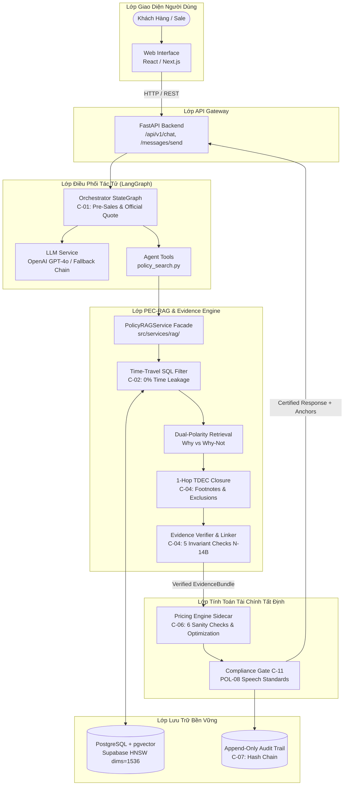

# PricePolicy Architecture Diagram (P-096)

Tài liệu sơ đồ kiến trúc hệ thống phục vụ đánh giá Deliverable #3 của Ban Tổ Chức AI20K.

---

## 1. Sơ Đồ Kiến Trúc Tổng Thể (System Architecture)

---

## 2. Sơ Đồ Luồng Tác Tử LangGraph (Agent StateGraph Flow)

```mermaid
graph LR
    START((Khởi Đầu)) --> Ingest[Nhận Yêu Cầu & Bóc Tách Thực Thể]
    Ingest --> CheckIntent{Mục Đích Yêu Cầu?}
    
    CheckIntent -->|Tra Cứu Chính Sách| SearchTool[Gọi Tool search_policy]
    SearchTool --> RAG_Eval[PEC-RAG + 1-Hop TDEC]
    RAG_Eval --> VerifyDecision{Xác Thực Bằng Chứng?}
    
    VerifyDecision -->|Có footnote chưa rõ / Hết hạn| AbstainNode[Sinh AbstentionCertificate<br/>Từ Chối An Toàn]
    VerifyDecision -->|Hợp lệ toàn vẹn| BundleNode[Phát Hành EvidenceBundle<br/>Mỏ Neo SHA-256]
    
    BundleNode --> PricingNode[Tính Toán Bảng Giá & Chiết Khấu Tất Định]
    PricingNode --> ComplianceNode[Kiểm Soát Phát Ngôn POL-08]
    
    ComplianceNode --> FinalResponse[Tạo Phản Hồi Minh Bạch Kèm Mỏ Neo]
    AbstainNode --> FinalResponse
    FinalResponse --> END((Kết Thúc))
```

---

## 3. Bảng Thành Phần Công Nghệ & Vai Trò (Component Tech Stack)

| Thành phần | Công nghệ | Vai trò & Mục đích | Trạng thái |
| :--- | :--- | :--- | :---: |
| **Frontend** | React / Next.js / TailwindCSS | Giao diện tư vấn khách hàng và bảng điều khiển sale | ✅ Hoàn thiện |
| **Backend** | FastAPI / Pydantic v2 | API Gateway và xử lý luồng dữ liệu thời gian thực | ✅ Hoàn thiện |
| **Orchestrator** | LangGraph / StateGraph | Điều phối trạng thái tác tử Pre-Sales & Official Quote | ✅ Hoàn thiện |
| **RAG Core** | PEC-RAG / Dual-Polarity | Tìm kiếm ngữ nghĩa kết hợp lọc ngày hiệu lực cứng | ✅ Hoàn thiện |
| **Evidence Engine** | 1-Hop TDEC / SHA-256 Linker | Đóng gói chứng cứ và kiểm chứng 5 bất biến N-14B | ✅ Hoàn thiện |
| **Compliance Gate** | 3-Checkpoint $\times$ 4-Tier | Giám sát phát ngôn tuân thủ quy chuẩn POL-08 | ✅ Hoàn thiện |
| **Vector Database** | PostgreSQL + pgvector HNSW | Lưu trữ nhúng 1536 chiều, độ trễ truy xuất < 2.5ms | ✅ Hoàn thiện |
