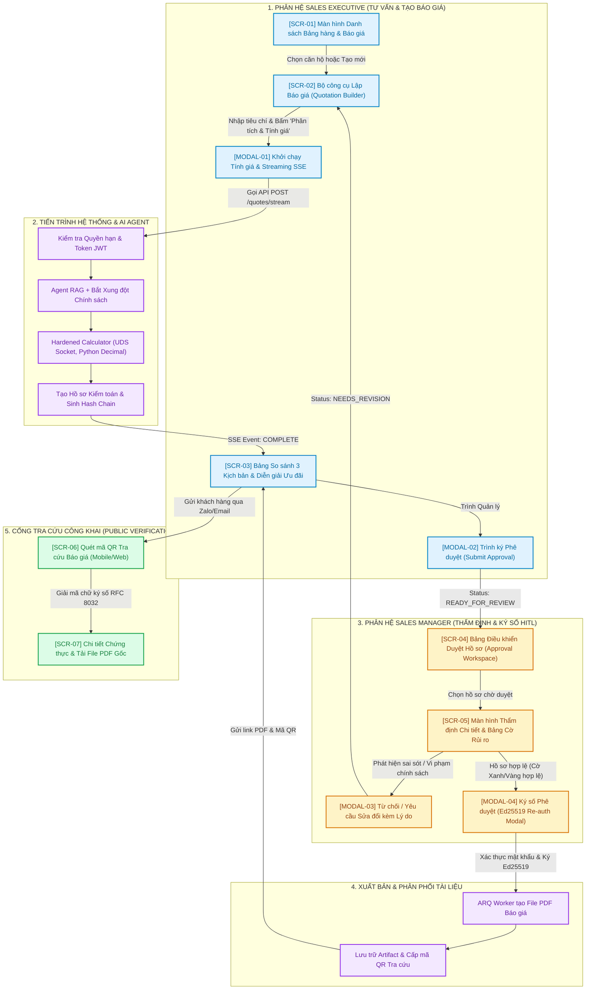

# ĐẶC TẢ GIAO DIỆN NGƯỜI DÙNG & SƠ ĐỒ LUỒNG THAO TÁC (WIREFRAME & UI FLOW SPECIFICATION)
## DỰ ÁN: PRICEPOLICY AI AGENT – NỀN TẢNG BẢO CHỨNG ĐỊNH GIÁ VLANDFUTURE
**Mã đề tài:** BDS020-06  
**Khối nghiệp vụ:** Kinh doanh Bất động sản  VLandFuture  
**Phiên bản:** v1.0 — UI/UX Engineering & Interaction Design Baseline  
**Tài liệu liên quan:** [Brief.md](Brief.md), [1.requirement-analysis.md](1.requirement-analysis.md) (PRD v2.3), [4.1-technical-architecture-runtime-deployment.md](4-technical-design/4.1-technical-architecture-runtime-deployment.md)

---

# 1. KIẾN TRÚC LUỒNG ĐIỀU HƯỚNG TỔNG THỂ (OVERALL UI FLOW)

Sơ đồ thể hiện toàn bộ các màn hình, các trạng thái chuyển giao (State Transitions), tương tác người dùng cho 3 vai trò: **Sales Executive**, **Sales Manager** và **Khách hàng công khai**:



---

# 2. HỆ THỐNG THIẾT KẾ & THÀNH PHẦN GIAO DIỆN (DESIGN SYSTEM & TOKENS)

Để giao diện đạt đẳng cấp chuyên nghiệp cho doanh nghiệp bất động sản cao cấp, hệ thống màu sắc và kiểu dáng tuân theo chuẩn **Modern Enterprise Dark & Light Calibrated System**:

### 2.1 Bảng Màu Nhận diện (Color Palette)
- **Primary Navy (`#0F172A` / `#1E293B`):** Màu nền chính của Header và thanh điều hướng, thể hiện tính bảo mật, uy nghiêm và chuẩn mực tài chính.
- **Accent Brand Cyan (`#0284C7` / `#0EA5E9`):** Điểm nhấn thương hiệu, các nút hành động chính (Primary Action, CTA).
- **Emerald Green (`#10B981` / `#059669`):** Trạng thái Thành công, Phương án Đề xuất (`RECOMMENDED`), Cờ Xanh Kiểm duyệt, Chữ ký số Hợp lệ.
- **Amber Warning (`#F59E0B` / `#D97706`):** Cờ Vàng Cảnh báo Nghiệp vụ (chạm trần chiết khấu, ngày nộp điều chỉnh), Trạng thái Cần chú ý.
- **Crimson Alert (`#EF4444` / `#DC2626`):** Cờ Đỏ Xung đột Chính sách, Trạng thái Từ chối (`REJECTED`), Vi phạm thẩm quyền SoD.
- **Background Slate Surface (`#F8FAFC` / `#F1F5F9`):** Nền làm việc của Sales & Manager, tạo cảm giác dịu mắt, dễ đọc các bảng số liệu tài chính.

### 2.2 Hệ thống Cờ Rủi ro (Risk Flag System)
- `GREEN_FLAG (Bình thường)`: Báo giá tuân thủ 100% chính sách chuẩn, không có điều khoản ngoại lệ.
- `YELLOW_FLAG (Cảnh báo)`: Tổng chiết khấu $\ge 10\%$ hoặc ngày thanh toán rơi vào ngày lễ được tự động dời sang ngày làm việc kế tiếp.
- `RED_FLAG (Nghiêm trọng / Chặn)`: Xung đột điều khoản (chọn vay HTLS nhưng lại áp dụng chiết khấu thanh toán sớm) hoặc cố tình tự duyệt báo giá do chính mình tạo ra.

---

# 3. CHI TIẾT CÁC MÀN HÌNH WIREFRAME (DETAILED WIREFRAMES)

---

## 3.1 Màn hình 1: [SCR-02] Không gian Lập Báo giá cho Sales (Sales Quotation Workspace)
Màn hình chia làm **2 cột chính**: Bên trái là form nhập dữ liệu căn hộ & khách hàng; Bên phải là khu vực tương tác AI Agent thời gian thực và kết quả so sánh 3 kịch bản.

```
┌──────────────────────────────────────────────────────────────────────────────────────────────────────────────────┐
│ VLANDFUTURE PRICEPOLICY AI │ Dự án: THE EMERALD PALACE │ Sales: Nguyễn Văn Tuấn (Mã: NV-8802) │ [Đăng xuất]       │
├──────────────────────────────────────────────────────────────────────────────────────────────────────────────────┤
│ ◀ Quay lại Danh sách       HỒ SƠ BÁO GIÁ: #Q-2026-09-00124 (Phiên bản: v1 - Dự thảo)              [Lưu Nháp]    │
├───────────────────────────────────────────────────┬──────────────────────────────────────────────────────────────┤
│ 1. THÔNG TIN BẤT ĐỘNG SẢN & KHÁCH HÀNG            │ 2. KẾT QUẢ PHÂN TÍCH & BẢO CHỨNG TÀI CHÍNH BỞI AI AGENT       │
│                                                   │                                                              │
│ Căn hộ: [ Căn: A-12-05 ─────────────── ▼ ]        │ ┌──────────────────────────────────────────────────────────┐ │
│ • Diện tích: 78.5 m² (2 PN, 2 WC, Hướng Đông Nam) │ │ [●] TIẾN TRÌNH SUY LUẬN & BẢO CHỨNG (STREAMING REAL-TIME)│ │
│ • Giá niêm yết (chưa VAT): 3.200.000.000 VNĐ      │ │ ✔ [0.8s] Tra cứu Chính sách bán hàng Đợt 3 (v2.1)        │ │
│ • Tình trạng: ĐANG MỞ BÁN (Lock 30 phút)          │ │ ✔ [1.4s] Kiểm tra Điều kiện & Bắt xung đột điều khoản    │ │
│                                                   │ │ ✔ [2.1s] Tính toán số học 0-float trên Sidecar Engine    │ │
│ Khách hàng:                                       │ │ ✔ [3.0s] Phân bổ Dòng tiền & Chạy Dual Reconciliation    │ │
│ • Tên khách: [ Trần Thị Minh Trang             ]  │ └──────────────────────────────────────────────────────────┘ │
│ • CCCD/Mã KH: [ 001198034521                   ]  │                                                              │
│ • Nhóm khách: [ Khách hàng Thân thiết (F1)  ▼  ]  │ ┌──────────────────────────────────────────────────────────┐ │
│                                                   │ │ BẢNG ĐỐI ĐẦU 3 PHƯƠNG ÁN THANH TOÁN (CANONICAL SCENARIOS) │ │
│ Tiêu chí Tối ưu hóa (Optimization Objective):     │ ├─────────────────┬───────────────────┬────────────────────┤ │
│ [⊙] MIN_NET_PRICE (Giá mua Net thấp nhất)         │ │ PA-1: TIẾN ĐỘ   │ PA-2: TRẢ NHANH   │ PA-3: VAY HTLS 0%  │ │
│ [ ] MIN_INITIAL_OUTFLOW (Tiền đợt 1 thấp nhất)   │ │ (Chuẩn 9 Đợt)   │ (Chiết khấu 7.5%) │ (Ngân hàng 70%)    │ │
│ [ ] MIN_CASH_OUTFLOW_TO_HANDOVER                  ├─────────────────┼───────────────────┼────────────────────┤ │
│ [ ] MAX_BENEFIT_VALUE                             │ │ Giá Net:        │ Giá Net: [★ TỐI ƯU]│ Giá Net:           │ │
│                                                   │ │ 3.104.000.000 đ │ 2.871.000.000 đ   │ 3.104.000.000 đ    │ │
│ Ngày lập dự kiến: [ 2026-09-18 ]                  │ │                 │ (Tiết kiệm 233Tr) │                    │ │
│ Tiền cọc đăng ký: [ 100.000.000 VNĐ            ]  │ │ Tổng HĐMB:      │ Tổng HĐMB:        │ Tổng HĐMB:         │ │
│                                                   │ │ 3.476.480.000 đ │ 3.215.520.000 đ   │ 3.476.480.000 đ    │ │
│ Ưu đãi / Quà tặng muốn chọn:                      │ │                 │                   │                    │ │
│ [✔] Voucher Nội thất VIP (Trị giá 50.000.000 đ)  │ │ Đợt 1 trả thêm: │ Đợt 1 trả thêm:   │ Đợt 1 trả thêm:    │ │
│ [✔] Chiết khấu Mở bán Tháng 9 (1.0%)              │ │ 221.552.000 đ   │ 2.954.744.000 đ   │ 221.552.000 đ      │ │
│ [ ] Gói Hỗ trợ Lãi suất 0% trong 18 tháng        │ ├─────────────────┼───────────────────┼────────────────────┤ │
│                                                   │ │ [Xem Lịch nộp]  │ [★ ĐÃ CHỌN]       │ [Xem Lịch nộp]     │ │
│ ┌───────────────────────────────────────────────┐ │ └─────────────────┴───────────────────┴────────────────────┘ │
│ │ [⚡ PHÂN TÍCH & TÍNH TOÁN LẠI VỚI AI AGENT]   │ │                                                              │
│ └───────────────────────────────────────────────┘ │ 3. MINH BẠCH CHIẾT KHẤU & DIỄN GIẢI LOẠI TRỪ ("WHY NOT?")    │
│                                                   │ • [Áp dụng] CK Trả nhanh 7.5% theo Mục 4.1 Chính sách Đợt 3. │
│ Ghi chú đặc biệt gửi Quản lý:                     │ • [Áp dụng] Voucher Nội thất 50.000.000 VNĐ (Không trừ vào giá)│
│ [ Khách thiện chí, xin ưu tiên duyệt sớm để...]   │ • [LOẠI TRỪ] Không áp dụng HTLS 0% (Xung đột với CK Trả nhanh)│
│                                                   │                                                              │
│                                                   │ ┌──────────────────────────────────────────────────────────┐ │
│                                                   │ │ [ 📤 TRÌNH QUẢN LÝ KINH DOANH PHÊ DUYỆT BÁO GIÁ ]        │ │
│                                                   │ └──────────────────────────────────────────────────────────┘ │
└───────────────────────────────────────────────────┴──────────────────────────────────────────────────────────────┘
```

---

## 3.2 Màn hình 2: [SCR-04 & SCR-05] Cổng Phê duyệt Ký số của Quản lý (Manager Approval Workspace)
Màn hình dành riêng cho Trưởng phòng/Giám đốc Bán hàng. Tích hợp bảng cờ cảnh báo thông minh giúp rà soát và ký số trong dưới 30 giây:

```
┌──────────────────────────────────────────────────────────────────────────────────────────────────────────────────┐
│ VLANDFUTURE PORTAL │ PHÂN HỆ QUẢN LÝ: THẨM ĐỊNH & PHÊ DUYỆT BÁO GIÁ │ User: Trần Hoàng Hải (TPBH) │ [Đăng xuất]  │
├──────────────────────────────────────────────────────────────────────────────────────────────────────────────────┤
│ TỔNG QUAN HÔM NAY: [ 12 Hồ sơ chờ duyệt ]  │  [ 45 Đã duyệt thành công ]  │  [ 1 Hồ sơ bị từ chối ]             │
├──────────────────────────────────────────────────────────────────────────────────────────────────────────────────┤
│ DANH SÁCH HỒ SƠ CHỜ THẨM ĐỊNH (HITL QUEUE)                                                                      │
│ Mã Báo giá   │ Căn hộ  │ Khách hàng       │ Giá trị HĐMB     │ Sales tạo      │ Cờ Rủi ro │ Thao tác           │
│ ──────────── │ ─────── │ ──────────────── │ ──────────────── │ ────────────── │ ───────── │ ────────────────── │
│ Q-09-00124   │ A-12-05 │ Trần Thị M.Trang │ 3.215.520.000 đ  │ Nguyễn V. Tuấn │ 🟢 XANH   │ [ Xem & Phê duyệt] │
│ Q-09-00125   │ B-04-12 │ Lê Hoàng Nam     │ 4.850.000.000 đ  │ Đỗ Thùy Linh   │ 🟡 VÀNG   │ [ Xem Cảnh báo   ] │
│ Q-09-00121   │ C-21-08 │ Phạm Quốc Hưng   │ 5.120.000.000 đ  │ Nguyễn V. Tuấn │ 🔴 ĐỎ     │ [ Chặn & Trả về  ] │
├──────────────────────────────────────────────────────────────────────────────────────────────────────────────────┤
│ CHI TIẾT THẨM ĐỊNH HỒ SƠ: #Q-09-00124 (Căn A-12-05 ── Khách: Trần Thị Minh Trang)                               │
│                                                                                                                  │
│ ┌─ HỆ THỐNG CẢM BIẾN RỦI RO (RISK AUDIT ENGINE) ───────────────────────────────────────────────────────────────┐ │
│ │ 🟢 CỜ XANH: Hồ sơ chuẩn mực, không có ngoại lệ vượt khung.                                                   │ │
│ │ • Separation of Duties (SoD): Người tạo [Nguyễn V. Tuấn] ≠ Người duyệt [Trần Hoàng Hải] -> HỢP LỆ.          │ │
│ │ • Chính sách áp dụng: CSBH-Emerald-Dot3-v2.1 (Còn hiệu lực đến 30/09/2026, SHA-256: 8f4a1c...b2) -> HỢP LỆ.  │ │
│ │ • Tổng chiết khấu thương mại: 8.5% <= Khung tối đa cho phép 12.0% -> HỢP LỆ.                                │ │
│ └──────────────────────────────────────────────────────────────────────────────────────────────────────────────┘ │
│                                                                                                                  │
│ BẢNG TIẾN ĐỘ THANH TOÁN ĐÃ ĐƯỢC CHỐNG SAI SỐ (DUAL RECONCILIATION VERIFIED):                                    │
│ Đợt │ Mốc thời gian │ Tỷ lệ  │ Tiền nhà (gồm VAT) │ Cấn trừ Cọc  │ Khách thực nộp │ KPBT (2%)  │ Tổng cộng     │
│ ─── │ ───────────── │ ────── │ ────────────────── │ ──────────── │ ────────────── │ ────────── │ ───────────── │
│ 1   │ Trong 15 ngày │ 95.00% │ 2.905.744.000 đ    │ 100.000.000 đ│ 2.805.744.000 đ│ 0 đ        │ 2.805.744.000 │
│ 2   │ Nhận bàn giao │  5.00% │   152.934.000 đ    │ 0 đ          │   152.934.000 đ│ 57.420.000 │   210.354.000 │
│ TỔNG NGHĨA VỤ PHẢI THU: 3.215.520.000 VNĐ  (Bù trừ sai số làm tròn: Delta = 0 VNĐ tuyệt đối)                    │
│                                                                                                                  │
│ [ ❌ TỪ CHỐI / YÊU CẦU ĐIỀU CHỈNH ]                    [ ✍️ KÝ SỐ ED25519 & PHÁT HÀNH BÁO GIÁ CHÍNH THỨC ]      │
└──────────────────────────────────────────────────────────────────────────────────────────────────────────────────┘
```

---

## 3.3 Modal Phê duyệt & Ký số Bảo mật (Manager Signing Modal)
Khi Quản lý bấm nút ký số, hệ thống kích hoạt cửa sổ xác thực lại mật khẩu/mã OTP để kích hoạt khóa riêng tư Ed25519 (RFC 8032):

```
┌────────────────────────────────────────────────────────────────────────┐
│ ✍️ XÁC THỰC KÝ SỐ ĐIỆN TỬ BÁO GIÁ THƯƠNG MẠI                          [✕] │
├────────────────────────────────────────────────────────────────────────┤
│ Bạn đang chuẩn bị phát hành Báo giá chính thức có giá trị pháp lý:    │
│ • Mã báo giá: #Q-2026-09-00124 (Phiên bản 1.0)                        │
│ • Khách hàng: Trần Thị Minh Trang (CCCD: 001198034521)                 │
│ • Tổng giá trị HĐMB: 3.215.520.000 VNĐ                                │
│                                                                        │
│ Thuật toán Ký: Ed25519 (RFC 8032 - Curve25519)                         │
│ Key ID Định danh: key-vland-prod-signer-2026a                          │
│ Mã băm tính toán (Calculation Hash): c8f3...a91e                      │
│                                                                        │
│ Vui lòng nhập Mật khẩu Quản lý hoặc Mã OTP để xác nhận ký:             │
│ [ •••••••••••••••••• ] [ Gửi lại mã OTP ]                              │
│                                                                        │
│ ⚠ Lưu ý: Sau khi ký, hồ sơ và chính sách áp dụng sẽ bị ĐÓNG BĂNG VĨNH  │
│ VIỄN trong cơ sở dữ liệu. Nghiêm cấm mọi hành vi sửa đổi.              │
│                                                                        │
│          [ Hủy bỏ ]           [ 🔐 XÁC NHẬN KÝ & XUẤT BẢN PDF ]        │
└────────────────────────────────────────────────────────────────────────┘
```

---

## 3.4 Màn hình 3: [SCR-06 & SCR-07] Cổng Kiểm thực Độc lập Công khai (Public Verification Portal)
Màn hình hiển thị trên điện thoại thông minh hoặc máy tính khi Khách hàng quét mã QR trên bản in báo giá PDF:

```
┌──────────────────────────────────────────────┐
│  📱 TRANG TRA CỨU & KIỂM THỰC BÁO GIÁ GỐC   │
│               VLANDFUTURE                    │
├──────────────────────────────────────────────┤
│                                              │
│   ┌──────────────────────────────────────┐   │
│   │  🛡️ CHỨNG THỰC BÁO GIÁ HỢP LỆ       │   │
│   │  Bản báo giá được bảo chứng bởi      │   │
│   │  Chữ ký số Ed25519 của VLandFuture   │   │
│   └──────────────────────────────────────┘   │
│                                              │
│ THÔNG TIN GIAO DỊCH BẤT ĐỘNG SẢN:            │
│ • Mã căn hộ: A-12-05                         │
│ • Tên Dự án: The Emerald Palace              │
│ • Giá bán HĐMB: 3.215.520.000 VNĐ            │
│ • Khách hàng: Trần Thị Minh Trang            │
│ • Ngày phát hành: 18/09/2026                 │
│                                              │
│ THÔNG TIN KIỂM THỰC CHỮ KÝ SỐ:               │
│ • Người ký duyệt: Trần Hoàng Hải (TPBH)      │
│ • Thời điểm ký: 18/09/2026 14:32:05 (GMT+7)  │
│ • Trạng thái Chữ ký: HỢP LỆ (VERIFIED)       │
│ • Trạng thái Báo giá: CHƯA BỊ THU HỒI        │
│ • Mã kiểm tra toàn vẹn (SHA-256):            │
│   e3b0c44298fc1c149afbf4c8996fb924...       │
│                                              │
│ ┌──────────────────────────────────────────┐ │
│ │  📥 TẢI BẢN BÁO GIÁ GỐC CHÍNH THỨC (PDF) │ │
│ └──────────────────────────────────────────┘ │
│                                              │
│ ℹ Mọi thắc mắc về giá bán và tiến độ dòng    │
│ tiền, quý khách vui lòng liên hệ Hotline:    │
│ 1900-VLAND (1900 8826)                       │
└──────────────────────────────────────────────┘
```

---

# 4. BẢN ĐỒ TRẠNG THÁI GIAO DIỆN & XỬ LÝ LỖI (UI STATES & ERROR HANDLING)

| Trạng thái Giao diện | Biểu hiện Trực quan trên Màn hình | Hành động Khả dụng của Người dùng |
| :--- | :--- | :--- |
| **DRAFT (Bản nháp)** | Header ghi "Bản nháp", nút "Trình duyệt" bị mờ (disabled) cho đến khi tính giá thành công. | Sales nhập thông tin, chỉnh sửa căn hộ, chọn ưu đãi, bấm "Phân tích & Tính giá". |
| **STREAMING (Đang tính)** | Thanh tiến trình nhảy qua 4 bước kèm spinner hoạt họa; các ô nhập liệu bị khóa tạm thời (`read-only`). | Sales có thể bấm nút "Hủy tính toán" nếu muốn đổi căn hộ khác. |
| **CONFLICT DETECTED** | Xuất hiện Banner màu Đỏ nổi bật; liệt kê rõ 2 điều khoản đang triệt tiêu lẫn nhau. | Không cho trình duyệt; yêu cầu Sales bỏ chọn 1 trong 2 ưu đãi hoặc chọn phương án khác. |
| **ABSTAINED (Từ chối an toàn)** | Xuất hiện Banner màu Vàng cam: *"Chính sách không đủ cơ sở xác định hoặc đã hết hạn hiệu lực"*. | Sales có thể bấm nút "Gửi câu hỏi hỗ trợ tới Admin Chính sách". |
| **READY_FOR_REVIEW** | Báo giá hiển thị đầy đủ 3 phương án; nút "Trình Quản lý duyệt" sáng màu xanh cyan. | Sales bấm nút để chuyển hồ sơ vào hàng đợi của Quản lý. |
| **APPROVED (Đã duyệt)** | Xuất hiện Huy hiệu Xanh "ĐÃ PHÊ DUYỆT & KÝ SỐ"; nút "Tải PDF Báo giá" và "Xem mã QR" sẵn sàng. | Sales tải file PDF chính thức gửi khách hàng. Khóa toàn bộ tính năng chỉnh sửa. |
| **NEEDS_REVISION** | Banner cảnh báo màu Vàng kèm lời nhắn giải thích lý do trả về từ Quản lý. | Mở lại quyền chỉnh sửa cho Sales để điều chỉnh và nộp lại phiên bản mới (v2). |

---

# 5. ĐÁNH GIÁ ĐỘ TƯƠNG THÍCH VỚI HẠ TẦNG MVP VPS

- Toàn bộ thiết kế giao diện được tối ưu hóa cho **Next.js 14 App Router** kết hợp với **TailwindCSS** và **Shadcn/UI**:
  - Không sử dụng các thư viện biểu đồ quá nặng nề; ưu tiên component bảng biểu sắc nét và Tailwind Grid linh hoạt.
  - Tích hợp chuẩn **Server-Sent Events (SSE)** thông qua API Endpoint `/quotes/stream`, tương thích trực tiếp với cấu hình `flush_interval -1` của **Caddy Reverse Proxy**.
  - Tối ưu giao diện đáp ứng (Responsive Design) hoàn hảo trên cả máy tính bảng tại sàn giao dịch bất động sản và điện thoại di động thông minh của khách hàng.
