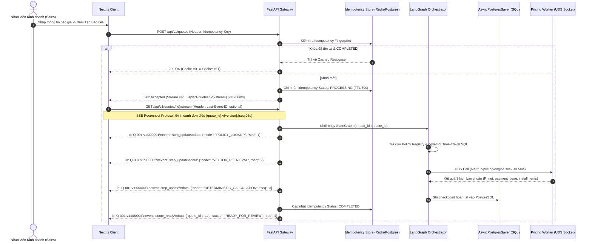
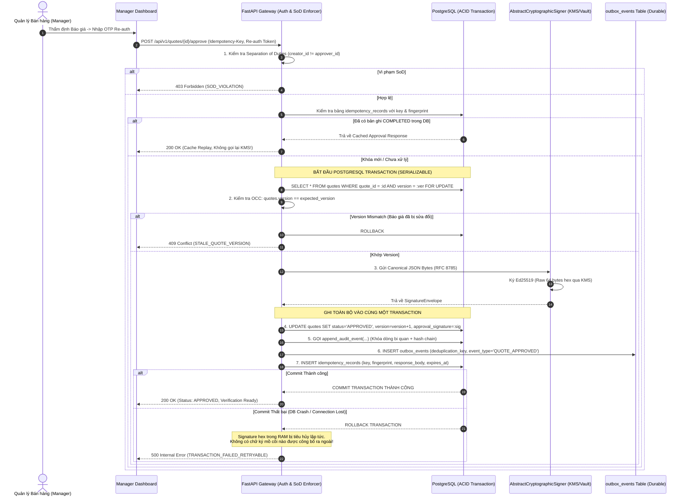

# THIẾT KẾ KỸ THUẬT KIẾN TRÚC RUNTIME & MÔ HÌNH TRIỂN KHAI
## DỰ ÁN: PRICEPOLICY AI AGENT – NỀN TẢNG BẢO CHỨNG ĐỊNH GIÁ & QUẢN TRỊ CHÍNH SÁCH BÁN HÀNG VLANDFUTURE
**Mã tài liệu:** TD-4.1 (Technical Design Workstream 4.1)  
**Mã sản phẩm:** BDSVLandFuture-06  
**Thuộc bộ đặc tả:** Phase 4 — Technical Design & Engineering Specification  
**Tài liệu tham chiếu chuẩn:** [1.requirement-analysis.md](../1.requirement-analysis.md) (PRD v2.3), [2.product-discovery.md](../2.product-discovery.md), [3.architecture-design.md](../3.architecture-design.md), [0.0.data-specification.md](../0.0.data-specification.md) (Data Spec v2.6), [0.1.dataRetrievalTech.md](../0.1.dataRetrievalTech.md), [0.2.financial-calculation-spec.md](../0.2.financial-calculation-spec.md) (FCS v2.6), [4.2-domain-data-financial-design.md](4.2-domain-data-financial-design.md) (TD-4.2 v2.3), [4.3-agent-stategraph-workflow-design.md](4.3-agent-stategraph-workflow-design.md) (TD-4.3 v2.2), [4.4-api-event-tool-contracts.md](4.4-api-event-tool-contracts.md) (TD-4.4 v2.2)  
**Phiên bản:** 2.3 - Hardened Implementation Baseline with Spikes Roadmap (Post-Critique Round 4 Hardened)  
**Tác giả:** Principal Enterprise & Runtime Systems Architect  
**Trạng thái phê duyệt:** **APPROVED FOR IMPLEMENTATION SPIKES & EXECUTABLE VERIFICATION | CONDITIONAL IMPLEMENTATION BASELINE (PRODUCTION RUNTIME BASELINE PENDING EXECUTABLE EVIDENCE)**  

---

# 1. MỤC TIÊU & NGUYÊN TẮC BẤT BIẾN RUNTIME (OBJECTIVES & RUNTIME INVARIANTS)

### 1.1 Mục tiêu Kỹ thuật
Tài liệu này là **Hợp đồng Kỹ thuật Runtime (Runtime Engineering Contract)** xác lập:
1. Ranh giới tiến trình cô lập, đặc tả Kubernetes Security Context cho Hardened Sidecar bảo vệ Động cơ Tính toán (`Pricing Engine Worker`).
2. Mô hình phê duyệt **Sign-before-commit with Non-public Orphan Handling** gắn kết nguyên tử với bản ghi Idempotency trong cùng một Transaction Database.
3. Cơ chế hàng đợi bền vững **At-Least-Once Delivery với Idempotent Consumers** và xác thực nội dung chống trùng lặp trên Amazon S3 (`pdf_sha256` content-addressed verification).
4. Phân rã độ trễ đa tầng và ngân sách thời gian LLM nhất quán số học ($9.0$s max budget, tách biệt Happy Path và Retry Path).
5. Giao thức truyền phát sự kiện **Server-Sent Events (SSE) Reconnection** với định danh đơn điệu toàn cục (`{quote_id}:v{quote_version}:{event_seq:06d}`).
6. Phân cấp cấu hình, quản trị khóa tin cậy qua **JWKS Trust Anchor** và Ma trận tương thích KMS Providers (Google Cloud KMS, HashiCorp Vault Transit, Local Ed25519).
7. Lộ trình thực thi **4 Implementation Spikes** nhằm thu thập chứng cứ đo kiểm thực thi (Executable Evidence) cho Phase 5.

### 1.2 Mười một Nguyên tắc Bất biến Runtime (Runtime Invariants)
- **INV-RT-01 (Hardened Sidecar Worker & K8s Security Context):** Khối tính toán tài chính (`Pricing Engine Worker`) vận hành dưới dạng tiến trình con cô lập (Dedicated Sidecar Container) trong cùng Kubernetes Pod: `runAsUser: 10001`, `runAsGroup: 10001`, `fsGroup: 10001`, `readOnlyRootFilesystem: true`, `allowPrivilegeEscalation: false`, `capabilities: { drop: ["ALL"] }`, `seccompProfile: { type: "RuntimeDefault" }`. Không mở port mạng inbound/outbound, không mount secret/credentials; giao tiếp duy nhất qua Unix Domain Socket (UDS) `/var/run/pricing/engine.sock` (quyền `0660`, volume `emptyDir` in-memory `16Mi`); cấm hoàn toàn số thực float (`decimal.Decimal` context 28 digits).
- **INV-RT-02 (RAG Verification Gate):** Vector Engine (`Supabase pgvector` với chỉ mục HNSW) thuần túy là chỉ mục tìm kiếm ngữ nghĩa; không phải Source of Truth. pgvector chỉ được truy vấn kết hợp bộ lọc thời gian cứng (`Time-Travel SQL Filter`) đối soát với `Policy Registry` trong PostgreSQL.
- **INV-RT-03 (Sign-before-commit & Atomic Idempotency):** Lệnh phê duyệt áp dụng mô hình Sign-before-commit: Khóa dòng `SELECT FOR UPDATE`, kiểm tra OCC qua `version`, ký số Ed25519 qua KMS/Signer. Toàn bộ các thao tác: cập nhật Quote `status = 'APPROVED'`, ghi Audit Hash Chain (`append_audit_event`), ghi Outbox Event, và ghi bản ghi `idempotency_records` bắt buộc nằm trong **cùng MỘT PostgreSQL ACID Transaction**. Nếu DB commit thất bại, chữ ký trong RAM bị tiêu hủy lập tức, tuyệt đối không lộ ra ngoài. Nếu Client mất kết nối sau khi commit, khi retry với cùng Idempotency Key sẽ nhận lại kết quả từ DB (Idempotent replay) mà không gọi KMS lần 2.
- **INV-RT-04 (Persistent Checkpointing):** Trạng thái StateGraph của LangGraph bắt buộc sử dụng **`AsyncPostgresSaver`** lưu vào PostgreSQL (`checkpoint_blobs`, `checkpoint_writes`); tuyệt đối cấm `MemorySaver` in-memory để đảm bảo khôi phục 100% tiến trình khi container bị dừng hoặc khởi động lại.
- **INV-RT-05 (At-least-once Outbox & S3 Content Verification):** Bảng `outbox_events` trong PostgreSQL là **Durable Source of Truth duy nhất** đảm bảo chuyển phát **At-Least-Once Delivery**. Redis/ARQ là **Transient Delivery Accelerator**. Tiến trình **Outbox Recovery Poller** độc lập quét định kỳ 15 giây để tự động khôi phục sự kiện quá hạn. Consumer đảm bảo tính lũy nghiệm qua S3 deterministic keys kèm **xác thực mã băm nội dung (`pdf_sha256`)** trước khi chuyển trạng thái `PDF_ISSUED`.
- **INV-RT-06 (Optimistic Concurrency Control - OCC):** Mọi thao tác cập nhật, phê duyệt hoặc yêu cầu sửa đổi báo giá bắt buộc kiểm tra phiên bản: `WHERE quote_id = :id AND version = :expected_version`. Nếu phiên bản bị lệch, từ chối ngay với mã lỗi `409 Conflict` (`STALE_QUOTE_VERSION`).
- **INV-RT-07 (Idempotency Fingerprint Binding):** Khóa Idempotency-Key bắt buộc kiểm tra kèm mã vân tay ngữ nghĩa:  
  $$\text{fingerprint} = \text{SHA-256}(\text{method} + \text{":"} + \text{endpoint} + \text{":"} + \text{actor\_id} + \text{":"} + \text{quote\_id} + \text{":"} + \text{quote\_version} + \text{":"} + \text{payload\_hash})$$  
  Nếu gửi lại cùng key nhưng khác fingerprint, hệ thống từ chối ngay với lỗi `409 IDEMPOTENCY_KEY_REUSE_PAYLOAD_MISMATCH`.
- **INV-RT-08 (Monotonic SSE Event Sequence Protocol):** Luồng Server-Sent Events bắt buộc gán định danh đơn điệu toàn cục `event_id = "{quote_id}:v{quote_version}:{event_seq:06d}"`. Tái kết nối qua header `Last-Event-ID` phát lại từ Event Log có thời gian lưu giữ (Retention 24h); nếu quá hạn lưu giữ, client tự động fallback truy vấn toàn bộ trạng thái qua REST API.
- **INV-RT-09 (Pre-Sales Safety Boundary & Watermark Protection):** Luồng Pre-Sales Web cho khách hàng (F1, F2, F3, F5) hoàn toàn bị cô lập khỏi luồng Official Quote: Tuyệt đối không được phép truy cập KMS signing, không được ghi nhận trạng thái `APPROVED`, không được ghi nhận `outbox_events` để phát hành PDF chính thức. Mọi bản kế hoạch tài chính trả về cho khách bắt buộc dán watermark bất biến `PRE-SALES ESTIMATE - NOT AN OFFICIAL QUOTE`.
- **INV-RT-10 (Claim-Level Evidence Coordinate Traceability - F4):** Mọi luận điểm Why và Why-not trong giải trình phương án bắt buộc phải mang đầy đủ `SourceCoordinate` vật lý (Document ID, Version, Hash SHA-256, Page, Section, Clause ID) và tham chiếu trường số học của `CalculationArtifact`. Validator tự động bóc tách các phát ngôn chỉ được hỗ trợ một phần (`PARTIALLY_SUPPORTED`), nghiêm cấm mọi hành vi suy diễn vượt quá chứng cứ văn bản.
- **INV-RT-11 (Zero-Trust Message Compliance Gate - F8):** Mọi tin nhắn gửi khách (do Agent gợi ý hay Sale tự soạn) đều phải trải qua 3 chốt chặn kiểm tra bắt buộc (on-draft, debounce on-typing, final send gate) với 4 mức tuân thủ (`SUPPORTED`, `CONDITIONAL`, `UNSUPPORTED`, `PROHIBITED`). Thao tác gửi cuối cùng bắt buộc băm SHA-256 `message_hash` và kiểm tra khóa cứng: Nếu phát ngôn chứa cam kết tín dụng/lợi nhuận quá thẩm quyền, lệnh gửi bị Backend chặn lập tức (`BLOCKED`).

---

# 2. KIẾN TRÚC RUNTIME & PHÂN RÃ TIẾN TRÌNH (RUNTIME PROCESS TOPOLOGY)

Kiến trúc runtime phân định rõ ranh giới giữa hai hồ sơ triển khai: **MVP Deployment Profile** (Dedicated Linux VPS & Docker Compose) và **Scale Deployment Profile** (Kubernetes & Managed Cloud Services).

### 2.1 MVP Deployment Profile — Dedicated Linux VPS & Docker Compose (Baseline Hiện Tại)

Dành cho giai đoạn MVP, Demo Hội đồng Khoa học và Triển khai thử nghiệm sàn giao dịch thực tế:

```text
┌────────────────────────────────────────────────────────────────────────────────────────┐
│                              CLIENT TIER (NGƯỜI DÙNG & TRÌNH DUYỆT)                    │
│  • Public Pre-Sales Mobile Web (F1, F2, F3, F5) ──┐                                    │
│  • Internal Sales Copilot & Manager Approval UI ──┴─► HTTPS REST & Server-Sent Events  │
└──────────────────────────────────────────┬─────────────────────────────────────────────┘
                                           │ Port 443 / 80
                                           ▼
┌────────────────────────────────────────────────────────────────────────────────────────┐
│                     INGRESS & REVERSE PROXY (NGINX CONTAINER)                          │
│  • SSL Termination (TLS 1.3), Gzip / Brotli compression                                │
│  • SSE Optimization: proxy_buffering off, proxy_read_timeout 3600s, keepalive 65s      │
│  • Rate Limiting: 10 req/s per IP (Public Pre-Sales), 50 req/s (Internal Sales)        │
└──────────────────────────────────────────┬─────────────────────────────────────────────┘
                                           │ Local Docker Bridge Network (172.28.0.0/16)
                                           ▼
┌────────────────────────────────────────────────────────────────────────────────────────┐
│                    DOCKER COMPOSE APPLICATION TIER (DEDICATED LINUX VPS)               │
│                                                                                        │
│  ┌──────────────────────────────────────────────────────────────────────────────────┐  │
│  │ MAIN CONTAINER: api-backend (FastAPI / Uvicorn Async Runtime, 4 Workers)         │  │
│  │ • Middleware: JWT Auth, Rate Limiter, Idempotency Fingerprint Enforcer           │  │
│  │ • Orchestrator: LangGraph StateGraph (PreSalesGraph & OfficialQuoteGraph)        │  │
│  │ • Memory Store: In-Memory apartments.json Cache (< 0.1ms Key Lookup)             │  │
│  │ • Persistence: AsyncPostgresSaver Checkpoint Pool                                │  │
│  └──────────────────────────────────────┬───────────────────────────────────────────┘  │
│                                         │ Shared Docker Volume: /var/run/pricing       │
│                                         │ (emptyDir-equivalent in-memory mount)        │
│                                         ▼ /var/run/pricing/engine.sock (Mode: 0660)    │
│  ┌──────────────────────────────────────────────────────────────────────────────────┐  │
│  │ SIDECAR CONTAINER: pricing-worker (Hardened Arithmetic Engine)                   │  │
│  │ • User: 10001:10001 (non-root) | readOnlyRootFilesystem: true                   │  │
│  │ • Pure decimal.Decimal (prec=28) | 0 Floats | 0 External Network Sockets         │  │
│  │ • 0 Secrets mounted | Hard Timeout 100ms per batch request                       │  │
│  └──────────────────────────────────────────────────────────────────────────────────┘  │
└──────────────┬───────────────────────────┬───────────────────────────┬─────────────────┘
               │ Async SQL Pool (PgBouncer)│ Transient Task Queue      │ Local Dev / Vault
               ▼                           ▼                           ▼
┌───────────────────────────┐ ┌───────────────────────────┐ ┌───────────────────────────┐
│ PERSISTENCE & VECTOR SOT  │ │   TRANSIENT TASK BROKER   │ │ CRYPTOGRAPHIC TRUST ANCHOR│
│ PostgreSQL 16 Enterprise  │ │ Redis 7 Container         │ │ Local Ed25519 Signer /    │
│ + pgvector Extension      │ │ • ARQ Task Broker         │ │ HashiCorp Vault Container │
│ • quotes, quote_scenarios │ │ • Fast In-Memory Queue    │ │ • Ed25519 Raw 64-byte Sig │
│ • pre_sales_sessions      │ │ • SSE Monotonic Stream    │ │ • Public Key via JWKS     │
│ • lead_dossiers           │ └─────────────┬─────────────┘ └───────────────────────────┘
│ • compliance_checks       │               │ Job Pop
│ • policy_rules (ACTIVE)   │               ▼
│ • pgvector HNSW Index     │ ┌─────────────────────────────────────────────────────────┐
│ • outbox_events (Durable) │ │ ASYNC OUTBOX & PDF WORKER CONTAINER                     │
│ • checkpoint_blobs        │ │ Python ARQ Consumer                                     │
│ • idempotency_records     │ │ • Read Outbox Event (FOR UPDATE SKIP LOCKED)            │
└─────────────┬─────────────┘ │ • Render Headless PDF with QR Code                      │
              │ Poller Query  │ • Calculate Content SHA-256 (pdf_sha256)                │
              └──────────────►│ • Store into MinIO / Encrypted Storage Volume           │
                              │ • Atomic Update quotes.pdf_status = 'PDF_ISSUED'        │
                              └─────────────────────────────────────────────────────────┘
```

#### Ma trận Đặc tả Tiến trình Docker Compose (MVP Profile)

| Tên Tiến trình Container | Runtime / Image | Trách nhiệm Kỹ thuật | Cơ chế Cô lập & Bảo mật | Giao tiếp |
| :--- | :--- | :--- | :--- | :--- |
| **`nginx`** | `nginx:alpine` | Reverse proxy, SSL, rate-limit, SSE keepalive. | Expose Port 80/443; Drop ALL caps ngoại trừ `NET_BIND_SERVICE`. | HTTPS Inbound / Docker Bridge |
| **`api-backend`** | `python:3.11-slim` + FastAPI | Gateway API, Authentication, LangGraph Orchestration. | Chạy dưới non-root user `appuser:10001`; không expose port public. | Local UDS `/var/run/pricing` + TCP nội bộ |
| **`pricing-worker`** | `python:3.11-slim` | Động cơ kế toán bất động sản tất định (`decimal.Decimal`). | **Hardened Process**: `network_mode: none`, `read_only: true`, không socket mạng ngoài. | Unix Domain Socket `/var/run/pricing/engine.sock` |
| **`postgresql`** | `pgvector/pgvector:pg16` | Database quan hệ + Vector Search HNSW duy nhất cho MVP. | Chỉ mở port nội bộ 5432 trên bridge network; volume mã hóa LUKS. | SQL qua Connection Pool nội bộ |
| **`redis`** | `redis:7-alpine` | Task broker tạm thời cho ARQ Worker và SSE stream buffer. | Chạy in-memory, password protected, appendonly yes. | TCP Port 6379 nội bộ |
| **`outbox-pdf-worker`**| `python:3.11-slim` + WeasyPrint| Xử lý outbox events, render file PDF báo giá chính thức. | Process cách ly; ghi file vào volume MinIO / S3. | ARQ Consumer qua Redis |
| **`minio`** | `minio/minio` | S3-compatible Object Storage cho chính sách gốc và PDF. | Private bucket; truy cập qua access/secret key nội bộ. | HTTP S3 API Port 9000 nội bộ |

---

### 2.2 Scale Deployment Profile — Kubernetes & Cloud Managed Services (Mở Rộng Quy Mô)

Khi hệ thống nâng cấp chịu tải toàn quốc và tích hợp ngân hàng đối tác, kiến trúc chuyển đổi mượt mà sang Kubernetes:
- **Pod Topology:** `api-backend` và `pricing-worker` chạy chung Pod (Multi-container Pod), kết nối qua `emptyDir` in-memory volume socket.
- **K8s Security Context cho Pricing Sidecar:**
```yaml
apiVersion: v1
kind: Pod
metadata:
  name: pricepolicy-backend-pod
spec:
  securityContext:
    runAsUser: 10001
    runAsGroup: 10001
    fsGroup: 10001
    seccompProfile:
      type: RuntimeDefault
  volumes:
    - name: uds-socket-dir
      emptyDir:
        medium: Memory
        sizeLimit: 16Mi
  containers:
    - name: api-backend
      image: vland/pricepolicy-api:v2.4
      volumeMounts:
        - name: uds-socket-dir
          mountPath: /var/run/pricing
      securityContext:
        allowPrivilegeEscalation: false
        readOnlyRootFilesystem: true
        capabilities:
          drop: ["ALL"]
    - name: pricing-worker
      image: vland/pricepolicy-pricing-worker:v2.4
      volumeMounts:
        - name: uds-socket-dir
          mountPath: /var/run/pricing
      securityContext:
        allowPrivilegeEscalation: false
        readOnlyRootFilesystem: true
        capabilities:
          drop: ["ALL"]
```
- **Managed Services:** AWS RDS PostgreSQL Multi-AZ, Managed Redis Cluster, Google Cloud KMS HSM cho chữ ký Ed25519, Amazon S3 Content-addressed upload (`pdf_sha256`), Qdrant Cluster khi quy mô vector vượt ngưỡng PostgreSQL.

> [!NOTE]
> **Khẳng định Vector Store Source of Truth:** `PostgreSQL 16 + pgvector (HNSW Index)` là **Source of Truth DUY NHẤT** cho toàn bộ dữ liệu vector của MVP. Qdrant chỉ được kích hoạt trong Scale Profile khi corpus vượt 100,000 chunks hoặc retrieval traffic vượt 2,000 QPS. Không triển khai song song hai cơ sở dữ liệu vector trong MVP để tránh phân mảnh trạng thái và lãng phí tài nguyên VPS.

---

# 3. MÔ HÌNH TUẦN TỰ RUNTIME & TRANSACTION SEMANTICS

---

### 3.1 Luồng Tạo Báo giá, Phân bổ Trễ Đa tầng & Giao thức SSE Replay

Hệ thống phân định các mốc đo kiểm trễ rõ ràng:
- **Sync Ingress Latency (POST /api/v1/quotes $\rightarrow$ HTTP 202):** $P95 \le \mathbf{200\text{ms}}$.
- **Time-to-Analysis-Start:** $P95 \le \mathbf{300\text{ms}}$.
- **Happy-Path E2E Quote Generation (Không có retry):** $P95 \le \mathbf{4.5\text{s}}$.
- **Retried Workflow Latency (Khi có 1 LLM retry):** $\text{Max} \le \mathbf{9.0\text{s}}$.
- **Timeout-Path Latency (Kích hoạt Safe Abstention):** $\text{Deadline} = \mathbf{10.0\text{s}}$.
- **Pricing Engine UDS Execution Latency:** $P95 \le \mathbf{5\text{ms}}$, $P99 \le \mathbf{10\text{ms}}$.
- **Async PDF Generation & Issuance:** $P95 \le \mathbf{2.0\text{s}}$.



#### Quy tắc Giao thức SSE Reconnection:
1. **Cấu trúc Event ID Đơn điệu:** `id = "{quote_id}:v{quote_version}:{event_seq:06d}"` (ví dụ: `Q-2026-03-00088:v1:000017`). Tuyệt đối không dùng `step_index` của đồ thị vì một node có thể lặp lại hoặc phát nhiều sự kiện.
2. **Replay từ Event Store:** Khi client gửi `Last-Event-ID: Q-2026-03-00088:v1:000012`, gateway đọc từ Event Log và phát lại tất cả sự kiện có `event_seq > 12` của phiên bản báo giá đó.
3. **Chính sách Lưu trữ Replay (Retention Policy):** Sự kiện SSE được lưu giữ 24 giờ trong Redis Streams hoặc bảng `quote_audit_events`. Nếu client gửi `Last-Event-ID` đã quá hạn 24 giờ, gateway trả về mã HTTP `410 Gone` kèm header `X-Action: RESYNC_FULL_STATE`, client tự động gọi REST API `GET /api/v1/quotes/{id}` để đồng bộ lại toàn bộ trạng thái.
4. **Heartbeat:** Gateway phát định kỳ `: ping\n\n` mỗi **15 giây** để chống timeout ngắt kết nối từ Cloud Load Balancer / NAT Gateway.
5. **Deduplication tại Client:** Client duy trì tập hợp các `event_id` đã nhận trong phiên để loại bỏ các sự kiện trùng lặp do kết nối lại.

---

### 3.2 Luồng Phê duyệt Sign-before-commit & Ghi Nhận Idempotency Nguyên tử

Để ngăn chặn hoàn toàn rủi ro gọi lại KMS không cần thiết hoặc chữ ký mồ côi khi mạng bị đứt giữa chừng, toàn bộ các cập nhật của lệnh phê duyệt được gói trong **MỘT TRANSACTION ACID DUY NHẤT**:



---

### 3.3 Hàng đợi Bền vững At-Least-Once Delivery & S3 Content Verification

- **Xác thực Nội dung Trùng lặp trên Amazon S3 (Blocker 5):** Khi Worker xuất bản file PDF:
  1. Worker kết xuất nội dung file PDF trong bộ nhớ và tính mã băm `pdf_sha256 = SHA256(pdf_bytes)`.
  2. Đường dẫn S3 được xác định tất định: `s3://vland-quote-evidence-vault/quotes/{quote_id}/v{version}/quote_{quote_id}_v{version}.pdf`.
  3. Worker thực hiện gọi `HeadObject` kiểm tra xem file đã tồn tại trên S3 chưa:
     - **Nếu file đã tồn tại:** Đọc metadata `x-amz-meta-sha256`. Nếu mã băm khớp chính xác với `pdf_sha256` vừa tạo $\rightarrow$ Bỏ qua bước upload (Skip redundant PUT), tiến hành cập nhật database. Nếu mã băm khác biệt $\rightarrow$ Báo động khẩn cấp `S3_CONTENT_MISMATCH` (dấu hiệu kết xuất không tất định).
     - **Nếu file chưa tồn tại:** Thực hiện `PutObject` kèm gắn header metadata `x-amz-meta-sha256 = pdf_sha256`.
  4. Cập nhật `quote_pdf_artifacts.pdf_status = 'PDF_ISSUED'` và `quotes.pdf_status = 'PDF_ISSUED'`.
- **Outbox Recovery Poller:** Tiến trình nền quét mỗi **15 giây** xử lý các event `PENDING` hoặc `PROCESSING` quá hạn (`locked_until < NOW()`) bằng mẫu truy vấn `FOR UPDATE SKIP LOCKED`.

---

# 4. MÔ HÌNH NĂNG LỰC HẠ TẦNG & SẴN SÀNG CAO (CAPACITY & HA DEPLOYMENT)

### 4.1 Mô hình Dung lượng Kết nối Cơ sở Dữ liệu Toàn diện (Comprehensive DB Pool Model)

Để tránh hiện tượng cạn kiệt Connection Pool làm sập hệ thống dưới tải cao, tài liệu phân định rõ ranh giới:
1. **Client-side Application Pool:** Tổng số kết nối tối đa mở từ ứng dụng tới PgBouncer.
2. **PgBouncer Server Pool:** Cơ chế Transaction Pooling gom và tái sử dụng kết nối.
3. **PostgreSQL Backend Connections:** Kết nối thực tế mở trên máy chủ AWS RDS.

$$\text{RDS Backend Connections} = \text{App Server Pool} + \text{Checkpoint Pool} + \text{Outbox Worker Pool} + \text{PDF Worker Pool} + \text{Admin/Poller} + \text{Reserve}$$

| Thành phần Tiêu thụ | Mô hình Pooling | Client Pool Size | PgBouncer Server Pool | RDS Backend Connections |
| :--- | :--- | :---: | :---: | :---: |
| **FastAPI Backend Cluster (2 Pods)** | Transaction Pooling (Uvicorn 4w/pod) | $2 \times 4 \times 5 = \mathbf{40}$ | Gom thành $\mathbf{20}$ server conns | **20 connections** |
| **PDF Background Workers (2 Pods)** | Transaction Pooling (ARQ Worker) | $2 \times 3 = \mathbf{6}$ | Gom thành $\mathbf{4}$ server conns | **4 connections** |
| **Outbox Recovery Poller** | Dedicated Poller Thread | $\mathbf{2}$ | Dedicated Direct | **2 connections** |
| **LangGraph AsyncPostgresSaver** | Dedicated Checkpoint Pool | $\mathbf{10}$ | Dedicated Checkpoint | **10 connections** |
| **DB Admin & Flyway Migration** | On-demand Session Reserve | $\mathbf{5}$ | On-demand Direct | **5 connections** |
| **Monitoring, Superuser & Failover**| PostgreSQL Superuser Reserve | $\mathbf{15}$ | Native Reserved | **15 connections** |
| **TỔNG KẾT HỆ THỐNG** | **Ngưỡng an toàn vận hành** | **78 client slots** | **Tối đa đồng thời** | **56 / 100 RDS conns** |

> [!TIP]
> **Biên độ An toàn (Safety Headroom):** Cấu hình AWS RDS `db.t4g.medium` hỗ trợ tối đa `max_connections = 112`. Mức sử dụng đỉnh của toàn bộ hệ thống được kiểm soát ở mức **56 connections** (tương đương $\approx 50\%$ tải tối đa), bảo đảm biên độ an toàn $50\%$ để xử lý các đợt tăng tải đột biến hoặc quá trình chuyển đổi dự phòng Multi-AZ Failover mà không gây từ chối kết nối.

---

# 5. ĐẶC TẢ THAM SỐ CẤU HÌNH & CHỮ KÝ SỐ ED25519

### 5.1 Ngân sách Thời gian LLM Nhất quán Số học (Consistent LLM Budget)
- **Per-attempt LLM Timeout:** $4.0$ giây.
- **Max Retries:** $1$ lần (Tổng cộng tối đa $2$ attempts).
- **Backoff Policy:** $1.0$ giây $\pm 20\%$ Jitter ($0.8\text{s} - 1.2\text{s}$).
- **Tổng Ngân sách LLM Tối đa:**
  $$\text{Total LLM Budget} = 4.0\text{s (attempt 1)} + 1.0\text{s (backoff)} + 4.0\text{s (attempt 2)} = \mathbf{9.0\text{s}} \le \mathbf{10.0\text{s}}$$
- **Circuit Breaker Policy:** Mở mạch (Open Circuit) trong $30$ giây nếu ghi nhận $3$ lỗi liên tiếp. Request mới chuyển sang `ABSTAINED` với mã lỗi `LLM_GATEWAY_TIMEOUT`.

### 5.2 Hợp đồng Lớp Ký số Trừu tượng & Quản trị Khóa qua JWKS Trust Anchor

Để tránh rủi ro bảo mật và giảm tải kích thước payload, hệ thống **không bắt buộc nhúng lặp lại `public_key_pem`** trong từng Signature Envelope. Điểm tựa tin cậy (Trust Anchor) chính thức là **JWKS Endpoint**:

```python
from abc import ABC, abstractmethod
from typing import Optional
from pydantic import BaseModel

class SignatureEnvelope(BaseModel):
    algorithm: str = "Ed25519"
    key_id: str                  # Định danh khóa duy nhất (e.g., 'vland-attestation-key-2026-v1')
    signature_encoding: str = "hex"
    signature: str               # Raw 64-byte Ed25519 signature encoded as hex (RFC 8032)
    public_key_pem: Optional[str] = None  # Trường tùy chọn (chỉ dùng cho convenience logging)

class AbstractCryptographicSigner(ABC):
    @abstractmethod
    async def sign_canonical_payload(self, canonical_bytes: bytes) -> SignatureEnvelope:
        """Ký số trên chuỗi byte chuẩn hóa RFC 8785 Canonical JSON."""
        pass

    @abstractmethod
    async def get_public_jwks(self) -> dict:
        """Trả về tập khóa công khai chuẩn JWKS RFC 7517 phục vụ bên thứ 3 kiểm thực."""
        pass
```

#### Ma trận Tương thích Nhà cung cấp Ký số (KMS Compatibility Matrix):

| Nhà cung cấp Ký số | API / Phương thức Ký | Định dạng Đầu ra Gốc | Xử lý qua Adapter | Chuẩn hóa Envelope |
| :--- | :--- | :--- | :--- | :--- |
| **Google Cloud KMS** | `asymmetricSign` (`EC_SIGN_ED25519`) | Raw 64 bytes binary | Đọc trực tiếp byte stream, encode sang chuỗi hex 128 ký tự. | Raw 64B Hex, Key ID tham chiếu Cloud KMS Resource URI. |
| **HashiCorp Vault** | Transit Secret Engine (`/sign/ed25519`) | Chuỗi `vault:v1:<base64>` | Adapter bóc tách tiền tố `vault:v1:`, giải mã base64 sang raw 64 bytes, encode sang hex. | Raw 64B Hex, Key ID tham chiếu Vault Key Name + Version. |
| **Local Ed25519 Signer** | Python `cryptography.hazmat` | Raw 64 bytes binary | Ký trực tiếp bằng private key trong Docker Secret, encode sang hex. | Raw 64B Hex, Key ID là mã băm SHA-256 của public key. |

#### Đặc tả JWKS Trust Anchor (`GET /.well-known/jwks.json`):
Mọi bên thứ ba (hoặc ứng dụng quét mã QR) kiểm thực chữ ký số bằng cách tra cứu khóa công khai qua endpoint chuẩn:
```json
{
  "keys": [
    {
      "kty": "OKP",
      "crv": "Ed25519",
      "kid": "vland-attestation-key-2026-v1",
      "x": "O2A4FYubB3W8i8wE97W-k3S1rS_Xp2a-8J3F9s0x5g8",
      "use": "sig",
      "status": "ACTIVE",
      "valid_from": "2026-01-01T00:00:00Z",
      "valid_to": "2027-01-01T00:00:00Z",
      "revoked_at": null
    }
  ]
}
```

---

# 6. MÁY TRẠNG THÁI TOÀN DIỆN CỦA QUOTE VÀ PDF (STATE ENUMS)

```text
QUOTE WORKFLOW STATUS:
[DRAFT] ───► [ANALYZING] ───► [READY_FOR_REVIEW] ───► [APPROVED] ───► [CLOSED]
                 │                    │                      │
                 ▼                    ▼                      ▼
            [ABSTAINED]        [NEEDS_REVISION]         [REJECTED]
            [BLOCKED]                                        │
                                                             ▼
                                                         [REVOKED]

PDF ASYNC STATUS:
[PENDING] ───► [GENERATING] ───► [PDF_ISSUED]
                     │
                     ▼
                 [FAILED] ───► [RETRYING] ───► [MANUAL_INTERVENTION]
```

---

# 7. TIÊU CHUẨN NGHIỆM THU ĐỊNH LƯỢNG (QUANTITATIVE ACCEPTANCE CRITERIA)

| Mã AC | Nhóm Tiêu chuẩn | Phương pháp & Môi trường Đo kiểm | Ngưỡng Đạt Kỹ thuật (Pass Threshold) |
| :--- | :--- | :--- | :---: |
| **AC-RT-01a** | **Sync Ingress Latency** | Đo thời gian phản hồi POST `/api/v1/quotes` (k6 test tải 50 VUs). | **$P95 \le 200$ms**, Lỗi HTTP $0.0\%$. |
| **AC-RT-01b** | **Happy-Path E2E Generation** | Đo thời gian từ request đến khi nhận SSE event `quote_ready`. | **$P95 \le 4.5$s**, Không có LLM retry. |
| **AC-RT-01c** | **Retried Workflow Latency** | Giả lập 1 lần LLM retry (backoff 1.0s). | **Max $\le 9.0$s**, Không vượt quá timeout. |
| **AC-RT-01d** | **Pricing Engine Sidecar** | Đo thời gian tính toán qua UDS Socket của Hardened Sidecar Worker. | **$P95 \le 5$ms**, $P99 \le 10$ms. |
| **AC-RT-02** | **LLM Budget & Circuit Breaker**| Giả lập LLM Gateway treo mạng hoặc độ trễ phản hồi $> 4.0$s. | **Ngắt chính xác tại $9.0$s $\pm 0.2$s**, chuyển trạng thái `ABSTAINED`. |
| **AC-RT-03** | **Approval Atomicity & Non-public Orphan** | Thử nghiệm crash DB ngay sau khi KMS trả về chữ ký số. | **Không có chữ ký mồ côi nào được công bố**; DB rollback $100\%$; Idempotent retry không gọi lại KMS. |
| **AC-RT-04** | **Idempotency Fingerprint** | Gửi cùng `Idempotency-Key` với action hoặc payload khác nhau. | **Trả về HTTP 409 Conflict**; Lookup cache hit $< 5$ms. |
| **AC-RT-05** | **Optimistic Locking (OCC)** | 2 Quản lý bấm Approve đồng thời trên cùng một báo giá version 1. | Đúng **1 request 200 OK**, request thứ hai nhận **409 Conflict**. |
| **AC-RT-06** | **At-Least-Once Outbox Delivery**| Giả lập `redis-server` bị restart đột ngột khi có 10 outbox events. | **Phục hồi và xử lý $100\%$ events** sau chu kỳ Poller $\le 15$s. |
| **AC-RT-07** | **S3 Content-Addressed Dedup**| Giả lập Outbox Worker chạy lại event xuất bản PDF đã tồn tại trên S3. | **Kiểm tra mã băm `pdf_sha256` khớp $100\%$**, không upload đè file rỗng hoặc lỗi. |
| **AC-RT-08** | **SSE Monotonic Reconnection**| Client mất kết nối mạng và reconnect với `Last-Event-ID`. | **Phát lại đầy đủ $100\%$ sự kiện bị thiếu** theo đúng sequence, không lặp. |
| **AC-RT-09** | **Public JWKS QR Verification**| Gửi request kiểm thực chữ ký số đến `/api/v1/attestations/verify`. | Trả về kết quả xác thực hợp lệ trong **$< 50$ms**. |
| **AC-RT-10** | **Pre-Sales Isolation & Watermark** | Gọi API sinh plan sơ bộ; kiểm tra quyền KMS signing và watermark file. | **100% không gọi KMS**, dán watermark `PRE-SALES ESTIMATE - NOT AN OFFICIAL QUOTE`. |
| **AC-RT-11** | **Zero-Trust Compliance Gate** | Giả lập Sale gửi tin nhắn cam kết lãi suất ngân hàng hoặc chiết khấu quá trần. | **Backend chặn gửi $100\%$** (HTTP 422 `COMPLIANCE_PROHIBITED`), ghi audit log. |
| **AC-RT-12** | **Claim Coordinate Traceability** | Đối soát 100 claims Why/Why-not trả về từ công cụ giải trình. | **100% claims có đầy đủ `SourceCoordinate`** (doc, ver, page, clause), bóc tách đúng `PARTIALLY_SUPPORTED`. |
| **AC-RT-13** | **Policy Rule Test Gate** | Thử nghiệm publish quy tắc chính sách chưa vượt qua bộ kiểm thử hồi quy. | **Hệ thống chặn xuất bản $100\%$**; từ chối nạp vào Official Quote Engine. |

---

# 8. LỘ TRÌNH TRIỂN KHAI 6 IMPLEMENTATION SPIKES (PHASE 5 PREP)

Nhằm thu thập **Bằng chứng Đo kiểm Thực thi (Executable Test Evidence)** trước khi công nhận Production Runtime Baseline, hệ thống thiết lập lộ trình 6 Spikes kỹ thuật độc lập:

### Spike 1 — Pure Decimal Deterministic Pricing Engine Sidecar
- **Mục tiêu:** Chứng minh động cơ tính toán độc lập, hoàn toàn không sử dụng số thực float, tuân thủ 100% 15 Golden Vectors của FCS v2.6.
- **Sản phẩm bàn giao (Deliverables):**
  - Báo cáo kiểm thử tự động 15 Golden Test Vectors ($\Delta = 0$ VNĐ).
  - Báo cáo Property-based Testing (Hypothesis) với 10,000 cấu hình tham số ngẫu nhiên.
  - Benchmark độ trễ qua UDS Socket đo bằng k6 ($P95 \le 5$ms).
  - Báo cáo xác nhận tính tất định tuyệt đối của mã băm `canonical_calculation_hash`.

### Spike 2 — RFC 8785 Canonical JSON & Ed25519 Provider Adapters
- **Mục tiêu:** Chứng minh chuỗi byte chuẩn hóa RFC 8785 tất định tuyệt đối trên các nền tảng và tương thích hoàn toàn giữa 3 Signer Adapters.
- **Sản phẩm bàn giao (Deliverables):**
  - Test suite chứng minh: Cùng dữ liệu đầu vào $\rightarrow$ cùng chuỗi byte canonical $\rightarrow$ cùng mã băm SHA-256.
  - Test suite xác thực chữ ký số Ed25519 raw 64 bytes bằng thư viện chuẩn `cryptography`.
  - Test case giả mạo payload (Tampered payload) $\rightarrow$ Xác thực thất bại $100\%$.
  - Kiểm thử Key Rotation và kiểm thực qua endpoint JWKS `GET /.well-known/jwks.json`.

### Spike 3 — AsyncPostgresSaver Checkpointing & Multi-replica Resume
- **Mục tiêu:** Xác nhận khả năng phục hồi nguyên vẹn tiến trình LangGraph khi container backend bị dừng đột ngột.
- **Sản phẩm bàn giao (Deliverables):**
  - Kịch bản kiểm thử: Kill container backend ở giữa node Tra cứu Chính sách và node Tính giá $\rightarrow$ Khởi động lại container và resume thành công $100\%$.
  - Kiểm thử multi-replica: Request tạo ở Replica A, reconnect SSE và resume ở Replica B thông qua persistent checkpoint trong PostgreSQL.
  - Stress test 100 luồng checkpoint đồng thời không phát sinh deadlock trên bảng `checkpoint_blobs`.

### Spike 4 — Durable Outbox, Redis/ARQ Recovery & S3 Content-Addressed Dedup
- **Mục tiêu:** Chứng minh mô hình At-least-once Delivery không làm thất thoát bất kỳ sự kiện nào và ngăn chặn ghi đè sai lệch trên S3.
- **Sản phẩm bàn giao (Deliverables):**
  - Kịch bản giả lập sập Redis Cluster $\rightarrow$ Outbox Poller quét PostgreSQL và khôi phục xử lý $100\%$ events.
  - Kịch bản duplicate delivery: Worker nhận cùng 1 task PDF 3 lần $\rightarrow$ S3 kiểm tra mã băm `pdf_sha256`, bỏ qua upload đè, cập nhật DB an toàn.
  - Kịch bản S3 Upload thành công nhưng DB update fail $\rightarrow$ Worker retry nhận diện ETag/Hash đã khớp và hoàn tất transition `PDF_ISSUED`.

### Spike 5 — Public Pre-Sales Session Checkpointing, TTL & StateGraph Interruption
- **Mục tiêu:** Xác thực máy trạng thái `PreSalesGraph` xử lý an toàn cho người dùng công khai vãng lai, quản trị TTL và gián đoạn an toàn.
- **Sản phẩm bàn giao (Deliverables):**
  - Kịch bản khách hàng ngắt kết nối trình duyệt khi đang ở node `WAITING_FOR_CUSTOMER_INPUT` $\rightarrow$ Resume lại chính xác qua `session_id` và `resume_token`.
  - Kiểm thử cơ chế hết hạn phiên tự động (Session Expiry sau 30 phút idle) $\rightarrow$ Ngăn chặn việc tái sử dụng session cũ bị rò rỉ.
  - Kiểm tra xác nhận ràng buộc: Không tạo kế hoạch tham khảo nếu khách hàng chưa bấm xác nhận các con số tài chính trích xuất.
  - Đo kiểm hiệu năng Public Rate Limiting (10 req/s per IP) chống DoS tài nguyên LLM.

### Spike 6 — Sales Message Compliance Verification Gate & Final Send Enforcement
- **Mục tiêu:** Chứng minh Zero-Trust Gate chặn đứng 100% phát ngôn bán hàng vi phạm quy chế hoặc cam kết sai sự thật.
- **Sản phẩm bàn giao (Deliverables):**
  - Bộ dữ liệu kiểm thử 50 tin nhắn đối kháng (Adversarial Messages): Cam kết bảo lãnh ngân hàng 100%, hứa hẹn hoàn tiền, chiết khấu ngầm, sai lệch con số dòng tiền.
  - Đo lường độ trễ của debounced verification worker ($P95 \le 300$ms trên chuỗi văn bản $\le 500$ từ).
  - Kiểm thử chốt chặn cuối cùng `POST /api/v1/messages/send`: Phát hiện payload bị sửa đổi sau khi check (Tampered message_hash) $\rightarrow$ Từ chối gửi $100\%$.
  - Báo cáo phân loại 4 mức tuân thủ (`SUPPORTED`, `CONDITIONAL`, `UNSUPPORTED`, `PROHIBITED`) đạt độ chính xác $100\%$.

---
**KẾT THÚC ĐẶC TẢ THIẾT KẾ KỸ THUẬT 4.1 (TD-4.1 v2.4 — HARDENED IMPLEMENTATION BASELINE WITH 6 SPIKES ROADMAP)**
