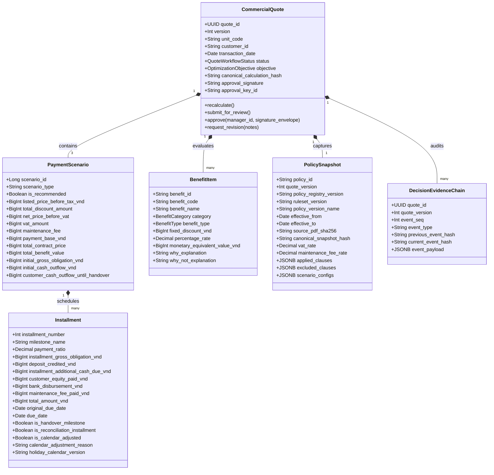

# THIẾT KẾ KỸ THUẬT MÔ HÌNH MIỀN, DỮ LIỆU & ĐẶC TẢ TÀI CHÍNH SỐ HỌC
## DỰ ÁN: PRICEPOLICY AI AGENT – NỀN TẢNG BẢO CHỨNG ĐỊNH GIÁ & QUẢN TRỊ CHÍNH SÁCH BÁN HÀNG VLANDFUTURE
**Mã tài liệu:** TD-4.2 (Technical Design Workstream 4.2)  
**Mã sản phẩm:** BDSVLandFuture-06  
**Thuộc bộ đặc tả:** Phase 4 — Technical Design & Engineering Specification  
**Tài liệu tham chiếu chuẩn:** [1.requirement-analysis.md](../1.requirement-analysis.md) (PRD v2.3), [2.product-discovery.md](../2.product-discovery.md), [3.architecture-design.md](../3.architecture-design.md), [0.0.data-specification.md](../0.0.data-specification.md) (Data Spec v2.6), [0.2.financial-calculation-spec.md](../0.2.financial-calculation-spec.md) (FCS v2.6), [4.1-technical-architecture-runtime-deployment.md](4.1-technical-architecture-runtime-deployment.md) (TD-4.1 v3.0), [4.3-agent-stategraph-workflow-design.md](4.3-agent-stategraph-workflow-design.md) (TD-4.3 v2.2), [4.4-api-event-tool-contracts.md](4.4-api-event-tool-contracts.md) (TD-4.4 v2.2)  
**Phiên bản:** 2.3 - Hardened Controlled Implementation Baseline (Post-Critique Round 4 Hardened)  
**Tác giả:** Principal Data, Domain & Financial Calculation Systems Architect  
**Trạng thái:** **APPROVED FOR CONTROLLED IMPLEMENTATION BASELINE | APPROVED FOR DATABASE SCHEMA SPIKE & MIGRATION DRY-RUN (PRODUCTION MIGRATION PENDING EXECUTABLE EVIDENCE)**  

---

# 1. MỤC TIÊU & NGUYÊN TẮC THIẾT KẾ CỐT LÕI

Tài liệu này xác lập mô hình miền nghiệp vụ (**Domain-Driven Design - DDD**), cấu trúc dữ liệu quan hệ (**PostgreSQL DDL**) và đặc tả số học tài chính bất động sản chi tiết đến từng đồng VNĐ, tích hợp toàn bộ các điểm cải tiến và phản biện kỹ thuật vòng 4:
1. **Thống nhất Semantics `P_listed`:** Xác lập định nghĩa duy nhất: `listed_price_before_tax_vnd` (Giá niêm yết trước thuế VAT và trước KPBT). Cấm tuyệt đối nhập nhằng giữa giá có thuế và chưa thuế.
2. **Đồng bộ Hợp đồng Dòng tiền với FCS v2.6:** Phân rã đầy đủ các cấu phần dòng tiền trong từng đợt thanh toán (`installment_gross_obligation_vnd`, `deposit_credited_vnd`, `installment_additional_cash_due_vnd`, `customer_equity_paid_vnd`, `bank_disbursement_vnd`, `maintenance_fee_paid_vnd`), lưu trữ rõ `payment_base_vnd` và `initial_gross_obligation_vnd` trên từng kịch bản.
3. **Cưỡng chế Chính sách Không Chồng lấn (Policy No-Overlap):** Sử dụng ràng buộc loại trừ PostgreSQL `btree_gist` Exclusion Constraint, bảo đảm cơ sở dữ liệu ngăn chặn hoàn toàn việc xuất bản 2 chính sách hiệu lực đè lên nhau trong cùng một phạm vi dự án, kênh bán và phân khúc.
4. **Bảo vệ Bất biến Chính sách Độc lập (Independent Policy Snapshot):** Tách biệt hoàn toàn `quote_policy_snapshots` khỏi `policy_registry`. Snapshot lưu giữ đầy đủ: `quote_id`, `quote_version`, `policy_registry_version`, `ruleset_version`, `canonical_snapshot_hash`, `applied_clauses_jsonb`, `excluded_clauses_jsonb`, `scenario_configs_jsonb` kèm ràng buộc `UNIQUE (quote_id, quote_version)` và trigger chặn sửa/xóa, độc lập hoàn toàn với vòng đời cập nhật hoặc thu hồi của chính sách gốc.
5. **Cơ chế Khóa Bi quan Chống Race Condition trong Chuỗi Băm Kiểm toán (Blocker 1 & 2):** Xây dựng Stored Procedure kiểm soát `append_audit_event(...)` thực hiện khóa bi quan cấp dòng `SELECT ... FOR UPDATE` trên bảng `quotes` cha trước khi xác định sequence tiếp theo. Cưỡng chế phân định rõ ranh giới: Application layer canonicalize JSON theo RFC 8785 và tính hash mật mã; Database procedure cưỡng chế sequence liên tục, ràng buộc hash trước sau (`previous_event_hash`), khởi tạo Genesis hash (`'0'*64`), và thu hồi quyền `INSERT` trực tiếp của runtime role.
6. **Phân loại Rạch ròi Trường Bất biến & Trường Metadata Hậu Phê duyệt (Blocker 3):** Trigger `trg_prevent_approved_quote_tamper()` khóa cứng toàn bộ các trường tài chính, căn cứ tính toán, thông tin phê duyệt và khóa ký sau khi `status = 'APPROVED'`. Chỉ cho phép cập nhật tập trường metadata luồng công việc giới hạn (`pdf_status`, `updated_at`) hoặc chuyển trạng thái hợp lệ sang `REVOKED` (với `is_revoked = TRUE`).
7. **Bảo vệ Phân quyền Hai người Đa tầng (Defense-in-Depth SoD - Blocker 4):** Check Constraint `chk_quote_sod (approved_by <> created_by)` là rào chắn đáy bảo vệ cơ sở dữ liệu, phối hợp đồng bộ cùng: RBAC tầng API (Manager role), Token xác thực tươi ngắn hạn (`X-Reauth-Token`), State Machine Guard (LangGraph node) và Chữ ký số Ed25519 gắn với key của người phê duyệt.
8. **Chính sách Lịch Tất định & Đình chỉ An toàn khi Mơ hồ (Blocker 5):** Phân định rạch ròi 2 chính sách lịch thực thi được (`KEEP_CALENDAR_DATE`, `NEXT_BUSINESS_DAY`) và trạng thái mơ hồ (`POLICY_AMBIGUOUS`). Nếu gặp `POLICY_AMBIGUOUS`, Calculation Engine tuyệt đối không tự đoán ngày mà chuyển sang trạng thái Đình chỉ An toàn (**Safe Abstention**: `quote.status = 'ABSTAINED' / 'NEEDS_INPUT'`). Yêu cầu định danh phiên bản lịch ngày lễ (`holiday_calendar_version`, ví dụ `'VN-2026-V1'`) khi chạy `NEXT_BUSINESS_DAY`.
9. **Định danh Khóa Deduplication Scoped & Tranh chấp Worker Outbox (Blocker 6):** Cấu trúc khóa trùng lặp theo định dạng chuẩn: `{aggregate_type}:{aggregate_id}:v{aggregate_version}:{event_type}` (ví dụ: `'QUOTE:Q-2026-03-00088:v1:PDF_GENERATION'`). Mở rộng bảng `outbox_events` với các trường `attempt_count`, `locked_until`, `locked_by`, `processed_at`, `last_error` và truy vấn công việc bằng cơ chế `FOR UPDATE SKIP LOCKED`.

---

# 2. THIẾT KẾ MÔ HÌNH MIỀN (DOMAIN-DRIVEN DESIGN)



### 2.1 Danh mục Đối tượng Miền Cốt lõi (Domain Taxonomy)

| Phân hệ Miền | Tên Đối tượng | Phân loại DDD | Trách nhiệm Nghiệp vụ & Ràng buộc Bất biến (Invariants) |
| :--- | :--- | :--- | :--- |
| **Commercial Governance** | `CommercialQuote` | **Aggregate Root** | Quản lý vòng đời báo giá theo phiên bản `(quote_id, version)`. Bất biến toàn bộ trường tài chính/phê duyệt khi trạng thái chuyển sang `APPROVED`. Cưỡng chế phân quyền hai người đa tầng (`chk_quote_sod`: `created_by != approved_by`). |
| **Commercial Governance** | `QuoteWorkflowStatus` | Domain Enum | Máy trạng thái hữu hạn: `DRAFT`, `NEEDS_INPUT`, `ANALYZING`, `CALCULATING`, `CALCULATION_FAILED`, `READY_FOR_REVIEW`, `NEEDS_REVISION`, `REJECTED`, `APPROVED`, `ABSTAINED`, `BLOCKED`, `REVOKED`. |
| **Financial Pricing** | `PaymentScenario` | Entity | Một trong 3 phương án thanh toán chuẩn tắc: Chuẩn (`STANDARD_PROGRESS`), Sớm 95% (`EARLY_95`), Vay 0% HTLS (`BANK_LOAN_HTLS`). Ràng buộc duy nhất 1 scenario mỗi loại trong 1 phiên bản quote. |
| **Financial Pricing** | `Installment` | Child Entity | Một đợt thanh toán chi tiết. Định danh nghiệp vụ theo cặp `(scenario_id, installment_number)`. Ràng buộc: `installment_additional_cash_due_vnd = customer_equity_paid_vnd + bank_disbursement_vnd` và `total_amount_vnd = customer_equity_paid_vnd + bank_disbursement_vnd + maintenance_fee_paid_vnd`. |
| **Financial Pricing** | `BenefitItem` | Entity | Khoản ưu đãi/chiết khấu. Phân định rõ `CASH_DISCOUNT` (trừ trực tiếp vào giá bán trước thuế) và `IN_KIND_GIFT` (tính vào tổng giá trị lợi ích nhận được). |
| **Policy Governance** | `PolicySnapshot` | Immutable Entity | Bản sao nguyên trạng chính sách độc lập bất biến tại thời điểm lập báo giá, có `quote_id`, `quote_version`, `policy_registry_version`, `ruleset_version`, `canonical_snapshot_hash`, `applied_clauses_jsonb`, `excluded_clauses_jsonb`. Ràng buộc `UNIQUE (quote_id, quote_version)`. |
| **Policy Governance** | `MutualExclusionRule` | Entity | Ma trận loại trừ giữa các điều khoản ưu đãi, phân định `TIER_1_HARD` (loại trừ tuyệt đối) và `TIER_2_GROUP` (chọn 1 trong nhóm). |
| **Audit & Governance** | `DecisionEvidenceChain`| Entity | Khối kiểm toán Per-Quote Version Hash Chain, nối băm `current_event_hash = SHA256(previous_event_hash + payload)`. Cưỡng chế sequence liên tục và khóa bi quan cấp row `SELECT FOR UPDATE` ngăn chặn race condition. |
| **Pre-Sales Discovery** | `PreSalesSession` | **Aggregate Root** | Phiên tự khám phá tài chính của khách hàng (F1). Quản lý danh sách tin nhắn, trạng thái phiên (`ACTIVE`, `COMPLETED`, `ABANDONED`) và ràng buộc PII. Không sở hữu quyền phát hành báo giá. |
| **Pre-Sales Discovery** | `CustomerConstraints` | Value Object | Ràng buộc tài chính chuẩn hóa được trích xuất từ hội thoại (F2): `own_funds_vnd`, `monthly_capacity_vnd`, `target_move_in_period`, `purchase_purpose` kèm confidence scores. |
| **Pre-Sales Discovery** | `PreSalesPlan` | Entity | Kịch bản phương án tài chính tham khảo (F3, F5). Ràng buộc bất biến: trạng thái `REFERENCE_ONLY`, bắt buộc mang `disclaimer_code` và watermark `NOT AN OFFICIAL QUOTE`. |
| **Lead & Handover** | `LeadDossier` | **Aggregate Root** | Hồ sơ bàn giao khách hàng cho Sales (F6). Lưu trữ nhu cầu, phương án đã xem, nhãn nhiệt độ Lead (`HOT`/`WARM`/`COLD`) và bằng chứng đồng thuận (`consent_token`). Là căn cứ để tạo Báo giá chính thức (F7). |
| **Evidence Governance**| `EvidenceBackedClaim` | Entity | Luận điểm Why/Why-not được bảo chứng bằng tọa độ chứng cứ cấp câu (F4): phân loại 4 Archetypes, liên kết `SourceCoordinate` (Doc, Version, Clause, Page, SHA-256) và `calculation_refs`. |
| **Compliance Gate** | `MessageComplianceCheck`| Entity | Nhật ký kiểm tra tuân thủ tin nhắn bán hàng (F8). Gắn với `message_hash`, `quote_version`, lưu kết quả đánh giá 4 mức (`SUPPORTED`, `CONDITIONAL`, `UNSUPPORTED`, `PROHIBITED`) qua 3 thời điểm kiểm tra. |

---

# 3. ĐẶC TẢ SỐ HỌC TÀI CHÍNH BẤT ĐỘNG SẢN (FINANCIAL CALCULATION SPECIFICATION)

---

### 3.1 Quy định Biểu diễn Tiền tệ & Độ chính xác Số học
- **Biểu diễn Tiền tệ:** Số nguyên VNĐ (`integer` / `BigInt` / `int64`). Tuyệt đối cấm dùng số thực `float` hoặc `double` cho bất kỳ phép tính tài chính nào.
- **Tính toán Nội bộ:** Sử dụng module `decimal.Decimal` của Python với thiết lập môi trường:
  $$\text{Context}(\text{prec}=28,\ \text{rounding}=\text{ROUND\_HALF\_UP})$$
- **Tỷ lệ Phần trăm:** Biểu diễn bằng số thập phân 4 chữ số thập phân (`Decimal("0.0800")` tương đương $8.0\%$).

---

### 3.2 Thống nhất Giá Cơ sở & Quy trình 5 Bước Tính Giá

Định nghĩa giá cơ sở chuẩn: **`P_listed` là Giá Niêm yết Trước Thuế (Chưa bao gồm VAT và Chưa bao gồm KPBT)**.

```text
[BƯỚC 1: XÁC ĐỊNH GIÁ NIÊM YẾT GỐC TRƯỚC THUẾ]
P_listed = listed_price_before_tax_vnd  (Lấy từ bảng hàng dự án)
       │
       ▼
[BƯỚC 2: KHẤU TRỪ ƯU ĐÃI TIỀN MẶT CỐ ĐỊNH TRỰC TIẾP]
Base_1 = P_listed - D_fixed  (với 0 <= D_fixed <= P_listed)
       │
       ▼
[BƯỚC 3: KHẤU TRỪ CHIẾT KHẤU TỶ LỆ % CỘNG DỒN]
• Sum_Rate = ∑ r_discount  (với Sum_Rate <= max_discount_rate, nạp từ policy)
• Discount_Amount = round_vnd(Base_1 × Sum_Rate)
• P_net = Base_1 - Discount_Amount  (Giá bán Net trước thuế, số nguyên VNĐ)
       │
       ▼
[BƯỚC 4: TÍNH THUẾ VAT & KINH PHÍ BẢO TRÌ KPBT]
• payment_base_vnd = P_net + VAT  (Căn cứ tính các đợt tiến độ tiền nhà)
  trong đó: VAT = round_vnd(P_net × R_vat), mặc định R_vat = 10%
• KPBT = round_vnd(P_net × R_kpbt), mặc định R_kpbt = 2% (Thu riêng đợt bàn giao)
• P_contract = P_net + VAT + KPBT = payment_base_vnd + KPBT  (Tổng giá HĐMB)
       │
       ▼
[BƯỚC 5: PHÂN BỔ DÒNG TIỀN THEO KỊCH BẢN KÈM RECONCILIATION GATE]
• Đợt k (1 đến N-1): Tính theo tỷ lệ tiến độ quy định trong chính sách.
• Đợt N (Quyết toán): Bù trừ sai số làm tròn, bảo đảm: ∑ amount_k ≡ P_contract
```

---

### 3.3 Phân loại Ưu đãi & Cơ chế Loại trừ 3 Cấp độ
1. **Phân loại Bản chất Ưu đãi:**
   - **`CASH_DISCOUNT`:** Chiết khấu bằng tiền hoặc quà tặng quy đổi trực tiếp thành tiền mặt $\rightarrow$ Trừ trực tiếp vào $D_{\text{fixed}}$ tại Bước 2 hoặc tính vào tỷ lệ $\sum r_{\text{discount}}$ tại Bước 3.
   - **`IN_KIND_GIFT`:** Quà tặng hiện vật không trừ vào giá bán (ví dụ Voucher nghỉ dưỡng, Gói dịch vụ quản lý) $\rightarrow$ Không trừ vào $P_{\text{net}}$, chỉ cộng dồn vào chỉ số so sánh `total_benefit_value_vnd`.
2. **Quy tắc Loại trừ 3 Cấp (Exclusion Matrix):**
   - **Cấp 1 (Theo Phương án):** Ưu đãi HTLS 0% ngân hàng $\Leftrightarrow$ Chiết khấu Thanh toán sớm 95% (Loại trừ tuyệt đối).
   - **Cấp 2 (Theo Nhóm Chính sách):** Các ưu đãi cùng nhóm chính sách có quy định "Chọn 1 trong 2" $\rightarrow$ Nếu vi phạm, AI Agent chuyển sang trạng thái `CONFLICT / NEEDS_CLARIFICATION`.
   - **Cấp 3 (Cộng dồn Hợp lệ):** Chiết khấu theo phương án + Chiết khấu khách hàng thân thiết + Quà tặng mùa vụ (nếu không nằm trong danh mục loại trừ).

---

### 3.4 Ba Phương án Thanh toán Chuẩn tắc & Thuật toán Dual Reconciliation

#### 3.4.1 Phương án Tiến độ Chuẩn (`PA-CHUDONG` — 9 Đợt Thanh toán)
- $R_{\text{early}} = 0\%$.
- Chia thành 9 đợt theo tiến độ xây dựng. Tiền cọc ban đầu được cấn trừ hoàn toàn vào Đợt 1 (`deposit_credited_vnd = deposit_amount`).
- Tỷ lệ `payment_ratio` tính trên $\text{payment\_base\_vnd} = P_{\text{net}} + \text{VAT}$. Ràng buộc: $\sum_{k=1}^9 \text{payment\_ratio} = 1.0000$.
- Đợt bàn giao (Đợt 8): Thu $20\%$ tiền nhà + $100\%$ KPBT.
- Đợt nhận sổ (Đợt 9): Thu $5\%$ tiền nhà còn lại kèm **Reconciliation Gate**:
  $$\text{amount}_9 = P_{\text{contract}} - \sum_{k=1}^8 \text{amount}_k$$

#### 3.4.2 Phương án Thanh toán Sớm 95% (`PA-NHANH` — 2 Đợt Thanh toán)
- Hưởng chiết khấu thanh toán sớm (nạp từ chính sách: ví dụ $6.0\%$ đến $8.0\%$).
- Đợt 1: Khách hàng thanh toán ngay $95\%$ tiền nhà (`payment_base_vnd \times 0.95 - deposit_credited_vnd`) trong vòng 15 ngày.
- Đợt 2: Thanh toán $5\%$ tiền nhà còn lại + $100\%$ KPBT khi nhận nhà/sổ hồng kèm **Reconciliation Gate**.

#### 3.4.3 Phương án Hỗ trợ Lãi suất 0% Ngân hàng (`PA-VAY` — Dual Reconciliation)
Trong phương án vay HTLS, nghĩa vụ tiền nhà được tài trợ từ 2 nguồn: **Vốn tự có (Equity)** và **Vốn giải ngân ngân hàng (Bank Disbursement)**:

```python
def calculate_pa_vay_dual_reconciliation(payment_base_vnd: int, kpbt_vnd: int, deposit_vnd: int, schedule_config: dict) -> list:
    """
    Thuật toán Cân bằng Kép (Dual Reconciliation) bảo đảm:
    1. Tổng tiền ngân hàng giải ngân + Tổng vốn tự có = payment_base_vnd
    2. Tổng toàn bộ các đợt = payment_base_vnd + kpbt_vnd = P_contract
    3. Sai số tuyệt đối Delta = 0 VND
    """
    # 1. Xác định hạn mức tài trợ ngân hàng (70%) và vốn tự có (30%)
    bank_ratio = Decimal("0.7000")
    total_bank_disbursement = round_vnd(Decimal(payment_base_vnd) * bank_ratio)
    total_customer_equity = payment_base_vnd - total_bank_disbursement  # Cân bằng cấp 1 (triệt tiêu 1 đồng)
    
    installments = []
    # Phân bổ các đợt vốn tự có khách nộp (Ví dụ: Đợt 1 nộp 15% trừ cọc, Đợt 2 nộp 10%, Đợt 3 nộp 5%)
    # Ngân hàng giải ngân 70% theo thông báo tiến độ
    # Đợt bàn giao: Khách hàng tự nộp 100% KPBT bằng tiền mặt
    # Đợt cuối cùng (Reconciliation Gate):
    final_due = (payment_base_vnd + kpbt_vnd) - sum(inst.total_amount_vnd for inst in installments)
    assert final_due >= 0, "Final installment must be non-negative"
    return installments
```

---

### 3.5 Đặc tả 5 Mục tiêu Xếp hạng Phương án (Optimization Objectives)
Thuật toán xếp hạng tất định `rank_scenarios_by_objective` so sánh 3 phương án dựa trên các trường tài chính chuẩn tắc:

1. **`MIN_NET_PRICE`:** $\arg\min_{s} (s.\text{net\_price\_before\_vat})$.
2. **`MIN_CONTRACT_PRICE`:** $\arg\min_{s} (s.\text{total\_contract\_price})$.
3. **`MIN_INITIAL_OUTFLOW`:** $\arg\min_{s} (s.\text{initial\_cash\_outflow\_vnd})$  
   *(Số tiền mặt thực chi tại Đợt 1 sau khi đã trừ tiền cọc cấn trừ: $\text{installment\_additional\_cash\_due\_vnd}$).*
4. **`MIN_CASH_OUTFLOW_TO_HANDOVER`:** $\arg\min_{s} (s.\text{customer\_cash\_outflow\_until\_handover})$  
   *(Tổng tiền mặt khách nộp lũy kế đến mốc `HANDOVER`, đã gồm 100% KPBT, không tính tiền ngân hàng giải ngân).*
5. **`MAX_BENEFIT_VALUE`:** $\arg\max_{s} (s.\text{total\_benefit\_value})$.

**Quy tắc Gãy hòa (Tie-break Rule):** Nếu 2 phương án có chỉ số mục tiêu bằng nhau tuyệt đối, ưu tiên theo thứ tự bất biến:  
$$\text{STANDARD\_PROGRESS} \succ \text{EARLY\_95} \succ \text{BANK\_LOAN\_HTLS}$$

---

### 3.6 Xử lý An toàn Các Trường hợp Biên & Quyết định Mở (Edge Cases)
- **Quy tắc Điều chỉnh Ngày Hạn nộp theo Chính sách (Calendar Adjustment Policy - Blocker 5):**  
  Hệ thống hỗ trợ 2 chế độ điều chỉnh ngày nộp có thể thực thi tự động:
  1. `KEEP_CALENDAR_DATE`: Giữ nguyên ngày dương lịch (áp dụng khi hợp đồng quy định ngày cố định).
  2. `NEXT_BUSINESS_DAY`: Tự động chuyển sang Ngày làm việc tiếp theo nếu ngày hạn nộp rơi vào Thứ Bảy, Chủ Nhật hoặc ngày lễ Việt Nam. Bắt buộc liên kết với phiên bản lịch ngày lễ cụ thể (`holiday_calendar_version`, ví dụ `'VN-2026-V1'`).
  3. `POLICY_AMBIGUOUS` (Safe Abstention Gate): Nếu văn bản chính sách không quy định hoặc câu chữ tối nghĩa, **Calculation Engine tuyệt đối không tự ý chọn giá trị mặc định**. Báo giá được chuyển sang trạng thái **`ABSTAINED` / `NEEDS_INPUT`** kèm mã lỗi `CALENDAR_POLICY_AMBIGUOUS`. Luồng công việc bị dừng lại cho đến khi có ý kiến xác nhận chính thức bằng văn bản từ bộ phận Pháp chế/Kinh doanh.  
  Lưu trữ rõ ràng: `original_due_date`, `due_date` (đã điều chỉnh), cờ `is_calendar_adjusted`, `calendar_adjustment_reason` và `holiday_calendar_version`.
- **Thuế Thu nhập Cá nhân đối với Quà tặng (OD-02):** Nếu chính sách bán hàng của Chủ đầu tư không ghi rõ "Chủ đầu tư nộp thay thuế TNCN", hệ thống **tuyệt đối không tự ý giả định**. Trạng thái xử lý phải chuyển thành **`POLICY_AMBIGUOUS / NEEDS_LEGAL_CONFIRMATION`**, yêu cầu người quản lý hoặc bộ phận Pháp chế xác nhận trước khi phê duyệt.

---

# 4. CƠ SỞ DỮ LIỆU QUAN HỆ CHUẨN HÓA (POSTGRESQL RELATIONAL SCHEMA DDL)

Dưới đây là toàn bộ DDL PostgreSQL 16 hoàn chỉnh (14 bảng quan hệ), tích hợp đầy đủ các cơ chế bảo vệ phân quyền đa tầng, trigger chống sửa sau khi duyệt có phân định nhóm trường, Stored Procedure băm chuỗi kiểm toán có khóa bi quan và Transactional Outbox chống tranh chấp worker:

```sql
-- =============================================================================
-- EXTENSIONS & ENUMS
-- =============================================================================
CREATE EXTENSION IF NOT EXISTS "uuid-ossp";
CREATE EXTENSION IF NOT EXISTS "btree_gist"; -- Phục vụ exclusion constraint no-overlap

CREATE TYPE policy_eval_status AS ENUM (
    'ELIGIBLE', 'NOT_ELIGIBLE', 'CONFLICT', 'AMBIGUOUS', 'EXPIRED'
);

CREATE TYPE quote_workflow_status AS ENUM (
    'DRAFT', 'NEEDS_INPUT', 'ANALYZING', 'CALCULATING', 'CALCULATION_FAILED',
    'READY_FOR_REVIEW', 'NEEDS_REVISION', 'REJECTED', 'APPROVED', 'ABSTAINED', 
    'BLOCKED', 'REVOKED'
);

CREATE TYPE quote_pdf_status AS ENUM (
    'PENDING', 'GENERATING', 'PDF_ISSUED', 'FAILED'
);

CREATE TYPE approval_decision_enum AS ENUM (
    'APPROVE', 'REJECT', 'REQUEST_REVISION'
);

CREATE TYPE optimization_objective_enum AS ENUM (
    'MIN_NET_PRICE', 'MIN_INITIAL_CASH', 'MIN_MONTHLY_BURDEN', 
    'MIN_TOTAL_CASH_OUTFLOW', 'MAX_BENEFIT_VALUE', 'EARLY_HANDOVER'
);

CREATE TYPE benefit_category_enum AS ENUM (
    'CASH_DISCOUNT', 'IN_KIND_GIFT', 'VOUCHER', 'SERVICE_WAIVER', 'INTEREST_SUPPORT'
);

CREATE TYPE calendar_adjustment_policy_enum AS ENUM (
    'KEEP_CALENDAR_DATE', 'NEXT_BUSINESS_DAY', 'PREVIOUS_BUSINESS_DAY', 'POLICY_AMBIGUOUS'
);

-- =============================================================================
-- TABLE 1: POLICY REGISTRY (IMMUTABLE, STRICT NO-OVERLAP)
-- =============================================================================
CREATE TABLE policy_registry (
    policy_id VARCHAR(64) PRIMARY KEY,
    project_id VARCHAR(64) NOT NULL,
    policy_type VARCHAR(64) NOT NULL,
    sales_channel VARCHAR(64) NOT NULL,
    customer_segment VARCHAR(64) NOT NULL,
    version_name VARCHAR(64) NOT NULL,
    policy_registry_version VARCHAR(64) NOT NULL DEFAULT '1.0',
    effective_from DATE NOT NULL,
    effective_to DATE NOT NULL,
    calendar_policy calendar_adjustment_policy_enum NOT NULL DEFAULT 'NEXT_BUSINESS_DAY',
    calendar_policy_source_clause VARCHAR(64),
    holiday_calendar_version VARCHAR(32) DEFAULT 'VN-2026-V1',
    source_document_path VARCHAR(255) NOT NULL,
    source_pdf_sha256 VARCHAR(64) NOT NULL,
    vat_rate NUMERIC(6, 4) NOT NULL DEFAULT 0.1000,
    maintenance_fee_rate NUMERIC(6, 4) NOT NULL DEFAULT 0.0200,
    max_total_discount_cap_rate NUMERIC(6, 4) NOT NULL DEFAULT 0.3500,
    is_active BOOLEAN NOT NULL DEFAULT TRUE,
    created_at TIMESTAMP WITH TIME ZONE DEFAULT CURRENT_TIMESTAMP,
    CONSTRAINT chk_policy_dates CHECK (effective_to >= effective_from),
    -- CƯỠNG CHẾ DATABASE CẤM 2 POLICY TRÙNG THỜI GIAN TRONG CÙNG PHẠM VI (GIST)
    CONSTRAINT policy_no_overlap EXCLUDE USING gist (
        project_id WITH =,
        policy_type WITH =,
        sales_channel WITH =,
        customer_segment WITH =,
        daterange(effective_from, effective_to, '[]') WITH &&
    ) WHERE (is_active = TRUE)
);

CREATE INDEX idx_policy_lookup ON policy_registry(project_id, sales_channel, customer_segment, effective_from, effective_to);

-- =============================================================================
-- TABLE 2: POLICY CLAUSES (DANH MỤC ĐIỀU KHOẢN CHÍNH SÁCH - RESTRICT ON DELETE)
-- =============================================================================
CREATE TABLE policy_clauses (
    clause_id VARCHAR(64) PRIMARY KEY,
    policy_id VARCHAR(64) NOT NULL REFERENCES policy_registry(policy_id) ON DELETE RESTRICT,
    clause_code VARCHAR(32) NOT NULL,
    clause_title VARCHAR(255) NOT NULL,
    category benefit_category_enum NOT NULL,
    fixed_amount_vnd BIGINT NOT NULL DEFAULT 0,
    discount_percentage NUMERIC(6, 4) NOT NULL DEFAULT 0.0000,
    is_stackable BOOLEAN NOT NULL DEFAULT TRUE,
    clause_text TEXT NOT NULL,
    created_at TIMESTAMP WITH TIME ZONE DEFAULT CURRENT_TIMESTAMP
);

-- =============================================================================
-- TABLE 3: MUTUAL EXCLUSION RULES (MA TRẬN XUNG ĐỘT ĐIỀU KHOẢN)
-- =============================================================================
CREATE TABLE mutual_exclusion_rules (
    rule_id BIGSERIAL PRIMARY KEY,
    project_id VARCHAR(64) NOT NULL,
    clause_id_a VARCHAR(64) NOT NULL REFERENCES policy_clauses(clause_id) ON DELETE RESTRICT,
    clause_id_b VARCHAR(64) NOT NULL REFERENCES policy_clauses(clause_id) ON DELETE RESTRICT,
    conflict_tier VARCHAR(16) NOT NULL, -- 'TIER_1_HARD', 'TIER_2_GROUP'
    precedence_clause_id VARCHAR(64) REFERENCES policy_clauses(clause_id) ON DELETE RESTRICT,
    description TEXT NOT NULL
);

-- =============================================================================
-- TABLE 4: COMMERCIAL QUOTES (AGGREGATE ROOT CÓ VERSION & SOD MULTI-TIER)
-- =============================================================================
CREATE TABLE quotes (
    quote_id VARCHAR(64) NOT NULL,
    version INT NOT NULL DEFAULT 1,
    unit_code VARCHAR(32) NOT NULL,
    customer_id VARCHAR(64) NOT NULL,
    transaction_date DATE NOT NULL,
    objective optimization_objective_enum NOT NULL,
    applied_policy_id VARCHAR(64) REFERENCES policy_registry(policy_id) ON DELETE RESTRICT,
    status quote_workflow_status NOT NULL DEFAULT 'DRAFT',
    pdf_status quote_pdf_status NOT NULL DEFAULT 'PENDING',
    created_by VARCHAR(64) NOT NULL,
    approved_by VARCHAR(64),
    approval_decision approval_decision_enum,
    approval_signature VARCHAR(255),
    approval_key_id VARCHAR(64),
    approval_algorithm VARCHAR(32) DEFAULT 'Ed25519',
    signed_at TIMESTAMP WITH TIME ZONE,
    canonical_calculation_hash VARCHAR(64),
    is_revoked BOOLEAN NOT NULL DEFAULT FALSE,
    created_at TIMESTAMP WITH TIME ZONE DEFAULT CURRENT_TIMESTAMP,
    updated_at TIMESTAMP WITH TIME ZONE DEFAULT CURRENT_TIMESTAMP,
    PRIMARY KEY (quote_id, version),
    -- CƯỠNG CHẾ BẢO MẬT: CẤM TỰ TẠO VÀ TỰ DUYỆT (SoD RÀO CHẮN ĐÁY)
    CONSTRAINT chk_quote_sod CHECK (approved_by IS NULL OR approved_by <> created_by),
    -- CƯỠNG CHẾ NHẤT QUÁN TRẠNG THÁI REVOKE (KHỬ DUAL TRUTH)
    CONSTRAINT chk_revoked_status CHECK (
        (is_revoked = FALSE AND status <> 'REVOKED') OR 
        (is_revoked = TRUE AND status = 'REVOKED')
    )
);

CREATE INDEX idx_quotes_lookup ON quotes(quote_id, status);

-- Trigger bảo vệ: Phân định rạch ròi trường bất biến và trường workflow metadata
CREATE OR REPLACE FUNCTION trg_prevent_approved_quote_tamper()
RETURNS TRIGGER AS $$
BEGIN
    IF OLD.status = 'APPROVED' THEN
        -- TRƯỜNG HỢP 1: Chuyển trạng thái sang REVOKED (Thu hồi báo giá hợp lệ)
        IF NEW.status = 'REVOKED' THEN
            IF NEW.is_revoked <> TRUE THEN
                RAISE EXCEPTION 'REVOCATION_INVALID: Thu hồi báo giá bắt buộc is_revoked = TRUE.';
            END IF;
            -- Toàn bộ thông tin định giá, căn cứ pháp lý và chữ ký duyệt phải giữ nguyên
            IF (NEW.quote_id <> OLD.quote_id OR
                NEW.version <> OLD.version OR
                NEW.unit_code <> OLD.unit_code OR
                NEW.customer_id <> OLD.customer_id OR
                NEW.transaction_date <> OLD.transaction_date OR
                NEW.objective <> OLD.objective OR
                NEW.applied_policy_id IS DISTINCT FROM OLD.applied_policy_id OR
                NEW.created_by <> OLD.created_by OR
                NEW.approved_by <> OLD.approved_by OR
                NEW.approval_decision <> OLD.approval_decision OR
                NEW.approval_signature <> OLD.approval_signature OR
                NEW.approval_key_id <> OLD.approval_key_id OR
                NEW.approval_algorithm <> OLD.approval_algorithm OR
                NEW.signed_at <> OLD.signed_at OR
                NEW.canonical_calculation_hash <> OLD.canonical_calculation_hash OR
                NEW.created_at <> OLD.created_at) THEN
                RAISE EXCEPTION 'POST_APPROVAL_MUTATION_FORBIDDEN: Không được sửa đổi dữ liệu tài chính/phê duyệt khi thu hồi báo giá.';
            END IF;
            RETURN NEW;

        -- TRƯỜNG HỢP 2: Giữ nguyên trạng thái APPROVED (Chỉ cho phép cập nhật metadata xuất bản)
        ELSIF NEW.status = 'APPROVED' THEN
            -- Kiểm tra tính bất biến của toàn bộ thông tin thương mại, tài chính và danh tính
            IF (NEW.quote_id <> OLD.quote_id OR
                NEW.version <> OLD.version OR
                NEW.unit_code <> OLD.unit_code OR
                NEW.customer_id <> OLD.customer_id OR
                NEW.transaction_date <> OLD.transaction_date OR
                NEW.objective <> OLD.objective OR
                NEW.applied_policy_id IS DISTINCT FROM OLD.applied_policy_id OR
                NEW.created_by <> OLD.created_by OR
                NEW.approved_by <> OLD.approved_by OR
                NEW.approval_decision <> OLD.approval_decision OR
                NEW.approval_signature <> OLD.approval_signature OR
                NEW.approval_key_id <> OLD.approval_key_id OR
                NEW.approval_algorithm <> OLD.approval_algorithm OR
                NEW.signed_at <> OLD.signed_at OR
                NEW.canonical_calculation_hash <> OLD.canonical_calculation_hash OR
                NEW.is_revoked <> OLD.is_revoked OR
                NEW.created_at <> OLD.created_at) THEN
                RAISE EXCEPTION 'POST_APPROVAL_MUTATION_FORBIDDEN: Dữ liệu tài chính/phê duyệt là bất biến. Chỉ được phép cập nhật pdf_status và updated_at.';
            END IF;
            RETURN NEW;

        -- TRƯỜNG HỢP 3: Mọi hành vi đảo trạng thái về DRAFT, CALCULATING, v.v. đều bị cấm
        ELSE
            RAISE EXCEPTION 'INVALID_STATUS_TRANSITION: Báo giá đã phê duyệt (APPROVED) không thể chuyển sang trạng thái %.', NEW.status;
        END IF;
    END IF;
    RETURN NEW;
END;
$$ LANGUAGE plpgsql;

CREATE TRIGGER trg_quote_immutability_guard
BEFORE UPDATE ON quotes
FOR EACH ROW EXECUTE FUNCTION trg_prevent_approved_quote_tamper();

-- =============================================================================
-- TABLE 5: QUOTE POLICY SNAPSHOTS (BẰNG CHỨNG CHÍNH SÁCH BẤT BIẾN ĐỘC LẬP)
-- =============================================================================
CREATE TABLE quote_policy_snapshots (
    snapshot_id BIGSERIAL PRIMARY KEY,
    quote_id VARCHAR(64) NOT NULL,
    quote_version INT NOT NULL,
    policy_id VARCHAR(64) NOT NULL REFERENCES policy_registry(policy_id) ON DELETE RESTRICT,
    policy_version_name VARCHAR(64) NOT NULL,
    policy_registry_version VARCHAR(64) NOT NULL DEFAULT '1.0',
    ruleset_version VARCHAR(32) NOT NULL DEFAULT '2.6',
    schema_version VARCHAR(16) NOT NULL DEFAULT '1.0',
    effective_from DATE NOT NULL,
    effective_to DATE NOT NULL,
    calendar_policy calendar_adjustment_policy_enum NOT NULL,
    holiday_calendar_version VARCHAR(32) DEFAULT 'VN-2026-V1',
    source_pdf_sha256 VARCHAR(64) NOT NULL,
    canonical_snapshot_hash VARCHAR(64) NOT NULL,
    vat_rate NUMERIC(6, 4) NOT NULL,
    maintenance_fee_rate NUMERIC(6, 4) NOT NULL,
    applied_clauses_jsonb JSONB NOT NULL,
    excluded_clauses_jsonb JSONB NOT NULL DEFAULT '[]'::jsonb,
    scenario_configs_jsonb JSONB NOT NULL DEFAULT '{}'::jsonb,
    created_at TIMESTAMP WITH TIME ZONE DEFAULT CURRENT_TIMESTAMP,
    CONSTRAINT fk_policy_snapshot_quote FOREIGN KEY (quote_id, quote_version) 
        REFERENCES quotes(quote_id, version) ON DELETE CASCADE,
    CONSTRAINT uq_policy_snapshot_quote_version UNIQUE (quote_id, quote_version)
);

-- Trigger bảo vệ: Snapshot là bất biến sau khi insert
CREATE OR REPLACE FUNCTION trg_block_snapshot_mutation()
RETURNS TRIGGER AS $$
BEGIN
    RAISE EXCEPTION 'SNAPSHOT_IMMUTABLE: Quote policy snapshot không được phép sửa đổi hoặc xóa.';
END;
$$ LANGUAGE plpgsql;

CREATE TRIGGER trg_quote_policy_snapshot_immutability
BEFORE UPDATE OR DELETE ON quote_policy_snapshots
FOR EACH ROW EXECUTE FUNCTION trg_block_snapshot_mutation();

-- =============================================================================
-- TABLE 6: QUOTE BENEFITS (CÁC KHOẢN ƯU ĐÃI ĐƯỢC THẨM ĐỊNH)
-- =============================================================================
CREATE TABLE quote_benefits (
    benefit_id BIGSERIAL PRIMARY KEY,
    quote_id VARCHAR(64) NOT NULL,
    quote_version INT NOT NULL,
    clause_id VARCHAR(64) NOT NULL REFERENCES policy_clauses(clause_id) ON DELETE RESTRICT,
    benefit_name VARCHAR(255) NOT NULL,
    category benefit_category_enum NOT NULL,
    applied_amount_vnd BIGINT NOT NULL DEFAULT 0,
    applied_rate NUMERIC(6, 4) NOT NULL DEFAULT 0.0000,
    monetary_equivalent_value_vnd BIGINT NOT NULL DEFAULT 0,
    valuation_status VARCHAR(32) NOT NULL DEFAULT 'CONFIRMED',
    decision_status VARCHAR(32) NOT NULL DEFAULT 'APPLIED',
    is_applied BOOLEAN NOT NULL DEFAULT TRUE,
    why_explanation TEXT,
    why_not_explanation TEXT,
    exclusion_reason TEXT,
    CONSTRAINT fk_quote_benefits FOREIGN KEY (quote_id, quote_version) 
        REFERENCES quotes(quote_id, version) ON DELETE CASCADE
);

-- =============================================================================
-- TABLE 7: QUOTE SCENARIOS (3 KỊCH BẢN THANH TOÁN CHUẨN)
-- =============================================================================
CREATE TABLE quote_scenarios (
    scenario_id BIGSERIAL PRIMARY KEY,
    quote_id VARCHAR(64) NOT NULL,
    quote_version INT NOT NULL,
    scenario_type VARCHAR(32) NOT NULL, -- 'STANDARD_PROGRESS', 'EARLY_95', 'BANK_LOAN_HTLS'
    is_recommended BOOLEAN NOT NULL DEFAULT FALSE,
    ranking_score NUMERIC(10, 4),
    listed_price_before_tax_vnd BIGINT NOT NULL,   -- ĐỊNH NGHĨA CHUẨN: TRƯỚC THUẾ VAT VÀ KPBT
    base_price_after_fixed_discount BIGINT NOT NULL,
    total_discount_amount BIGINT NOT NULL,
    net_price_before_vat BIGINT NOT NULL,
    vat_amount BIGINT NOT NULL,
    maintenance_fee BIGINT NOT NULL,
    payment_base_vnd BIGINT NOT NULL,              -- CĂN CỨ TÍNH TIẾN ĐỘ = P_net + VAT
    total_contract_price BIGINT NOT NULL,          -- TỔNG GIÁ HĐMB = payment_base_vnd + KPBT
    total_benefit_value BIGINT NOT NULL,
    initial_gross_obligation_vnd BIGINT NOT NULL,  -- TỔNG NGHĨA VỤ ĐỢT 1 TRƯỚC CẤN TRỪ CỌC
    initial_cash_outflow_vnd BIGINT NOT NULL,      -- DÙNG CHO MỤC TIÊU MIN_INITIAL_OUTFLOW (SAU TRỪ CỌC)
    customer_cash_outflow_until_handover BIGINT NOT NULL,
    calculation_trace JSONB NOT NULL,
    why_explanation TEXT,
    why_not_explanation TEXT,
    CONSTRAINT fk_quote_scenarios FOREIGN KEY (quote_id, quote_version) 
        REFERENCES quotes(quote_id, version) ON DELETE CASCADE,
    CONSTRAINT uq_quote_scenario_type UNIQUE (quote_id, quote_version, scenario_type)
);

-- =============================================================================
-- TABLE 8: QUOTE INSTALLMENTS (DÒNG TIỀN CHI TIẾT TỪNG ĐỢT & RECONCILIATION)
-- =============================================================================
CREATE TABLE quote_installments (
    installment_id BIGSERIAL PRIMARY KEY,
    scenario_id BIGINT NOT NULL REFERENCES quote_scenarios(scenario_id) ON DELETE CASCADE,
    installment_number INT NOT NULL,
    milestone_name VARCHAR(128) NOT NULL,
    payment_ratio NUMERIC(6, 4) NOT NULL, -- Tỷ lệ phần trăm tính trên payment_base_vnd (P_net + VAT)
    installment_gross_obligation_vnd BIGINT NOT NULL,
    deposit_credited_vnd BIGINT NOT NULL DEFAULT 0,
    installment_additional_cash_due_vnd BIGINT NOT NULL,
    customer_equity_paid_vnd BIGINT NOT NULL DEFAULT 0,
    bank_disbursement_vnd BIGINT NOT NULL DEFAULT 0,
    maintenance_fee_paid_vnd BIGINT NOT NULL DEFAULT 0,
    total_amount_vnd BIGINT NOT NULL,
    original_due_date DATE NOT NULL,
    due_date DATE NOT NULL,
    is_handover_milestone BOOLEAN NOT NULL DEFAULT FALSE,
    is_reconciliation_installment BOOLEAN NOT NULL DEFAULT FALSE,
    is_calendar_adjusted BOOLEAN NOT NULL DEFAULT FALSE,
    calendar_adjustment_reason VARCHAR(255),
    calendar_policy calendar_adjustment_policy_enum NOT NULL DEFAULT 'NEXT_BUSINESS_DAY',
    holiday_calendar_version VARCHAR(32) DEFAULT 'VN-2026-V1',
    CONSTRAINT uq_scenario_installment UNIQUE (scenario_id, installment_number),
    CONSTRAINT chk_positive_cash CHECK (customer_equity_paid_vnd >= 0 AND bank_disbursement_vnd >= 0 AND maintenance_fee_paid_vnd >= 0),
    CONSTRAINT chk_installment_cash_split CHECK (installment_additional_cash_due_vnd = customer_equity_paid_vnd + bank_disbursement_vnd),
    CONSTRAINT chk_installment_math CHECK (total_amount_vnd = customer_equity_paid_vnd + bank_disbursement_vnd + maintenance_fee_paid_vnd)
);

-- =============================================================================
-- TABLE 9: QUOTE AUDIT EVENTS (PER-QUOTE VERSION APPEND-ONLY HASH CHAIN)
-- =============================================================================
CREATE TABLE quote_audit_events (
    event_id BIGSERIAL PRIMARY KEY,
    quote_id VARCHAR(64) NOT NULL,
    quote_version INT NOT NULL,
    event_seq INT NOT NULL,
    event_type VARCHAR(64) NOT NULL,
    actor_id VARCHAR(64) NOT NULL,
    actor_role VARCHAR(64) NOT NULL,
    event_payload_json JSONB NOT NULL,
    previous_event_hash VARCHAR(64) NOT NULL,
    current_event_hash VARCHAR(64) NOT NULL,
    created_at TIMESTAMP WITH TIME ZONE DEFAULT CURRENT_TIMESTAMP,
    CONSTRAINT fk_audit_quote FOREIGN KEY (quote_id, quote_version) 
        REFERENCES quotes(quote_id, version) ON DELETE RESTRICT,
    CONSTRAINT uq_quote_version_event_seq UNIQUE (quote_id, quote_version, event_seq),
    CONSTRAINT uq_quote_version_current_hash UNIQUE (quote_id, quote_version, current_event_hash)
);

-- STORED PROCEDURE AN TOÀN APPEND AUDIT EVENT CÓ PESSIMISTIC LOCK (BLOCKER 1 & 2)
CREATE OR REPLACE FUNCTION append_audit_event(
    p_quote_id VARCHAR(64),
    p_quote_version INT,
    p_event_type VARCHAR(64),
    p_actor_id VARCHAR(64),
    p_actor_role VARCHAR(64),
    p_event_payload_json JSONB,
    p_current_event_hash VARCHAR(64),
    p_previous_event_hash VARCHAR(64)
) RETURNS INT AS $$
DECLARE
    v_last_hash VARCHAR(64);
    v_last_seq INT;
    v_next_seq INT;
    v_expected_prev_hash VARCHAR(64);
    c_genesis_hash CONSTANT VARCHAR(64) := '0000000000000000000000000000000000000000000000000000000000000000';
BEGIN
    -- 1. Pessimistic Lock trên row của quote cha để triệt tiêu Race Condition
    PERFORM quote_id 
    FROM quotes 
    WHERE quote_id = p_quote_id AND version = p_quote_version 
    FOR UPDATE;

    IF NOT FOUND THEN
        RAISE EXCEPTION 'QUOTE_NOT_FOUND: Không tìm thấy quote_id=% và version=% để ghi audit.', p_quote_id, p_quote_version;
    END IF;

    -- 2. Truy vấn event liền trước trong chuỗi của phiên bản này
    SELECT current_event_hash, event_seq 
    INTO v_last_hash, v_last_seq
    FROM quote_audit_events
    WHERE quote_id = p_quote_id AND quote_version = p_quote_version
    ORDER BY event_seq DESC 
    LIMIT 1;

    -- 3. Xác định sequence kỳ vọng và previous hash kỳ vọng
    IF v_last_seq IS NULL THEN
        v_next_seq := 1;
        v_expected_prev_hash := c_genesis_hash;
    ELSE
        v_next_seq := v_last_seq + 1;
        v_expected_prev_hash := v_last_hash;
    END IF;

    -- 4. Kiểm tra chuỗi băm tính liên tục và khớp nối
    IF p_previous_event_hash <> v_expected_prev_hash THEN
        RAISE EXCEPTION 'AUDIT_CHAIN_BROKEN: previous_event_hash không khớp với event liền trước. Kỳ vọng: %, Nhận: %', 
            v_expected_prev_hash, p_previous_event_hash;
    END IF;

    -- 5. Insert nguyên tử
    INSERT INTO quote_audit_events (
        quote_id, quote_version, event_seq, event_type,
        actor_id, actor_role, event_payload_json,
        previous_event_hash, current_event_hash, created_at
    ) VALUES (
        p_quote_id, p_quote_version, v_next_seq, p_event_type,
        p_actor_id, p_actor_role, p_event_payload_json,
        p_previous_event_hash, p_current_event_hash, CURRENT_TIMESTAMP
    );

    RETURN v_next_seq;
END;
$$ LANGUAGE plpgsql;

-- Trigger kiểm tra bổ sung tầng Database nếu cố tình gọi INSERT trực tiếp
CREATE OR REPLACE FUNCTION trg_verify_audit_hash_chain_on_insert()
RETURNS TRIGGER AS $$
DECLARE
    v_last_hash VARCHAR(64);
    v_expected_seq INT;
    c_genesis_hash CONSTANT VARCHAR(64) := '0000000000000000000000000000000000000000000000000000000000000000';
BEGIN
    SELECT current_event_hash, event_seq INTO v_last_hash, v_expected_seq
    FROM quote_audit_events
    WHERE quote_id = NEW.quote_id AND quote_version = NEW.quote_version
    ORDER BY event_seq DESC LIMIT 1;

    IF v_last_hash IS NULL THEN
        IF NEW.event_seq <> 1 OR NEW.previous_event_hash <> c_genesis_hash THEN
            RAISE EXCEPTION 'AUDIT_CHAIN_CORRUPTED: Event đầu tiên phải có seq=1 và previous_hash là 64 số 0.';
        END IF;
    ELSE
        IF NEW.event_seq <> v_expected_seq + 1 THEN
            RAISE EXCEPTION 'AUDIT_CHAIN_GAP: Event sequence bị nhảy cóc. Kỳ vọng %, nhận %.', v_expected_seq + 1, NEW.event_seq;
        END IF;
        IF NEW.previous_event_hash <> v_last_hash THEN
            RAISE EXCEPTION 'AUDIT_CHAIN_BROKEN: previous_event_hash không khớp với event liền trước.';
        END IF;
    END IF;
    RETURN NEW;
END;
$$ LANGUAGE plpgsql;

CREATE TRIGGER trg_audit_chain_insert_verification
BEFORE INSERT ON quote_audit_events
FOR EACH ROW EXECUTE FUNCTION trg_verify_audit_hash_chain_on_insert();

-- Trigger ngăn chặn UPDATE hoặc DELETE trên bảng Audit (Append-Only Hard Guard)
CREATE OR REPLACE FUNCTION trg_block_audit_mutation()
RETURNS TRIGGER AS $$
BEGIN
    RAISE EXCEPTION 'IMMUTABILITY_VIOLATION: Bảng quote_audit_events là append-only. Nghiêm cấm mọi hành vi UPDATE hoặc DELETE.';
END;
$$ LANGUAGE plpgsql;

CREATE TRIGGER trg_quote_audit_immutability
BEFORE UPDATE OR DELETE ON quote_audit_events
FOR EACH ROW EXECUTE FUNCTION trg_block_audit_mutation();

-- Phân quyền Database: Thu hồi quyền INSERT trực tiếp từ runtime role, bắt buộc qua Procedure
-- REVOKE INSERT, UPDATE, DELETE ON quote_audit_events FROM app_runtime_role;
-- GRANT EXECUTE ON FUNCTION append_audit_event TO app_runtime_role;

-- =============================================================================
-- TABLE 10: QUOTE PDF ARTIFACTS (QUẢN LÝ XUẤT BẢN FILE BÁO GIÁ)
-- =============================================================================
CREATE TABLE quote_pdf_artifacts (
    artifact_id BIGSERIAL PRIMARY KEY,
    quote_id VARCHAR(64) NOT NULL,
    quote_version INT NOT NULL,
    pdf_status quote_pdf_status NOT NULL DEFAULT 'PENDING'-- ============================================================================
-- 4.8 PHÂN HỆ TIỀN BÁN HÀNG & KHÁM PHÁ NHU CẦU (PRE-SALES & DISCOVERY F1, F2, F3, F5)
-- ============================================================================

CREATE TYPE presales_session_status_enum AS ENUM (
    'ACTIVE', 'WAITING_FOR_INPUT', 'ANALYZING', 'COMPLETED', 'EXPIRED', 'ABANDONED'
);

CREATE TABLE pre_sales_sessions (
    session_id VARCHAR(64) PRIMARY KEY,
    customer_temp_id VARCHAR(64) NOT NULL,
    channel VARCHAR(32) NOT NULL DEFAULT 'WEB_MOBILE',
    status presales_session_status_enum NOT NULL DEFAULT 'ACTIVE',
    project_id VARCHAR(64) NOT NULL,
    session_ttl_seconds INT NOT NULL DEFAULT 1800, -- 30 minutes idle timeout
    resume_token_hash VARCHAR(64),
    expires_at TIMESTAMPTZ NOT NULL,
    created_at TIMESTAMPTZ NOT NULL DEFAULT CURRENT_TIMESTAMP,
    updated_at TIMESTAMPTZ NOT NULL DEFAULT CURRENT_TIMESTAMP
);

CREATE TABLE customer_consents (
    consent_id VARCHAR(64) PRIMARY KEY,
    session_id VARCHAR(64) NOT NULL REFERENCES pre_sales_sessions(session_id) ON DELETE CASCADE,
    consent_type VARCHAR(64) NOT NULL, -- DATA_PROCESSING, SALES_CONTACT_REQUEST, MARKETING
    consent_version VARCHAR(16) NOT NULL DEFAULT 'v1.0',
    granted BOOLEAN NOT NULL DEFAULT TRUE,
    consented_at TIMESTAMPTZ NOT NULL DEFAULT CURRENT_TIMESTAMP,
    ip_hash VARCHAR(64),
    user_agent_hash VARCHAR(64),
    purpose TEXT NOT NULL
);

CREATE TABLE customer_constraints (
    constraint_id VARCHAR(64) PRIMARY KEY,
    session_id VARCHAR(64) NOT NULL REFERENCES pre_sales_sessions(session_id) ON DELETE CASCADE,
    asset_type VARCHAR(64) NOT NULL,
    purchase_purpose VARCHAR(64) NOT NULL, -- RESIDENTIAL, INVESTMENT, HYBRID
    own_funds_vnd BIGINT NOT NULL,
    monthly_income_vnd BIGINT,
    max_monthly_burden_vnd BIGINT NOT NULL,
    preferred_objective optimization_objective_enum NOT NULL DEFAULT 'MIN_NET_PRICE',
    preferred_handover_date DATE,
    confirmed_by_customer BOOLEAN NOT NULL DEFAULT FALSE,
    confirmed_at TIMESTAMPTZ,
    confidence_scores JSONB NOT NULL DEFAULT '{}'::jsonb,
    created_at TIMESTAMPTZ NOT NULL DEFAULT CURRENT_TIMESTAMP
);

CREATE TABLE pre_sales_plans (
    plan_id VARCHAR(64) PRIMARY KEY,
    session_id VARCHAR(64) NOT NULL REFERENCES pre_sales_sessions(session_id) ON DELETE CASCADE,
    scenario_type VARCHAR(32) NOT NULL,
    status VARCHAR(32) NOT NULL DEFAULT 'REFERENCE_ONLY',
    watermark_text VARCHAR(128) NOT NULL DEFAULT 'PRE-SALES ESTIMATE - NOT AN OFFICIAL QUOTE',
    initial_payment_vnd BIGINT NOT NULL,
    total_estimated_cashflow_vnd BIGINT NOT NULL,
    calculation_artifact_ref JSONB NOT NULL,
    policy_refs JSONB NOT NULL,
    assumptions JSONB NOT NULL DEFAULT '[]'::jsonb,
    expires_at TIMESTAMPTZ NOT NULL,
    created_at TIMESTAMPTZ NOT NULL DEFAULT CURRENT_TIMESTAMP,
    CONSTRAINT chk_presales_plan_status CHECK (status = 'REFERENCE_ONLY')
);

-- ============================================================================
-- 4.9 PHÂN HỆ BÀN GIAO HỒ SƠ & BÁO GIÁ CHÍNH THỨC (HANDOVER DOSSIER F6, F7)
-- ============================================================================

CREATE TYPE lead_dossier_status_enum AS ENUM (
    'PENDING_ASSIGNMENT', 'ASSIGNED', 'CONTACTED', 'CONVERTED_TO_QUOTE', 'EXPIRED', 'REJECTED'
);

CREATE TABLE lead_dossiers (
    dossier_id VARCHAR(64) PRIMARY KEY,
    session_id VARCHAR(64) NOT NULL REFERENCES pre_sales_sessions(session_id),
    consent_id VARCHAR(64) NOT NULL REFERENCES customer_consents(consent_id),
    lead_temperature VARCHAR(16) NOT NULL, -- HOT, WARM, COLD
    status lead_dossier_status_enum NOT NULL DEFAULT 'PENDING_ASSIGNMENT',
    customer_phone_masked VARCHAR(32) NOT NULL,
    customer_name VARCHAR(128),
    financial_summary JSONB NOT NULL,
    selected_plan_id VARCHAR(64) REFERENCES pre_sales_plans(plan_id),
    assigned_sales_id VARCHAR(64),
    sla_deadline TIMESTAMPTZ NOT NULL,
    deduplication_key VARCHAR(64) NOT NULL,
    official_quote_id VARCHAR(64) REFERENCES quotes(quote_id),
    created_at TIMESTAMPTZ NOT NULL DEFAULT CURRENT_TIMESTAMP,
    updated_at TIMESTAMPTZ NOT NULL DEFAULT CURRENT_TIMESTAMP,
    CONSTRAINT chk_lead_temperature CHECK (lead_temperature IN ('HOT', 'WARM', 'COLD'))
);

CREATE TABLE sales_handoff_records (
    handoff_id VARCHAR(64) PRIMARY KEY,
    dossier_id VARCHAR(64) NOT NULL REFERENCES lead_dossiers(dossier_id) ON DELETE CASCADE,
    sales_id VARCHAR(64) NOT NULL,
    handed_off_at TIMESTAMPTZ NOT NULL DEFAULT CURRENT_TIMESTAMP,
    accepted_at TIMESTAMPTZ,
    sla_met BOOLEAN,
    notes TEXT,
    official_quote_id VARCHAR(64) REFERENCES quotes(quote_id)
);

-- ============================================================================
-- 4.10 PHÂN HỆ BẢO CHỨNG CHỨNG CỨ CẤP CÂU & TUÂN THỦ TIN NHẮN (F4 & F8)
-- ============================================================================

CREATE TYPE compliance_status_enum AS ENUM (
    'DRAFT', 'CHECKING', 'SUPPORTED', 'CONDITIONAL', 'UNSUPPORTED', 'PROHIBITED', 'EXPIRED', 'SUPERSEDED'
);

CREATE TABLE evidence_backed_claims (
    claim_id VARCHAR(64) PRIMARY KEY,
    quote_id VARCHAR(64) NOT NULL REFERENCES quotes(quote_id) ON DELETE CASCADE,
    quote_version INT NOT NULL,
    claim_type VARCHAR(32) NOT NULL, -- POLICY_REASON, CALCULATION_RESULT, DERIVED_RECOMMENDATION, USER_PROVIDED
    claim_text TEXT NOT NULL,
    support_status VARCHAR(32) NOT NULL, -- SUPPORTED, PARTIALLY_SUPPORTED, UNSUPPORTED, CONTRADICTED, REQUIRES_REVIEW
    source_coordinates JSONB NOT NULL DEFAULT '[]'::jsonb, -- [ { document_id, version, clause_id, page, hash } ]
    calculation_refs JSONB NOT NULL DEFAULT '[]'::jsonb,   -- [ { artifact_id, field_path, hash } ]
    unsupported_fragments JSONB NOT NULL DEFAULT '[]'::jsonb,
    created_at TIMESTAMPTZ NOT NULL DEFAULT CURRENT_TIMESTAMP,
    CONSTRAINT chk_claim_type CHECK (claim_type IN ('POLICY_REASON', 'CALCULATION_RESULT', 'DERIVED_RECOMMENDATION', 'USER_PROVIDED')),
    CONSTRAINT chk_support_status CHECK (support_status IN ('SUPPORTED', 'PARTIALLY_SUPPORTED', 'UNSUPPORTED', 'CONTRADICTED', 'REQUIRES_REVIEW'))
);

CREATE TABLE compliance_checks (
    check_id VARCHAR(64) PRIMARY KEY,
    quote_id VARCHAR(64) NOT NULL REFERENCES quotes(quote_id) ON DELETE CASCADE,
    quote_version INT NOT NULL,
    policy_version VARCHAR(64) NOT NULL,
    actor_id VARCHAR(64) NOT NULL,
    actor_role VARCHAR(32) NOT NULL,
    channel VARCHAR(32) NOT NULL DEFAULT 'INTERNAL_PREVIEW',
    message_text TEXT NOT NULL,
    message_hash VARCHAR(64) NOT NULL, -- SHA-256 of message_text
    overall_status compliance_status_enum NOT NULL DEFAULT 'DRAFT',
    check_trigger VARCHAR(32) NOT NULL, -- ON_DRAFT, ON_TYPING_DEBOUNCE, FINAL_SEND_GATE
    evaluated_claims JSONB NOT NULL DEFAULT '[]'::jsonb,
    prohibited_phrases JSONB NOT NULL DEFAULT '[]'::jsonb,
    required_action TEXT,
    checked_at TIMESTAMPTZ NOT NULL DEFAULT CURRENT_TIMESTAMP,
    CONSTRAINT chk_compliance_trigger CHECK (check_trigger IN ('ON_DRAFT', 'ON_TYPING_DEBOUNCE', 'FINAL_SEND_GATE'))
);

-- ============================================================================
-- 4.11 PHÂN HỆ TRÍCH XUẤT QUY TẮC CHÍNH SÁCH CẤU TRÚC (STRUCTURED RULES F9)
-- ============================================================================

CREATE TYPE policy_rule_status_enum AS ENUM (
    'DRAFT', 'EXTRACTED', 'VALIDATION_REQUIRED', 'APPROVED_FOR_USE', 'ACTIVE', 'RETIRED', 'REJECTED'
);

CREATE TABLE policy_rules (
    rule_id VARCHAR(64) PRIMARY KEY,
    policy_id VARCHAR(64) NOT NULL REFERENCES policy_registry(policy_id) ON DELETE RESTRICT,
    clause_id VARCHAR(64) NOT NULL REFERENCES policy_clauses(clause_id) ON DELETE RESTRICT,
    rule_type VARCHAR(64) NOT NULL, -- ELIGIBILITY, DISCOUNT_CALCULATION, MUTUAL_EXCLUSION
    condition_json JSONB NOT NULL,
    benefit_json JSONB NOT NULL,
    source_coordinates JSONB NOT NULL, -- { document_id, version, page, clause_id, file_hash }
    status policy_rule_status_enum NOT NULL DEFAULT 'DRAFT',
    version INT NOT NULL DEFAULT 1,
    test_run_result JSONB,
    published_by VARCHAR(64),
    published_at TIMESTAMPTZ,
    retired_at TIMESTAMPTZ,
    created_at TIMESTAMPTZ NOT NULL DEFAULT CURRENT_TIMESTAMP,
    updated_at TIMESTAMPTZ NOT NULL DEFAULT CURRENT_TIMESTAMP
);

-- Ràng buộc xuất bản quy tắc: Chỉ rule APPROVED_FOR_USE hoặc ACTIVE mới được nạp vào Official Quote
CREATE OR REPLACE FUNCTION trg_verify_policy_rule_publish()
RETURNS TRIGGER AS $$
BEGIN
    IF NEW.status = 'ACTIVE' AND OLD.status <> 'APPROVED_FOR_USE' THEN
        RAISE EXCEPTION 'PUBLISH_GATE_VIOLATION: Quy tắc chỉ được kích hoạt ACTIVE khi đã vượt qua bước APPROVED_FOR_USE.';
    END IF;
    RETURN NEW;
END;
$$ LANGUAGE plpgsql;

CREATE TRIGGER trg_check_rule_publish
BEFORE UPDATE ON policy_rules
FOR EACH ROW EXECUTE FUNCTION trg_verify_policy_rule_publish();

CREATE INDEX idx_presales_session_proj ON pre_sales_sessions(project_id, status);
CREATE INDEX idx_lead_dossiers_temp ON lead_dossiers(lead_temperature, created_at);
CREATE INDEX idx_lead_dossiers_sla ON lead_dossiers(status, sla_deadline);
CREATE INDEX idx_evidence_claims_quote ON evidence_backed_claims(quote_id, quote_version);
CREATE INDEX idx_compliance_checks_hash ON compliance_checks(message_hash, quote_id, quote_version);
CREATE INDEX idx_policy_rules_status ON policy_rules(policy_id, status);

CREATE TABLE checkpoint_writes (
    thread_id VARCHAR(255) NOT NULL,
    checkpoint_id VARCHAR(255) NOT NULL,
    task_id VARCHAR(255) NOT NULL,
    idx INT NOT NULL,
    channel VARCHAR(255) NOT NULL,
    type VARCHAR(64) NOT NULL,
    data BYTEA NOT NULL,
    PRIMARY KEY (thread_id, checkpoint_id, task_id, idx)
);

---

# 5. TIÊU CHÍ NGHIỆM THU ĐỊNH LƯỢNG (ACCEPTANCE CRITERIA)

| Mã AC | Tiêu chuẩn Nghiệm thu | Phương pháp Kiểm thử | Ngưỡng Đạt Kỹ thuật |
| :--- | :--- | :--- | :---: |
| **AC-DATA-01** | **Sai số Số học Tuyệt đối** | Chạy kiểm thử tự động 15 Golden Test Vectors từ FCS v2.6. | **$\Delta = 0$ VNĐ** trên toàn bộ 15 test vectors. |
| **AC-DATA-02** | **Reconciliation Invariant** | Kiểm tra $\sum_{k=1}^N \text{amount}_k \equiv P_{\text{contract}}$ và $\text{amount}_N \ge 0$. | **Khớp chính xác từng đồng $100\%$**, không có số âm. |
| **AC-DATA-03** | **Policy No-Overlap Constraint** | Insert 2 chính sách cùng project, channel, segment và giao khoảng ngày. | **Database chặn đứng ngay lập tức với lỗi Exclusion Violation**. |
| **AC-DATA-04** | **Audit Immutability & Hash Chain** | Chạy lệnh `UPDATE`/`DELETE` hoặc cố tình insert sai sequence/hash. | **PostgreSQL Trigger chặn với mã `IMMUTABILITY_VIOLATION` hoặc `AUDIT_CHAIN_BROKEN`**. |
| **AC-DATA-05** | **Audit Concurrent Append Lock** | Kích hoạt 50 luồng concurrent append audit event vào cùng 1 phiên bản quote. | **100% event được cấp seq liên tục (1..50), không trùng lặp, chuỗi hash toàn vẹn, không deadlock**. |
| **AC-DATA-06** | **Post-Approval Immutability** | Thử sửa trường tài chính hoặc danh tính (`unit_code`, `payment_base_vnd`, `approved_by`) sau khi `APPROVED`. | **Trigger chặn đứng với lỗi `POST_APPROVAL_MUTATION_FORBIDDEN`**. |
| **AC-DATA-07** | **Post-Approval Workflow Mutation** | Cập nhật `pdf_status` hoặc chuyển trạng thái sang `REVOKED` (kèm `is_revoked = TRUE`). | **Cập nhật thành công**, dữ liệu tài chính không bị biến đổi. |
| **AC-DATA-08** | **Separation of Duties (SoD)** | Tạo quote với `created_by = 'user_1'` rồi approve với `approved_by = 'user_1'`. | **Check constraint chặn với lỗi `chk_quote_sod`**. |
| **AC-DATA-09** | **Outbox Scoped Concurrency** | Nhiều worker cùng quét outbox event bằng `FOR UPDATE SKIP LOCKED`. | **Mỗi event chỉ được xử lý bởi đúng 1 worker**, không trùng lặp tác vụ. |
| **AC-DATA-10** | **Calendar Ambiguity Safe Abstention**| Đánh giá chính sách có `calendar_policy = 'POLICY_AMBIGUOUS'`. | **Agent chuyển sang `ABSTAINED` / `NEEDS_INPUT`**, không tự ý đoán ngày. |
| **AC-DATA-11** | **Independent Snapshot Recovery** | Thu hồi hoặc xóa chính sách gốc trong `policy_registry` rồi đọc lại quote. | **Phục dựng $100\%$ căn cứ tính toán** từ bảng `quote_policy_snapshots`. |
| **AC-DATA-12** | **Canonical Objective Ranking Match**| Đối chiếu thứ tự xếp hạng phương án của 6 mục tiêu chuẩn tắc. | **Thuật toán tất định trả kết quả khớp $100\%$** công thức FCS v2.6. |
| **AC-DATA-13** | **Pre-Sales Session TTL & Resume** | Khách reconnect sau ngắt mạng hoặc sau 30 phút idle timeout. | **Resume đúng State nếu còn hạn; trả về EXPIRED nếu quá hạn**. |
| **AC-DATA-14** | **Policy Rule Publish Test Gate** | Thử xuất bản quy tắc chưa qua thẩm định hoặc chưa pass test suite. | **Trigger chặn xuất bản $100\%$**; bắt buộc tuân thủ trạng thái `APPROVED_FOR_USE`. |

---
**KẾT THÚC ĐẶC TẢ THIẾT KẾ KỸ THUẬT 4.2 (TD-4.2 v2.4 — HARDENED CONTROLLED IMPLEMENTATION BASELINE)**us CHECK (overall_status IN ('SUPPORTED', 'CONDITIONAL', 'UNSUPPORTED', 'PROHIBITED')),
    CONSTRAINT chk_compliance_trigger CHECK (check_trigger IN ('ON_DRAFT', 'ON_TYPING_DEBOUNCE', 'FINAL_SEND_GATE'))
);

CREATE INDEX idx_presales_session_proj ON pre_sales_sessions(project_id, status);
CREATE INDEX idx_lead_dossiers_temp ON lead_dossiers(lead_temperature, created_at);
CREATE INDEX idx_evidence_claims_quote ON evidence_backed_claims(quote_id, quote_version);
CREATE INDEX idx_compliance_checks_hash ON compliance_checks(message_hash, quote_id, quote_version);

CREATE TABLE checkpoint_writes (
    thread_id VARCHAR(255) NOT NULL,
    checkpoint_id VARCHAR(255) NOT NULL,
    task_id VARCHAR(255) NOT NULL,
    idx INT NOT NULL,
    channel VARCHAR(255) NOT NULL,
    type VARCHAR(64) NOT NULL,
    data BYTEA NOT NULL,
    PRIMARY KEY (thread_id, checkpoint_id, task_id, idx)
);
```

---

# 5. TIÊU CHÍ NGHIỆM THU ĐỊNH LƯỢNG (ACCEPTANCE CRITERIA)

| Mã AC | Tiêu chuẩn Nghiệm thu | Phương pháp Kiểm thử | Ngưỡng Đạt Kỹ thuật |
| :--- | :--- | :--- | :---: |
| **AC-DATA-01** | **Sai số Số học Tuyệt đối** | Chạy kiểm thử tự động 15 Golden Test Vectors từ FCS v2.6. | **$\Delta = 0$ VNĐ** trên toàn bộ 15 test vectors. |
| **AC-DATA-02** | **Reconciliation Invariant** | Kiểm tra $\sum_{k=1}^N \text{amount}_k \equiv P_{\text{contract}}$ và $\text{amount}_N \ge 0$. | **Khớp chính xác từng đồng $100\%$**, không có số âm. |
| **AC-DATA-03** | **Policy No-Overlap Constraint** | Insert 2 chính sách cùng project, channel, segment và giao khoảng ngày. | **Database chặn đứng ngay lập tức với lỗi Exclusion Violation**. |
| **AC-DATA-04** | **Audit Immutability & Hash Chain** | Chạy lệnh `UPDATE`/`DELETE` hoặc cố tình insert sai sequence/hash. | **PostgreSQL Trigger chặn với mã `IMMUTABILITY_VIOLATION` hoặc `AUDIT_CHAIN_BROKEN`**. |
| **AC-DATA-05** | **Audit Concurrent Append Lock** | Kích hoạt 50 luồng concurrent append audit event vào cùng 1 phiên bản quote. | **100% event được cấp seq liên tục (1..50), không trùng lặp, chuỗi hash toàn vẹn, không deadlock**. |
| **AC-DATA-06** | **Post-Approval Immutability** | Thử sửa trường tài chính hoặc danh tính (`unit_code`, `payment_base_vnd`, `approved_by`) sau khi `APPROVED`. | **Trigger chặn đứng với lỗi `POST_APPROVAL_MUTATION_FORBIDDEN`**. |
| **AC-DATA-07** | **Post-Approval Workflow Mutation** | Cập nhật `pdf_status` hoặc chuyển trạng thái sang `REVOKED` (kèm `is_revoked = TRUE`). | **Cập nhật thành công**, dữ liệu tài chính không bị biến đổi. |
| **AC-DATA-08** | **Separation of Duties (SoD)** | Tạo quote với `created_by = 'user_1'` rồi approve với `approved_by = 'user_1'`. | **Check constraint chặn với lỗi `chk_quote_sod`**. |
| **AC-DATA-09** | **Outbox Scoped Concurrency** | Nhiều worker cùng quét outbox event bằng `FOR UPDATE SKIP LOCKED`. | **Mỗi event chỉ được xử lý bởi đúng 1 worker**, không trùng lặp tác vụ. |
| **AC-DATA-10** | **Calendar Ambiguity Safe Abstention**| Đánh giá chính sách có `calendar_policy = 'POLICY_AMBIGUOUS'`. | **Agent chuyển sang `ABSTAINED` / `NEEDS_INPUT`**, không tự ý đoán ngày. |
| **AC-DATA-11** | **Independent Snapshot Recovery** | Thu hồi hoặc xóa chính sách gốc trong `policy_registry` rồi đọc lại quote. | **Phục dựng $100\%$ căn cứ tính toán** từ bảng `quote_policy_snapshots`. |

---
**KẾT THÚC ĐẶC TẢ THIẾT KẾ KỸ THUẬT 4.2 (TD-4.2 v2.3 — HARDENED CONTROLLED IMPLEMENTATION BASELINE)**
