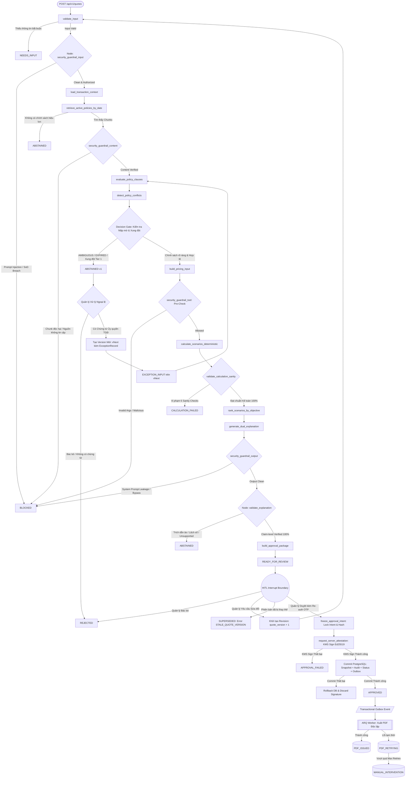
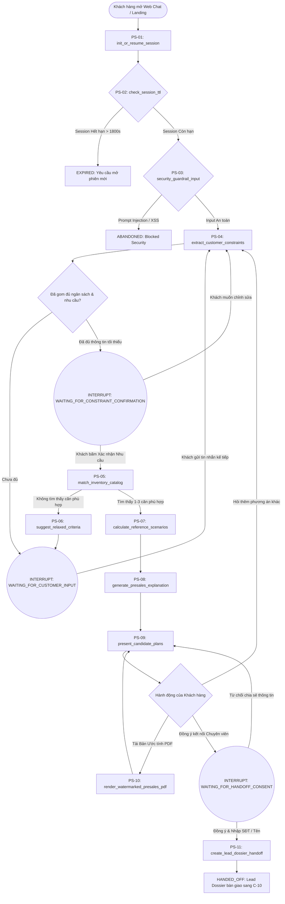
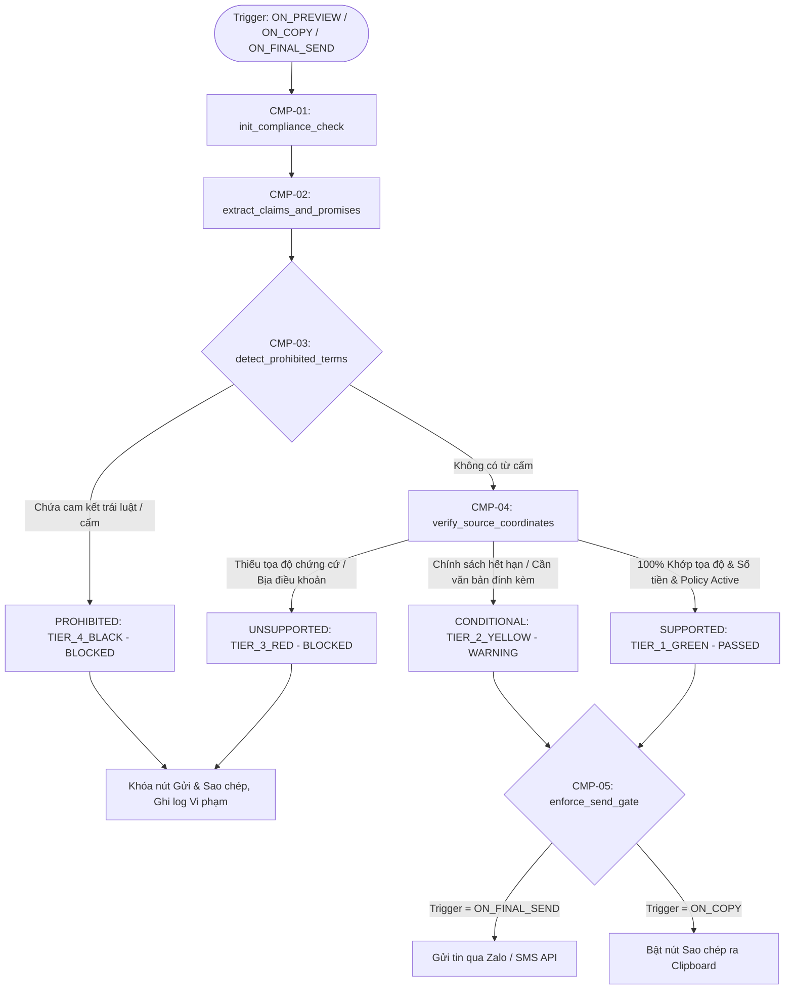

# THIẾT KẾ KỸ THUẬT ĐỒ THỊ MÁY TRẠNG THÁI & ĐIỀU PHỐI AGENT
## DỰ ÁN: PRICEPOLICY AI AGENT – NỀN TẢNG BẢO CHỨNG ĐỊNH GIÁ & QUẢN TRỊ CHÍNH SÁCH BÁN HÀNG VLANDFUTURE
**Mã tài liệu:** TD-4.3 (Technical Design Workstream 4.3)  
**Phiên bản:** 2.2 — Controlled Implementation Baseline & Production-Hardened Orchestration (Post-Critique Round 2 Optimized)  
**Mã sản phẩm:** BDSVLandFuture-06  
**Thuộc bộ đặc tả:** Phase 4 — Technical Design & Engineering Specification  
**Tài liệu tham chiếu chuẩn:**  
- [docs/1.requirement-analysis.md](../1.requirement-analysis.md) (PRD v2.3)  
- [docs/2.product-discovery.md](../2.product-discovery.md) (PD v2.1)  
- [docs/3.architecture-design.md](../3.architecture-design.md) (Architecture v2.2)  
- [docs/0.1.dataRetrievalTech.md](../0.1.dataRetrievalTech.md) (Data Pipeline v2.3)  
- [docs/0.2.financial-calculation-spec.md](../0.2.financial-calculation-spec.md) (FCS v2.6)  
- [docs/4-technical-design/4.1-technical-architecture-runtime-deployment.md](4.1-technical-architecture-runtime-deployment.md) (Architecture Runtime v2.0)  
- [docs/4-technical-design/4.2-domain-data-financial-design.md](4.2-domain-data-financial-design.md) (Domain Data & Financial Design v2.2)  
- [docs/4-technical-design/4.4-api-event-tool-contracts.md](4.4-api-event-tool-contracts.md) (API & Tool Contracts v2.2)  
- [phanbien.md](../phanbien.md) (Báo cáo Phản biện Vòng 2)  
**Tác giả:** Principal AI & Agent Workflow Architect  
**Trạng thái:** **APPROVED FOR CONTROLLED WORKFLOW IMPLEMENTATION & LANGGRAPH IMPLEMENTATION SPIKES**  

---

# 1. MỤC TIÊU & NGUYÊN TẮC THIẾT KẾ STATEGRAPH

Workstream 4.3 đóng vai trò là **Hợp đồng Điều phối Agent (Agentic Orchestration Contract)** xây dựng trên nền tảng **LangGraph StateGraph**.

Hệ thống vận hành như một **Máy trạng thái hữu hạn có nhận thức (Stateful Cognitive Finite State Machine)** với các nguyên tắc kiến trúc kiểm soát sản xuất được chuẩn hóa sau phản biện vòng 2:

1. **Phân tách Độc lập 3 Hệ thống Trạng thái & Sự kiện An ninh (Triple Enum Isolation):**  
   Phân định rạch ròi giữa Vòng đời Báo giá (`QuoteWorkflowStatus`), Trạng thái Phê duyệt (`ApprovalStatus`), và Trạng thái Sinh tệp Bất đồng bộ (`PdfStatus`), kết hợp cùng Sự kiện Bảo mật (`SecurityEvent`). Tuyệt đối không ghép trạng thái và mã lỗi thành một chuỗi (ví dụ: tách rõ `SUPERSEDED` và mã lỗi `STALE_QUOTE_VERSION`).
2. **Khóa chặt Định kiểu Mạnh (Strongly Typed State via Pydantic v2):**  
   Loại bỏ hoàn toàn các dictionary tự do (`Dict[str, Any]`). Mọi input, output tính toán, khuyến nghị và giải trình đều có Pydantic Schema kiểm soát kiểu dữ liệu, ràng buộc biên và schema validation.
3. **Tuân thủ Chuẩn Tài chính Kế toán Bất động sản FCS v2.6:**  
   Toàn bộ luồng toán học tham chiếu phiên bản **FCS v2.6**, sử dụng trường `listed_price_before_tax_vnd` và dynamic rates từ chính sách (VAT, KPBT, trần chiết khấu, `tiebreak_rule_id`).
4. **Bản chất Mật mã học của Phê duyệt (Server Attestation of Manager Approval):**  
   Chữ ký điện tử Ed25519 (RFC 8032) là **Chữ ký Chứng thực Máy chủ Bất đối xứng (Asymmetric Cryptographic Server Attestation)** do KMS/Vault Server Signer phát hành. Nó tạo bằng chứng kiểm toán mật mã học liên kết chặt chẽ danh tính Quản lý, phiên bản báo giá và payload đã chuẩn hóa RFC 8785; không phải chữ ký số cá nhân đại diện pháp lý của cá nhân Quản lý.
5. **Giao dịch Phê duyệt Đóng băng & Phục hồi KMS Side Effect (Atomic Commit with Frozen Intent):**  
   Khóa đóng băng `approval_intent_id`, `approval_payload_hash`, `approval_created_at_frozen` trước khi gọi KMS. Thao tác ký KMS là Pre-commit Side Effect. Nếu DB commit thất bại, chữ ký tạm thời bị hủy bỏ trong bộ nhớ (Orphan Discard), đảm bảo rollback an toàn. Khi client timeout retry với cùng Idempotency Key, hệ thống nhận diện và trả về kết quả đã commit (Idempotent replay).
6. **Xử lý Ngoại lệ Tách biệt Phiên bản (Exception Workflow with Version Increment):**  
   Khi hồ sơ bị dừng ở `ABSTAINED` (V1), việc xử lý ngoại lệ **bắt buộc tạo phiên bản mới (V2)** gắn kèm `ExceptionApprovalRecord` và văn bản ủy quyền của Ban Tổng Giám đốc. Phiên bản V1 giữ nguyên trạng thái `ABSTAINED` làm chứng tích kiểm toán bất biến.
7. **Ranh giới Ngắt HITL Toàn diện (Resume Semantics with Stale Version Guards):**  
   Sử dụng LangGraph `interrupt()`. Hỗ trợ resume token, deadline phê duyệt, kiểm tra xung đột phiên bản cũ (`expected_quote_version == current_quote_version`). Nếu V1 đã bị V2 thay thế, V1 chuyển sang `SUPERSEDED` và từ chối thao tác với lỗi `STALE_QUOTE_VERSION`.
8. **Kiểm chứng Giải trình Đa tầng Cấp Claim (Claim-Level Explanation Verification):**  
   Node `validate_explanation` kiểm tra 5 rào chắn: (1) Clause ID tồn tại; (2) Policy version đang active; (3) Tọa độ tài liệu nguồn (doc_id, doc_hash, page, section); (4) Số tiền khớp 100% với Math Engine; (5) Không có khẳng định thiếu chứng cứ (`UNSUPPORTED`).
9. **Rào chắn An ninh Đa điểm Toàn diện (Multi-Point Security Guardrails):**  
   Bao phủ toàn bộ 4 ranh giới: Input người dùng (`security_guardrail_input`), Nội dung chính sách nguồn (`security_guardrail_content`), Lệnh gọi công cụ (`security_guardrail_tool`), và Đầu ra LLM (`security_guardrail_output`).
10. **Tối ưu hóa Bộ nhớ StateGraph Lean kèm Hash/Version Binding:**  
    AgentState giữ các trường điều phối gọn nhẹ (IDs, Hashes, Status, Metadata). Mọi artifact reference bắt buộc phải gắn liền với `artifact_version` và `artifact_hash` tương ứng để đảm bảo replay chính xác.
11. **Cô lập Đồ thị Tiền Bán hàng (Pre-Sales Advisory StateGraph Isolation):**  
    Pre-Sales vận hành như một StateGraph độc lập (`PreSalesGraph` - C-09) dưới checkpoint namespace `PRE_SALES` (`presales:{tenant_id}:{session_id}`) với session TTL (1800s). Đồ thị tương tác thu thập nhu cầu, lọc giỏ hàng và tính phương án tham khảo với 3 điểm ngắt HITL: `WAITING_FOR_CUSTOMER_INPUT`, `WAITING_FOR_CONSTRAINT_CONFIRMATION`, và `WAITING_FOR_HANDOFF_CONSENT`. Ranh giới kỹ thuật tối thượng: Tuyệt đối không gọi KMS, không sinh chữ ký số, không chuyển sang `APPROVED`, không ghi transactional outbox, và chỉ sinh PDF On-demand Watermark.
12. **Cổng Kiểm soát Tuân thủ Thông điệp Tư vấn (Message Compliance Verification Gate):**  
    Đồ thị `SalesMessageComplianceGraph` (C-11) bảo đảm mọi thông điệp gửi cho khách hàng phải qua cổng kiểm tra `POST /api/v1/compliance/check-message` và cổng phát hành `POST /api/v1/messages/send`. Trạng thái kiểm duyệt gắn chặt với `message_hash` và `policy_version`. Nghiêm cấm gửi nếu trạng thái là `UNSUPPORTED` hoặc `PROHIBITED`.

---

# 2. PHÂN ĐỊNH HỆ THỐNG TRẠNG THÁI NGHIỆP VỤ (STATE ISOLATION)

Hệ thống phân tách thành 6 phân hệ trạng thái độc lập, không bao giờ dùng chung một biến trạng thái:

```text
┌────────────────────────────────────────────────────────────────────────────────────────┐
│ 1. POLICY EVALUATION STATUS (Đánh giá điều kiện từng điều khoản văn bản)               │
│    • ELIGIBLE                 • CONFLICT               • EXPIRED                       │
│    • NOT_ELIGIBLE             • AMBIGUOUS                                              │
├────────────────────────────────────────────────────────────────────────────────────────┤
│ 2. QUOTE WORKFLOW STATUS (Vòng đời hồ sơ báo giá trong Database & StateGraph)          │
│    • DRAFT                    • CALCULATING            • ABSTAINED                     │
│    • NEEDS_INPUT              • CALCULATION_FAILED     • EXCEPTION_INPUT               │
│    • ANALYZING                • READY_FOR_REVIEW       • BLOCKED                       │
│    • APPROVED                 • NEEDS_REVISION         • REJECTED                      │
│    • SUPERSEDED               • REVOKED                                                │
├────────────────────────────────────────────────────────────────────────────────────────┤
│ 3. SUBSIDIARY STATUSES (Phê duyệt HITL & Xuất bản PDF Worker Báo giá Chính thức)      │
│    ApprovalStatus:                                                                     │
│    • NOT_REQUIRED             • PENDING                • ATTESTED (Pre-Commit Valid)   │
│    • APPROVED                 • APPROVAL_FAILED        • REVISION_REQUESTED            │
│    • REJECTED                                                                          │
│    PdfStatus (Quản lý độc lập qua Transactional Outbox Worker):                        │
│    • NOT_REQUESTED            • PENDING                • GENERATING                    │
│    • ISSUED                   • FAILED                 • RETRYING                      │
│    • MANUAL_INTERVENTION                                                               │
├────────────────────────────────────────────────────────────────────────────────────────┤
│ 4. PRE-SALES SESSION & HANDOFF LIFECYCLE (Đồ thị Tư vấn Tiền Bán hàng C-09 & C-10)    │
│    PreSalesSessionStatus:                                                              │
│    • ACTIVE                   • WAITING_FOR_CUSTOMER_INPUT                             │
│    • WAITING_FOR_CONSTRAINT_CONFIRMATION • WAITING_FOR_HANDOFF_CONSENT                 │
│    • HANDED_OFF               • EXPIRED                • ABANDONED                     │
│    LeadDossierStatus:                                                                  │
│    • NEW                      • ASSIGNED               • CONTACTED                     │
│    • QUALIFIED                • CONVERTED_TO_QUOTE     • EXPIRED        • DISQUALIFIED │
├────────────────────────────────────────────────────────────────────────────────────────┤
│ 5. SALES MESSAGE COMPLIANCE STATUS (Kiểm soát Thông điệp Tư vấn C-11 & Cổng F8)       │
│    ComplianceStatus:                                                                   │
│    • DRAFT                    • CHECKING               • SUPPORTED                     │
│    • CONDITIONAL              • UNSUPPORTED            • PROHIBITED                    │
│    • EXPIRED                  • SUPERSEDED                                             │
├────────────────────────────────────────────────────────────────────────────────────────┤
│ 6. SECURITY AUDIT EVENTS & FAILURE CODES                                               │
│    Failure Codes:                                                                      │
│    • STALE_QUOTE_VERSION      • FINANCIAL_SANITY_FAILED • EXPLANATION_UNSUPPORTED       │
│    • POLICY_AMBIGUOUS         • POLICY_EXPIRED          • POLICY_CONFLICT_UNRESOLVED   │
│    • CONSENT_MISSING          • COMPLIANCE_REJECTED     • SESSION_EXPIRED              │
│    Security Events (Ghi nhận vào chuỗi băm Append-Only):                               │
│    • PROMPT_INJECTION_BLOCKED                          • SOURCE_UNTRUSTED_BLOCKED      │
│    • SOD_VIOLATION_BLOCKED                             • TOOL_CALL_BLOCKED             │
│    • OUTPUT_LEAKAGE_BLOCKED                            • UNAUTHORIZED_ACTION_BLOCKED   │
└────────────────────────────────────────────────────────────────────────────────────────┘
```

---

# 3. ĐẶC TẢ CẤU TRÚC AGENT STATE (STRONGLY TYPED PYDANTIC SCHEMAS)

Toàn bộ payload lưu chuyển trong StateGraph được kiểm soát bởi các schema định kiểu nghiêm ngặt:

```python
from __future__ import annotations
from typing import Annotated, Dict, List, Optional, Any, Literal
from pydantic import BaseModel, Field, field_validator
from datetime import date, datetime, timezone
from enum import Enum

# =========================================================
# 1. CANONICAL ENUMS
# =========================================================
class PolicyEvaluationStatus(str, Enum):
    ELIGIBLE = "ELIGIBLE"
    NOT_ELIGIBLE = "NOT_ELIGIBLE"
    CONFLICT = "CONFLICT"
    AMBIGUOUS = "AMBIGUOUS"
    EXPIRED = "EXPIRED"

class QuoteWorkflowStatus(str, Enum):
    DRAFT = "DRAFT"
    NEEDS_INPUT = "NEEDS_INPUT"
    ANALYZING = "ANALYZING"
    EXCEPTION_INPUT = "EXCEPTION_INPUT"
    CALCULATING = "CALCULATING"
    CALCULATION_FAILED = "CALCULATION_FAILED"
    READY_FOR_REVIEW = "READY_FOR_REVIEW"
    NEEDS_REVISION = "NEEDS_REVISION"
    ABSTAINED = "ABSTAINED"
    BLOCKED = "BLOCKED"
    REJECTED = "REJECTED"
    APPROVED = "APPROVED"
    SUPERSEDED = "SUPERSEDED"
    REVOKED = "REVOKED"

class ApprovalStatus(str, Enum):
    NOT_REQUIRED = "NOT_REQUIRED"
    PENDING = "PENDING"
    ATTESTED = "ATTESTED"
    APPROVED = "APPROVED"
    APPROVAL_FAILED = "APPROVAL_FAILED"
    REJECTED = "REJECTED"
    REVISION_REQUESTED = "REVISION_REQUESTED"

class PdfStatus(str, Enum):
    NOT_REQUESTED = "NOT_REQUESTED"
    PENDING = "PENDING"
    GENERATING = "GENERATING"
    ISSUED = "ISSUED"
    FAILED = "FAILED"
    RETRYING = "RETRYING"
    MANUAL_INTERVENTION = "MANUAL_INTERVENTION"

class OptimizationObjective(str, Enum):
    MIN_NET_PRICE = "MIN_NET_PRICE"
    MIN_INITIAL_CASH = "MIN_INITIAL_CASH"
    MIN_MONTHLY_BURDEN = "MIN_MONTHLY_BURDEN"
    MIN_TOTAL_CASH_OUTFLOW = "MIN_TOTAL_CASH_OUTFLOW"
    MAX_BENEFIT_VALUE = "MAX_BENEFIT_VALUE"
    EARLY_HANDOVER = "EARLY_HANDOVER"

class PreSalesSessionStatus(str, Enum):
    ACTIVE = "ACTIVE"
    WAITING_FOR_CUSTOMER_INPUT = "WAITING_FOR_CUSTOMER_INPUT"
    WAITING_FOR_CONSTRAINT_CONFIRMATION = "WAITING_FOR_CONSTRAINT_CONFIRMATION"
    WAITING_FOR_HANDOFF_CONSENT = "WAITING_FOR_HANDOFF_CONSENT"
    HANDED_OFF = "HANDED_OFF"
    EXPIRED = "EXPIRED"
    ABANDONED = "ABANDONED"

class LeadDossierStatus(str, Enum):
    NEW = "NEW"
    ASSIGNED = "ASSIGNED"
    CONTACTED = "CONTACTED"
    QUALIFIED = "QUALIFIED"
    CONVERTED_TO_QUOTE = "CONVERTED_TO_QUOTE"
    EXPIRED = "EXPIRED"
    DISQUALIFIED = "DISQUALIFIED"

class ComplianceStatus(str, Enum):
    DRAFT = "DRAFT"
    CHECKING = "CHECKING"
    SUPPORTED = "SUPPORTED"
    CONDITIONAL = "CONDITIONAL"
    UNSUPPORTED = "UNSUPPORTED"
    PROHIBITED = "PROHIBITED"
    EXPIRED = "EXPIRED"
    SUPERSEDED = "SUPERSEDED"

class ComplianceTier(str, Enum):
    TIER_1_GREEN = "TIER_1_GREEN"
    TIER_2_YELLOW = "TIER_2_YELLOW"
    TIER_3_RED = "TIER_3_RED"
    TIER_4_BLACK = "TIER_4_BLACK"

class ComplianceCheckTrigger(str, Enum):
    ON_PREVIEW = "ON_PREVIEW"
    ON_COPY = "ON_COPY"
    ON_FINAL_SEND = "ON_FINAL_SEND"

class SecurityEventType(str, Enum):
    PROMPT_INJECTION_BLOCKED = "PROMPT_INJECTION_BLOCKED"
    SOURCE_UNTRUSTED_BLOCKED = "SOURCE_UNTRUSTED_BLOCKED"
    TOOL_CALL_BLOCKED = "TOOL_CALL_BLOCKED"
    OUTPUT_LEAKAGE_BLOCKED = "OUTPUT_LEAKAGE_BLOCKED"
    SOD_VIOLATION_BLOCKED = "SOD_VIOLATION_BLOCKED"
    STALE_VERSION_APPROVAL_BLOCKED = "STALE_VERSION_APPROVAL_BLOCKED"
    UNAUTHORIZED_ACTION_BLOCKED = "UNAUTHORIZED_ACTION_BLOCKED"

class ExceptionScope(str, Enum):
    QUOTE_ONLY = "QUOTE_ONLY"
    CUSTOMER_ONLY = "CUSTOMER_ONLY"
    POLICY_SPECIFIC = "POLICY_SPECIFIC"

# =========================================================
# 2. CONTEXT & INPUT MODELS
# =========================================================
class TransactionContext(BaseModel):
    unit_code: str
    customer_id: str
    customer_segment: str = "STANDARD"
    project_id: str
    sales_channel: str
    transaction_date: date
    contract_signing_date: Optional[date] = None
    listed_price_before_tax_vnd: int = Field(gt=0, description="Giá niêm yết căn hộ trước thuế (VNĐ)")
    optimization_objective: OptimizationObjective = OptimizationObjective.MIN_NET_PRICE
    is_simulation: bool = False

class PolicyClauseEvaluation(BaseModel):
    clause_id: str
    policy_id: str
    policy_version: str
    policy_name: str
    clause_title: str
    status: PolicyEvaluationStatus
    evidence_quote: str
    source_chunk_hash: str
    article_reference: str
    discount_rate: float = 0.0
    fixed_discount_vnd: int = 0
    reason: str

class ConflictReport(BaseModel):
    has_conflict: bool = False
    conflict_tier: Optional[Literal["TIER_1_HARD", "TIER_2_CONDITIONAL", "TIER_3_AMBIGUOUS"]] = None
    conflicting_clause_ids: List[str] = Field(default_factory=list)
    is_precedence_resolved: bool = False
    resolved_clause_id: Optional[str] = None
    precedence_rule_id: Optional[str] = None
    explanation: str = ""

# =========================================================
# 3. DETERMINISTIC FINANCIAL ENGINE SCHEMAS (FCS v2.6)
# =========================================================
class PricingCalculationInput(BaseModel):
    quote_id: str
    quote_version: int
    unit_code: str
    transaction_date: date
    listed_price_before_tax_vnd: int = Field(gt=0)
    fixed_discount_vnd: int = Field(default=0, ge=0)
    percentage_discount_rate_sum: float = Field(default=0.0, ge=0.0, le=0.50)
    vat_rate: float = Field(default=0.10, ge=0.0, le=0.20)
    maintenance_fee_rate: float = Field(default=0.02, ge=0.0, le=0.05)
    deposit_amount_vnd: int = Field(default=100000000, ge=0)
    tiebreak_rule_id: str = "TB-RULE-2026-CHUDONG-V1"
    selected_scenarios: List[str] = Field(default_factory=lambda: ["PA-CHUDONG", "PA-NHANH", "PA-VAY"])

class InstallmentDetail(BaseModel):
    installment_no: int
    milestone_name: str
    due_date: Optional[date] = None
    payment_ratio: float
    base_amount_vnd: int
    vat_amount_vnd: int
    maintenance_fee_vnd: int = 0
    total_installment_vnd: int
    deposit_offset_vnd: int = 0
    net_payable_vnd: int

class ScenarioCalculationResult(BaseModel):
    scenario_type: str # 'PA-CHUDONG', 'PA-NHANH', 'PA-VAY'
    scenario_name: str
    net_price_vnd: int
    vat_amount_vnd: int
    maintenance_fee_vnd: int
    total_contract_price_vnd: int
    first_installment_vnd: int
    net_first_installment_vnd: int
    cashflow_schedule: List[InstallmentDetail] = Field(default_factory=list)
    applied_discount_rate: float = 0.0
    applied_fixed_discount_vnd: int = 0
    calculation_trace_hash: str

class PricingCalculationOutput(BaseModel):
    quote_id: str
    quote_version: int
    calculated_at: datetime = Field(default_factory=lambda: datetime.now(timezone.utc))
    scenarios: List[ScenarioCalculationResult]
    sanity_validation_passed: bool
    sanity_checks_log: List[str] = Field(default_factory=list)

# =========================================================
# 4. RECOMMENDATION & TRANSPARENCY EXPLANATION SCHEMAS
# =========================================================
class SourceCoordinate(BaseModel):
    document_id: str
    document_hash: str
    page_number: int
    section_id: str

class EvidenceBackedClaim(BaseModel):
    claim_id: str
    text: str
    claim_type: Literal["POLICY_REASON", "EXCLUSION_REASON", "FINANCIAL_COMPARISON"] = "POLICY_REASON"
    policy_id: str
    policy_version: str
    clause_refs: List[str]
    source_coordinates: List[SourceCoordinate]
    amount_refs: List[str]
    referenced_numeric_value_vnd: Optional[int] = None
    support_status: Literal["SUPPORTED", "UNSUPPORTED"] = "SUPPORTED"

class DualExplanation(BaseModel):
    why_recommended: List[EvidenceBackedClaim]
    why_not_alternatives: List[EvidenceBackedClaim]
    numeric_consistency_hash: str
    source_citation_hash: str
    explanation_model_version: str
    validation_status: Literal["PASSED", "FAILED"] = "PASSED"

class RecommendationResult(BaseModel):
    recommended_scenario_type: str
    objective_matched: OptimizationObjective
    ranking_summary: List[Dict[str, Any]]
    is_tie_break_applied: bool = False
    tiebreak_rule_id: Optional[str] = None
    tie_break_reason: Optional[str] = None

# =========================================================
# 5. GOVERNANCE, HITL & EXCEPTION SCHEMAS
# =========================================================
class ExceptionApprovalRecord(BaseModel):
    exception_id: str
    quote_id: str
    target_quote_version: int = Field(description="Phiên bản mới (vNext) được áp dụng ngoại lệ")
    based_on_abstained_version: int = Field(description="Phiên bản bị dừng ban đầu")
    exception_scope: ExceptionScope = ExceptionScope.QUOTE_ONLY
    reason: str
    approver_id: str
    authority_document_id: str
    authority_document_hash: str
    effective_from: date
    effective_to: date
    override_policy_clause_id: Optional[str] = None
    created_at: datetime = Field(default_factory=lambda: datetime.now(timezone.utc))
    server_attestation_id: Optional[str] = None

class HumanReviewDecision(BaseModel):
    decision: Literal["APPROVE", "REQUEST_REVISION", "REJECT", "SUBMIT_EXCEPTION"]
    actor_id: str
    actor_role: str
    decision_notes: Optional[str] = None
    server_attestation_signature: Optional[str] = None
    exception_record: Optional[ExceptionApprovalRecord] = None
    resume_token: str
    timestamp: datetime = Field(default_factory=lambda: datetime.now(timezone.utc))

# =========================================================
# 6. MASTER LANGGRAPH AGENT STATE (LEAN ORCHESTRATION MODEL)
# =========================================================
class AgentState(BaseModel):
    # Context & Core Identifiers
    quote_id: str
    quote_version: int = 1
    trace_id: str
    checkpoint_id: Optional[str] = None
    transaction_context: TransactionContext
    
    # Security Guardrail State
    security_event: Optional[SecurityEventType] = None
    security_reason: Optional[str] = None
    
    # Retrieval & Policy Evaluation
    retrieved_policy_ids: List[str] = Field(default_factory=list)
    policy_snapshot_id: Optional[str] = None
    policy_snapshot_hash: Optional[str] = None
    policy_clauses: List[PolicyClauseEvaluation] = Field(default_factory=list)
    conflict_report: Optional[ConflictReport] = None
    
    # Deterministic Financial Calculation References & Summary
    calculation_input: Optional[PricingCalculationInput] = None
    calculation_output_ref: Optional[str] = None       # ID trong bảng quote_calculations
    calculation_output_hash: Optional[str] = None      # Hash toàn vẹn của kết quả tính
    calculation_summary: Optional[List[Dict[str, Any]]] = None # Summary gọn nhẹ
    
    # Recommendation & Transparency Explanation
    recommendation_record: Optional[RecommendationResult] = None
    dual_explanation: Optional[DualExplanation] = None
    explanation_id: Optional[str] = None
    explanation_hash: Optional[str] = None
    explanation_validation_passed: bool = False
    
    # Governance, Risk & Approval Package
    risk_flags: List[str] = Field(default_factory=list)
    manager_review_decision: Optional[HumanReviewDecision] = None
    exception_record: Optional[ExceptionApprovalRecord] = None
    revision_count: int = 0
    approval_deadline: Optional[datetime] = None
    
    # Frozen Approval Intent (Chống Orphan Crash)
    approval_intent_id: Optional[str] = None
    approval_payload_hash: Optional[str] = None
    approval_created_at_frozen: Optional[datetime] = None
    
    # Cryptographic Attestation & Audit Trail
    canonical_payload_hash: Optional[str] = None
    previous_audit_event_hash: Optional[str] = None
    server_attestation_signature: Optional[str] = None
    
    # Three-Tier Lifecycle Tracking
    workflow_status: QuoteWorkflowStatus = QuoteWorkflowStatus.DRAFT
    approval_status: ApprovalStatus = ApprovalStatus.NOT_REQUIRED
    pdf_status: PdfStatus = PdfStatus.NOT_REQUESTED
    
    # Error & Recovery Diagnostics
    failure_stage: Optional[str] = None
    failure_code: Optional[str] = None
    error_message: Optional[str] = None
    
    # Audit Timestamp
    updated_at: datetime = Field(default_factory=lambda: datetime.now(timezone.utc))

# =========================================================
# 7. PRE-SALES ADVISORY & COMPLIANCE SCHEMAS (C-09, C-10, C-11)
# =========================================================
class CustomerConsent(BaseModel):
    consent_id: str
    session_id: str
    channel: str = "WEB_CHAT"
    agreed_terms: bool = True
    agreed_at: datetime = Field(default_factory=lambda: datetime.now(timezone.utc))
    ip_hash: str
    user_agent_hash: str
    consent_type: Literal["EXPLICIT_CHAT_OPTIN", "FORM_SUBMIT"] = "EXPLICIT_CHAT_OPTIN"

class CustomerConstraint(BaseModel):
    constraint_id: str
    session_id: str
    budget_max_vnd: Optional[int] = None
    initial_cash_vnd: Optional[int] = None
    monthly_income_vnd: Optional[int] = None
    monthly_debt_capacity_vnd: Optional[int] = None
    preferred_bedrooms: Optional[int] = None
    preferred_orientation: Optional[str] = None
    target_timeline_months: Optional[int] = None
    optimization_objective: OptimizationObjective = OptimizationObjective.MIN_INITIAL_CASH
    confirmed_by_customer: bool = False
    confirmed_at: Optional[datetime] = None

class PreSalesPlan(BaseModel):
    plan_id: str
    session_id: str
    unit_code: str
    scenario_type: str # 'PA-CHUDONG', 'PA-NHANH', 'PA-VAY'
    estimated_net_price_vnd: int
    estimated_initial_outflow_vnd: int
    estimated_monthly_payment_vnd: int
    matched_features: List[str] = Field(default_factory=list)
    fit_score: float = 0.0 # 0.0 - 1.0
    watermark_text: str = "BẢN ƯỚC TÍNH THAM KHẢO TIỀN BÁN HÀNG - KHÔNG PHẢI BÁO GIÁ CHÍNH THỨC"
    created_at: datetime = Field(default_factory=lambda: datetime.now(timezone.utc))

class LeadDossier(BaseModel):
    dossier_id: str
    session_id: str
    customer_name: Optional[str] = None
    customer_phone_masked: Optional[str] = None
    channel: str = "PRE_SALES_CHAT"
    assigned_sales_id: Optional[str] = None
    status: LeadDossierStatus = LeadDossierStatus.NEW
    dossier_summary: Dict[str, Any] = Field(default_factory=dict)
    key_constraints: CustomerConstraint
    recommended_plans: List[PreSalesPlan] = Field(default_factory=list)
    sla_deadline: datetime
    deduplication_key: str
    created_at: datetime = Field(default_factory=lambda: datetime.now(timezone.utc))

class PreSalesState(BaseModel):
    # Identifiers & Isolation
    session_id: str
    tenant_id: str = "DEFAULT"
    thread_id: str # format: presales:{tenant_id}:{session_id}
    checkpoint_namespace: Literal["PRE_SALES"] = "PRE_SALES"
    session_ttl_seconds: int = 1800
    resume_token_hash: Optional[str] = None
    
    # Dialog & Message History
    messages: List[Dict[str, Any]] = Field(default_factory=list)
    turn_count: int = 0
    max_turns: int = 50
    
    # Constraints & Preferences
    customer_constraints: Optional[CustomerConstraint] = None
    constraints_confirmed: bool = False
    
    # Unit Exploration & Uncommitted Plans
    matched_unit_codes: List[str] = Field(default_factory=list)
    candidate_plans: List[PreSalesPlan] = Field(default_factory=list)
    selected_plan: Optional[PreSalesPlan] = None
    pdf_watermarked_url: Optional[str] = None
    
    # Customer Consent & Lead Dossier Handoff
    customer_consent: Optional[CustomerConsent] = None
    lead_dossier_id: Optional[str] = None
    handoff_status: Literal["NOT_REQUESTED", "CONSENTED", "HANDED_OFF", "REJECTED"] = "NOT_REQUESTED"
    
    # Lifecycle & Guardrails
    session_status: PreSalesSessionStatus = PreSalesSessionStatus.ACTIVE
    security_event: Optional[SecurityEventType] = None
    risk_notes: Optional[str] = None
    last_interaction_at: datetime = Field(default_factory=lambda: datetime.now(timezone.utc))

class SalesMessageComplianceState(BaseModel):
    message_id: str
    tenant_id: str = "DEFAULT"
    session_id: Optional[str] = None
    quote_id: Optional[str] = None
    quote_version: Optional[int] = None
    channel: str = "ZALO" # ZALO, SMS, EMAIL, CHAT
    
    raw_message_text: str
    message_hash: str # SHA256(raw_message_text)
    
    # Trigger context
    trigger: ComplianceCheckTrigger = ComplianceCheckTrigger.ON_FINAL_SEND
    
    # Compliance Evaluation
    compliance_status: ComplianceStatus = ComplianceStatus.DRAFT
    compliance_tier: Optional[ComplianceTier] = None
    verified_policy_version: Optional[str] = None
    
    # Evidence & Claim Verification
    extracted_claims: List[Dict[str, Any]] = Field(default_factory=list)
    unsupported_claims: List[str] = Field(default_factory=list)
    prohibited_terms: List[str] = Field(default_factory=list)
    
    # Decision Gate
    action_allowed: Literal["SEND_ALLOWED", "COPY_ALLOWED", "BLOCKED"] = "BLOCKED"
    rejection_reason: Optional[str] = None
    checked_at: datetime = Field(default_factory=lambda: datetime.now(timezone.utc))
```

---

# 4. SƠ ĐỒ ĐỒ THỊ MÁY TRẠNG THÁI LANGGRAPH (HARDENED STATEGRAPH WORKFLOWS)

### 4.1 ĐỒ THỊ BÁO GIÁ CHÍNH THỨC (OFFICIAL QUOTE STATEGRAPH - C-01)



---

### 4.2 ĐỒ THỊ TƯ VẤN TIỀN BÁN HÀNG (PRE-SALES ADVISORY STATEGRAPH - C-09)

Vận hành độc lập dưới Checkpoint Namespace `PRE_SALES`, lưu vết phiên theo định dạng `presales:{tenant_id}:{session_id}`, hỗ trợ TTL 1800s và 3 điểm ngắt HITL:



---

### 4.3 ĐỒ THỊ KIỂM SOÁT TUÂN THỦ THÔNG ĐIỆP TƯ VẤN (SALES MESSAGE COMPLIANCE GRAPH - C-11)

Bảo đảm mọi thông điệp gửi cho khách hàng phải qua cổng kiểm duyệt `POST /api/v1/compliance/check-message` và cổng phát hành `POST /api/v1/messages/send`:



---

# 5. CHI TIẾT CÁC NODE TRONG ĐỒ THỊ LANGGRAPH (NODE SPECIFICATIONS)

### 5.1 Các Node trong Đồ thị Báo giá Chính thức (QuoteGraph C-01)

| Mã Node | Tên Node Thực thi | Phân loại Node | Đầu vào (Inputs) | Hành vi Xử lý Cốt lõi | Đầu ra (Outputs) & Trạng thái |
| :--- | :--- | :--- | :--- | :--- | :--- |
| **N-01** | `validate_input` | Pure (Deterministic) | Request Payload | Kiểm tra các trường bắt buộc (`unit_code`, `transaction_date`, `customer_id`). Nếu thiếu ngày giao dịch $\rightarrow$ Dừng tại `NEEDS_INPUT`. | `TransactionContext`, `workflow_status` |
| **N-02** | `security_guardrail_input` | Guardrail | Context, Request Notes | Quét prompt injection trong ghi chú tư vấn, xác thực quyền hạn (SoD: Sales không được tự duyệt). Nếu vi phạm $\rightarrow$ `BLOCKED`. | `security_event`, `risk_flags` |
| **N-03** | `load_transaction_context` | Pure Lookup | `unit_code` | Đọc thông tin căn hộ từ RAM In-Memory Cache ($< 0.1\text{ms}$): `listed_price_before_tax_vnd`, diện tích thông thủy, tầng, trạng thái căn (`AVAILABLE`). | Complete Context |
| **N-04** | `retrieve_active_policies` | Pure Lookup | `transaction_date`, `project_id` | Truy vấn Supabase Policy Registry & pgvector tìm các văn bản có hiệu lực tại ngày GD (`Time-Travel SQL Join`). Truy xuất các Policy Chunks ngữ nghĩa kèm metadata tọa độ nguồn. | `retrieved_policy_ids`, `policy_snapshot_hash`, Chunks |
| **N-05** | `security_guardrail_content`| Guardrail | Retrieved Chunks | Quét chống Indirect Prompt Injection trong tài liệu chính sách hoặc chunk vector. Nếu phát hiện lệnh bypass $\rightarrow$ `BLOCKED`. | Content Safety Verified |
| **N-06** | `evaluate_policy_clauses`| Deterministic / Reasoner | Context, Chunks, Exception Record | Đánh giá từng điều khoản chính sách theo 5 trạng thái: `ELIGIBLE`, `NOT_ELIGIBLE`, `CONFLICT`, `AMBIGUOUS`, `EXPIRED`. Trích dẫn câu văn bản gốc và băm nguồn `source_chunk_hash`. | `List[PolicyClauseEvaluation]` |
| **N-07** | `detect_policy_conflicts` | Pure Logic | Clauses đã thẩm định | Tra cứu ma trận xung đột (`mutual_exclusion_rules`). Phân loại xung đột Cấp 1, Cấp 2, Cấp 3. Kiểm tra xem có `precedence_rule` hợp lệ không. | `ConflictReport` |
| **N-08** | `safe_decision_gate` | Guardrail Gate | Evaluations & Conflict Report | **Cổng Rẽ nhánh An toàn (Safe Abstention Gate):** Nếu phát hiện bất kỳ điều khoản nào `AMBIGUOUS`, `EXPIRED`, hoặc Xung đột Cấp 1 không có Precedence $\rightarrow$ Ngắt ngay sang `ABSTAINED`. | `workflow_status = ABSTAINED` hoặc tiếp tục |
| **N-09** | `build_pricing_input` | Pure Logic | Eligible Clauses, Context | Đóng gói payload đầu vào cho Math Engine: Lấy đúng `listed_price_before_tax_vnd`, tính tổng tỷ lệ chiết khấu $\sum D_{\%}$, chiết khấu cố định $D_{\text{fixed}}$, nạp tỷ lệ VAT, KPBT và `tiebreak_rule_id`. | `PricingCalculationInput` |
| **N-10A**| `security_guardrail_tool` | Guardrail | Tool Call Request | Kiểm tra tool allowlist và thẩm định chặt chẽ argument bounds (cấm truyền tham số ngoài phạm vi, kiểm tra SQLi/Command Injection). | Tool Safety Verified |
| **N-10B**| `calculate_scenarios` | Pure (Deterministic) | `PricingCalculationInput` | Gọi Python Math Worker độc lập mô phỏng đồng thời 3 phương án dòng tiền (`PA-CHUDONG`, `PA-NHANH`, `PA-VAY`) theo chuẩn **FCS v2.6**. | `PricingCalculationOutput`, `calculation_output_hash` |
| **N-11** | `validate_calculation` | Sanity Guard | `PricingCalculationOutput` | Thực thi 6 bài kiểm tra Sanity Kế toán: (1) Giá Net $> 0$; (2) Thuế VAT tính đúng tỷ lệ trên Giá Net; (3) KPBT tính đúng trên Giá Net; (4) Tổng các đợt $\equiv P_{\text{contract}}$; (5) Không làm tròn số trung gian; (6) Đợt 1 nộp đúng sau cấn trừ cọc. | `sanity_validation_passed` |
| **N-12** | `rank_scenarios` | Pure (Deterministic) | Scenarios, Objective | Xếp hạng 3 phương án dựa trên 6 mục tiêu tối ưu chuẩn tắc (`MIN_NET_PRICE`, `MIN_INITIAL_CASH`, `MIN_MONTHLY_BURDEN`, `MIN_TOTAL_CASH_OUTFLOW`, `MAX_BENEFIT_VALUE`, `EARLY_HANDOVER`). Áp dụng Tie-Break tất định. | `RecommendationResult` |
| **N-13** | `generate_explanation` | LLM Reasoner | Chunks, Calculations | LLM Reasoner biên soạn giải trình minh bạch hai chiều: *Why* (tại sao chọn phương án đề xuất) và *Why-not* (tại sao các phương án còn lại không tối ưu). Trả về danh sách `EvidenceBackedClaim` có tọa độ nguồn. | `DualExplanation` (Draft) |
| **N-14A**| `security_guardrail_output`| Guardrail | LLM Generated Text | Quét kiểm tra rò rỉ system prompt, chỉ thị nội bộ hoặc câu từ gây hiểu lầm cam kết pháp lý ngoài chính sách. Nếu vi phạm $\rightarrow$ `BLOCKED`. | Output Clean Verified |
| **N-14B**| `validate_explanation` | Guardrail Gate | `DualExplanation`, Chunks, Calculations | **Kiểm chứng Giải trình Cấp Claim:** (1) Clause ID tồn tại; (2) Policy version active; (3) Tọa độ tài liệu nguồn (doc_id, doc_hash, page, section); (4) Số tiền khớp 100% với Math Engine; (5) Gắn cờ `UNSUPPORTED` nếu thiếu chứng cứ. Nếu có lỗi $\rightarrow$ `ABSTAINED`. | `explanation_validation_passed` |
| **N-15** | `build_approval_package`| Pure Logic | Toàn bộ State | Đóng gói hồ sơ thẩm duyệt chuẩn bị cho HITL: Bảng đối đầu 3 phương án, Cờ cảnh báo rủi ro (Đỏ/Vàng/Xanh), Bảng giải trình Why/Why-not. Chuyển trạng thái sang `READY_FOR_REVIEW`. | `READY_FOR_REVIEW` |
| **N-16** | `interrupt_human_review`| Interrupt Boundary | Quyết định của Quản lý | **Ranh giới Ngắt (Interrupt Boundary):** LangGraph tạm dừng thực thi, lưu checkpoint vào PostgreSQL. Kiểm tra resume token, deadline, và stale quote version. | `HumanReviewDecision` |
| **N-17** | `create_new_quote_revision`| Pure State Mutation | Revision Notes | Khi Quản lý yêu cầu điều chỉnh: Đánh dấu version cũ là `SUPERSEDED`, tạo `quote_version = version + 1`, vô hiệu hóa cache cũ nhưng bảo toàn snapshot cũ, quay lại chạy lại từ `validate_input`. | `quote_version + 1`, `NEEDS_REVISION` |
| **N-18** | `create_exception_version` | Pure State Mutation | Exception Record | Tiếp nhận chứng từ ủy quyền của TGĐ: Giữ nguyên V1 ở trạng thái `ABSTAINED`, tạo mới V2 (`quote_version = 2`) gắn kèm `ExceptionApprovalRecord`, chuyển sang `evaluate_policy_clauses` của V2. | `vNext`, `EXCEPTION_INPUT` |
| **N-19A**| `freeze_approval_intent` | Deterministic Pre-Check| Manager Decision, State | Đóng băng cố định `approval_intent_id`, `approval_payload_hash = SHA256(canonical_json)` và `approval_created_at_frozen` trước khi gọi KMS. | `approval_intent_id`, Payload Hash |
| **N-19B**| `request_server_attestation`| Pre-Commit Side Effect | Frozen Intent, Manager OTP | Xác thực OTP của Quản lý, gọi KMS Server Signer ký số Ed25519 (RFC 8032) trên hash đã đóng băng. Nếu KMS timeout $\rightarrow$ `APPROVAL_FAILED`. | `server_attestation_signature`, `ATTESTED` |
| **N-20** | `commit_atomic_transaction`| Database Side Effect | All Evidence & Attestation | Mở một PostgreSQL Transaction duy nhất: (1) Lưu Snapshot; (2) Ghi `quote_audit_events` (chuỗi băm liên tục); (3) Cập nhật trạng thái `APPROVED`; (4) Chèn sự kiện vào `transactional_outbox`. Nếu DB fail $\rightarrow$ Discard signature. | `APPROVED`, `approval_status = APPROVED` |

---

### 5.2 Các Node trong Đồ thị Tư vấn Tiền Bán hàng (PreSalesGraph C-09)

| Mã Node | Tên Node Thực thi | Phân loại Node | Đầu vào (Inputs) | Hành vi Xử lý Cốt lõi | Đầu ra (Outputs) & Trạng thái |
| :--- | :--- | :--- | :--- | :--- | :--- |
| **PS-01** | `init_or_resume_session` | Session Lifecycle | `session_id`, `resume_token` | Khởi tạo phiên mới hoặc tải state từ checkpoint namespace `PRE_SALES`. Cấp phát `session_id` và sinh `resume_token_hash`. | `PreSalesState`, `session_status = ACTIVE` |
| **PS-02** | `check_session_ttl` | Session Guard | `last_interaction_at`, `TTL` | Kiểm tra thời gian không hoạt động. Nếu $> 1800\text{s}$ (30 phút) $\rightarrow$ Đóng phiên, chuyển sang `EXPIRED`. | `is_valid_ttl`, `EXPIRED` |
| **PS-03** | `security_guardrail_input` | Guardrail | User Chat Message | Quét Prompt Injection, Jailbreak, HTML/JS XSS trong tin nhắn của khách hàng. Nếu độc hại $\rightarrow$ `ABANDONED`. | Clean Message / Blocked |
| **PS-04** | `extract_customer_constraints` | LLM Extractor | Chat History, Message | Trích xuất có cấu trúc: Ngân sách tối đa, vốn tự có ban đầu, thu nhập hàng tháng, số phòng ngủ, mục tiêu ưu tiên. Kiểm tra xem đã đủ thông tin tối thiểu chưa. | `CustomerConstraint`, `has_minimum_constraints` |
| **PS-05** | `match_inventory_catalog` | Pure Query (Read-Only)| Constraints | Truy vấn kho căn hộ (Read-Only): Lọc căn hộ phù hợp với ngân sách và phòng ngủ. Giới hạn trả về 1-3 căn tối ưu nhất. | `matched_unit_codes` |
| **PS-06** | `suggest_relaxed_criteria` | LLM Reasoner | Constraints, Inventory Stats | Khi không có căn phù hợp: Giải thích lý do và gợi ý nới lỏng ngân sách ($+5\%$) hoặc chuyển sang loại căn lân cận. | Gợi ý phản hồi tương tác |
| **PS-07** | `calculate_reference_scenarios` | Pure Math (Read-Only) | Units, Constraints | Gọi Pricing Engine tính toán 3 phương án tham khảo cho căn đã chọn (chưa chốt giao dịch chính thức). | `List[PreSalesPlan]` |
| **PS-08** | `generate_presales_explanation` | LLM Reasoner | Reference Plans, Constraints | Soạn thảo phản hồi giải thích dễ hiểu, trực quan, phù hợp với tâm lý khách hàng mua nhà. | Markdown Chat Response |
| **PS-09** | `present_candidate_plans` | Pure Logic | State, Plans | Hiển thị bảng so sánh phương án, đính kèm nút "Tải Bản ước tính PDF" và nút "Kết nối Chuyên viên tư vấn". | Chat UI Component Payload |
| **PS-10** | `render_watermarked_presales_pdf` | Synchronous PDF Worker | Selected Plan, Timestamp | Kết xuất PDF tham khảo tức thời ($< 1.5\text{s}$) kèm Watermark chìm bắt buộc: `BẢN ƯỚC TÍNH THAM KHẢO TIỀN BÁN HÀNG - KHÔNG PHẢI BÁO GIÁ CHÍNH THỨC`. Tuyệt đối không có chữ ký số KMS. | `pdf_watermarked_url` |
| **PS-11** | `create_lead_dossier_handoff` | Integration / Handoff | State, Verified Consent | Xác thực có `CustomerConsent` hợp lệ (kèm ip_hash, user_agent_hash) $\rightarrow$ Khởi tạo `LeadDossier` (C-10), tính `sla_deadline = now + 15m`, gán cho Sales Agent. | `lead_dossier_id`, `session_status = HANDED_OFF` |

---

### 5.3 Các Node trong Đồ thị Kiểm soát Tuân thủ Thông điệp (SalesMessageComplianceGraph C-11)

| Mã Node | Tên Node Thực thi | Phân loại Node | Đầu vào (Inputs) | Hành vi Xử lý Cốt lõi | Đầu ra (Outputs) & Trạng thái |
| :--- | :--- | :--- | :--- | :--- | :--- |
| **CMP-01**| `init_compliance_check` | Pure Deterministic | Message Text, Quote Ref, Channel| Chuẩn hóa văn bản, tính `message_hash = SHA256(raw_text)`, kiểm tra phiên bản báo giá liên kết và chính sách áp dụng. | Initial Compliance State, `CHECKING` |
| **CMP-02**| `extract_claims_and_promises` | NLP / LLM Extractor | Raw Message Text | Bóc tách toàn bộ các phát biểu khẳng định về: Tỷ lệ chiết khấu, số tiền giảm giá, thời hạn thanh toán, ân hạn nợ gốc, cam kết quà tặng/lãi suất. | `List[ExtractedClaim]` |
| **CMP-03**| `detect_prohibited_terms` | Guardrail / Rule Engine | Raw Text, Claim List | Đối chiếu danh mục từ khóa cấm / cam kết pháp lý trái luật (ví dụ: "Cam kết chắc chắn lời 20%", "Miễn phí quản lý trọn đời không điều kiện"). Nếu có $\rightarrow$ `PROHIBITED` (`TIER_4_BLACK`). | Prohibited Term Result |
| **CMP-04**| `verify_source_coordinates` | Verification Gate | Claims, Quote Snapshot, Policies| Đối chiếu từng Claim với `SourceCoordinate` và số tiền trong snapshot báo giá: (1) Số tiền khớp 100%; (2) Có điều khoản chính sách bảo chứng; (3) Chính sách còn hiệu lực. Nếu bịa $\rightarrow$ `UNSUPPORTED` (`TIER_3_RED`); nếu chính sách gần hết hạn $\rightarrow$ `CONDITIONAL` (`TIER_2_YELLOW`); nếu chuẩn $100\%$ $\rightarrow$ `SUPPORTED` (`TIER_1_GREEN`). | `ComplianceStatus`, `ComplianceTier` |
| **CMP-05**| `enforce_send_gate` | Security Enforcement Gate | Compliance Result, Trigger | Kiểm tra điều kiện: Chỉ cho phép phát hành (`SEND_ALLOWED`) hoặc sao chép (`COPY_ALLOWED`) nếu trạng thái là `SUPPORTED` hoặc `CONDITIONAL`. Nếu `UNSUPPORTED` hoặc `PROHIBITED` $\rightarrow$ Khóa chặn ở tầng backend, trả lỗi `403 Forbidden`. | `action_allowed`, Enforced Result |

---

# 6. MA TRẬN CHUYỂN DỊCH TRẠNG THÁI TOÀN DIỆN (STATE TRANSITION MATRIX)

### 6.1 Ma trận Chuyển dịch Hồ sơ Báo giá Chính thức (Quote Workflow)

| Trạng thái Hiện tại | Sự kiện Kích hoạt | Điều kiện Bảo vệ (Guard Conditions) | Trạng thái Tiếp theo | Tác dụng Phụ (Side Effects) | Xử lý Thất bại (Failure Fallback) |
| :--- | :--- | :--- | :--- | :--- | :--- |
| `DRAFT` | `VALIDATE_INPUT` | Thiếu `transaction_date` hoặc `unit_code` | `NEEDS_INPUT` | Phản hồi yêu cầu bổ sung thông tin | Chờ user input mới |
| `DRAFT` | `VALIDATE_INPUT` | Đầy đủ thông tin bắt buộc | `ANALYZING` | Ghi audit log `VALIDATION_STARTED` | Exception $\rightarrow$ `BLOCKED` |
| `ANALYZING` | `CHECK_SECURITY` | Phát hiện Prompt Injection, SoD Breach, Tool/Output Leak | `BLOCKED` | Ghi log `SECURITY_EVENT`, chặn truy cập | Báo cáo an ninh |
| `ANALYZING` | `DETECT_SAFETY` | Policy hết hạn HOẶC Xung đột Cấp 1 HOẶC Mập mờ | `ABSTAINED` | Ghi Audit Event `ABSTENTION_TRIGGERED`, bật cờ Đỏ; version hiện tại đóng băng bất biến | Chờ thẩm định ngoại lệ |
| `ANALYZING` | `PROCEED_CALC` | Chính sách rõ ràng & Hợp lệ $100\%$ | `CALCULATING` | Khởi tạo payload `PricingCalculationInput` | Lỗi mapping $\rightarrow$ `CALCULATION_FAILED` |
| `CALCULATING` | `RUN_MATH` | Vi phạm Sanity Checks Kế toán | `CALCULATION_FAILED` | Ghi nhận nguyên nhân vi phạm (Sanity Log) | Báo cáo lỗi kỹ thuật |
| `CALCULATING` | `RUN_MATH` | Vượt qua 100% 6 bài Sanity Checks FCS v2.6 | `READY_FOR_REVIEW` | Đóng gói Approval Package, kích hoạt `interrupt()` | Lỗi đóng gói $\rightarrow$ `CALCULATION_FAILED` |
| `READY_FOR_REVIEW` | `MANAGER_REVISION`| Quản lý gửi yêu cầu chỉnh sửa | `NEEDS_REVISION` | Version cũ đánh dấu `SUPERSEDED`, tạo `quote_version + 1`, quay lại `validate_input` | Giữ nguyên version cũ |
| `READY_FOR_REVIEW` | `MANAGER_REJECT` | Quản lý bấm Bác bỏ | `REJECTED` | Đóng hồ sơ, cập nhật trạng thái DB | Khóa vĩnh viễn |
| `READY_FOR_REVIEW` | `CHECK_STALE_VER` | Hồ sơ đã bị thay thế bởi version mới hơn | `SUPERSEDED` | Từ chối thao tác, trả lỗi `STALE_QUOTE_VERSION` | Khóa thao tác trên version cũ |
| `READY_FOR_REVIEW` | `MANAGER_APPROVE` | Quản lý Re-auth hợp lệ + SoD hợp lệ | `APPROVED` | KMS Server Attestation, commit snapshot & outbox | Lỗi KMS $\rightarrow$ `APPROVAL_FAILED`; Lỗi DB $\rightarrow$ Discard Sig |
| `ABSTAINED` (V1) | `SUBMIT_EXCEPTION`| Quản lý đính kèm chứng từ ủy quyền TGĐ | `EXCEPTION_INPUT` (V2)| Tạo mới V2 (`quote_version = 2`), V1 giữ nguyên `ABSTAINED` bất biến | Thiếu chứng từ $\rightarrow$ Từ chối |
| `EXCEPTION_INPUT` (V2)| `REVALIDATE` | Có đầy đủ chứng từ thẩm quyền hợp lệ | `ANALYZING` | Đánh giá lại điều khoản của V2 theo luật ưu tiên | Không hợp lệ $\rightarrow$ `REJECTED` |
| `APPROVED` | `TRIGGER_OUTBOX` | Outbox Poller phát hiện sự kiện mới | `PDF_PENDING` | Đẩy tác vụ sang Redis/ARQ Worker | Worker timeout $\rightarrow$ `PDF_RETRYING` |
| `PDF_PENDING` | `WORKER_PROCESS` | Đọc Snapshot, kết xuất PDF, chèn QR SHA-256 | `PDF_ISSUED` | Lưu file vào Storage, cập nhật `pdf_status = ISSUED` | Lỗi render $\rightarrow$ `PDF_FAILED` |
| `PDF_FAILED` | `RETRY_EXHAUSTED`| Đã thử lại 5 lần không thành công | `MANUAL_INTERVENTION`| Gửi cảnh báo Admin can thiệp thủ công | Báo động DevOps |

---

### 6.2 Ma trận Chuyển dịch Trạng thái Phiên Tư vấn Tiền Bán hàng (Pre-Sales Session)

| Trạng thái Hiện tại | Sự kiện Kích hoạt | Điều kiện Bảo vệ (Guard Conditions) | Trạng thái Tiếp theo | Tác dụng Phụ (Side Effects) | Xử lý Thất bại (Failure Fallback) |
| :--- | :--- | :--- | :--- | :--- | :--- |
| `ACTIVE` | `USER_MESSAGE` | Chưa đủ thông tin ngân sách & nhu cầu căn | `WAITING_FOR_CUSTOMER_INPUT` | Gọi `interrupt()`, lưu checkpoint `PRE_SALES` | Chờ tin nhắn tiếp theo |
| `ACTIVE` | `USER_MESSAGE` | Đã gom đủ thông tin tối thiểu | `WAITING_FOR_CONSTRAINT_CONFIRMATION` | Hiển thị tóm tắt ràng buộc, gọi `interrupt()` | Chờ khách bấm xác nhận |
| `WAITING_FOR_CONSTRAINT_CONFIRMATION`| `CUSTOMER_CONFIRM` | Khách bấm "Xác nhận đúng nhu cầu" | `ACTIVE` | Kích hoạt tìm kiếm giỏ hàng và tính phương án tham khảo | Lỗi lọc căn $\rightarrow$ Gợi ý nới tiêu chí |
| `ACTIVE` | `PRESENT_PLANS`| Đã tính xong 1-3 phương án tham khảo | `ACTIVE` | Trả về bảng đối đầu phương án và watermark PDF link | Render PDF fail $\rightarrow$ Chỉ hiện web plan |
| `ACTIVE` | `REQUEST_HANDOFF` | Khách bấm "Kết nối Chuyên viên tư vấn" | `WAITING_FOR_HANDOFF_CONSENT` | Hiển thị form xin phép chia sẻ thông tin, gọi `interrupt()` | Chờ sự đồng thuận của khách |
| `WAITING_FOR_HANDOFF_CONSENT`| `SUBMIT_CONSENT` | Khách đồng ý điều khoản + Nhập SĐT hợp lệ | `HANDED_OFF` | Tạo `CustomerConsent`, khởi tạo `LeadDossier` (C-10), thông báo Sales | Thiếu Consent $\rightarrow$ Không tạo hồ sơ |
| Bất kỳ | `TTL_EXCEEDED` | Thời gian không hoạt động $> 1800\text{s}$ | `EXPIRED` | Giải phóng session state, yêu cầu mở phiên mới | Người dùng load lại trang |
| Bất kỳ | `SECURITY_BREACH` | Phát hiện Prompt Injection / Malicious Payload | `ABANDONED` | Chặn kết nối, lưu log vi phạm bảo mật | Ngắt phiên lập tức |

---

### 6.3 Ma trận Chuyển dịch Trạng thái Tuân thủ Thông điệp Tư vấn (Message Compliance)

| Trạng thái Hiện tại | Sự kiện Kích hoạt | Điều kiện Bảo vệ (Guard Conditions) | Trạng thái Tiếp theo | Quyền Thực hiện (Allowed Actions) | Phản hồi Hệ thống |
| :--- | :--- | :--- | :--- | :--- | :--- |
| `DRAFT` | `CHECK_COMPLIANCE`| Bắt đầu tiến trình kiểm tra tuân thủ | `CHECKING` | Chưa cho phép gửi hoặc copy | Hiển thị spinner kiểm duyệt |
| `CHECKING` | `EVALUATE_CLAIMS` | Phát hiện từ cấm / cam kết sai lệch | `PROHIBITED` | **BLOCKED:** Tuyệt đối cấm gửi và cấm copy | Trả mã `403 Forbidden`, cảnh báo pháp lý đỏ |
| `CHECKING` | `EVALUATE_CLAIMS` | Claim thiếu chứng cứ / Sai số tiền / Bịa điều khoản| `UNSUPPORTED` | **BLOCKED:** Cấm gửi và cấm copy | Yêu cầu đối chiếu lại báo giá chính thức |
| `CHECKING` | `EVALUATE_CLAIMS` | Tọa độ chuẩn xác nhưng chính sách sắp hết hạn | `CONDITIONAL` | **WARNING:** Cho phép gửi kèm cảnh báo hiệu lực | Hiển thị nhãn vàng, lưu log rủi ro |
| `CHECKING` | `EVALUATE_CLAIMS` | 100% Claim có tọa độ chứng cứ, khớp số, CS active | `SUPPORTED` | **PASSED:** Cho phép phát hành và sao chép | Hiển thị nhãn xanh an toàn |
| `SUPPORTED` / `CONDITIONAL` | `SEND_MESSAGE` | Gọi `POST /api/v1/messages/send` kèm `message_hash` | Đã gửi thành công | Đẩy sang Zalo/SMS Outbox, gắn audit log | Nếu hash không khớp $\rightarrow$ Từ chối gửi |

---

# 7. QUY TRÌNH PHÊ DUYỆT & PHỤC HỒI KMS SIDE EFFECT (CRASH RECOVERY PROTOCOL)

Để giải quyết triệt để rủi ro lỗi biên (process crash giữa chừng lúc ký KMS và ghi DB):

```text
┌────────────────────────────────────────────────────────────────────────────────────────┐
│ BẢN CHẤT CHỮ KÝ: ASYMMETRIC CRYPTOGRAPHIC SERVER ATTESTATION                           │
│ • Private Key Ed25519 được bảo vệ an toàn tại KMS / HSM Server Signer.                 │
│ • Quản lý thực hiện Re-authentication (OTP / Password) xác nhận sự đồng thuận cá nhân. │
│ • Server Attestation chứng thực: Danh tính Manager + Version + Canonical Payload Hash. │
└────────────────────────────────────────────────────────────────────────────────────────┘

                     ┌──────────────────────────────────────────────┐
                     │ Manager bấm Duyệt & Nhập OTP Re-auth         │
                     └──────────────────────┬───────────────────────┘
                                            │
                                            ▼
                     ┌──────────────────────────────────────────────┐
                     │ Kiểm tra SoD & Check Stale Quote Version     │
                     └──────────────────────┬───────────────────────┘
                                            │
                                            ▼
                     ┌──────────────────────────────────────────────┐
                     │ BƯỚC 0: ĐÓNG BĂNG INTENT & CANONICAL HASH    │
                     │ • Tạo approval_intent_id = UUIDv4            │
                     │ • canonical_hash = SHA256(canonical_json)    │
                     │ • approval_created_at_frozen = now()         │
                     └──────────────────────┬───────────────────────┘
                                            │
                                            ▼
                     ┌──────────────────────────────────────────────┐
                     │ BƯỚC 1 (Pre-commit Side Effect):             │
                     │ Gọi KMS Server Signer ký Ed25519 trên Hash   │
                     └──────────────────────┬───────────────────────┘
                                            │
                         ┌──────────────────┴──────────────────┐
                         │                                     │
                 [KMS Thất bại / Timeout]              [KMS Ký Thành công]
                         │                                     │
                         ▼                                     ▼
                [APPROVAL_FAILED]             ┌─────────────────────────────────┐
             (Không ghi nhận duyệt)           │ BƯỚC 2 (PostgreSQL Transaction):│
                                              │ BEGIN;                          │
                                              │ 1. INSERT quote_snapshots;      │
                                              │ 2. INSERT quote_audit_events;   │
                                              │ 3. UPDATE quotes (APPROVED);    │
                                              │ 4. INSERT transactional_outbox; │
                                              │ COMMIT;                         │
                                              └────────────────┬────────────────┘
                                                               │
                                       ┌───────────────────────┴───────────────────────┐
                                       │                                               │
                             [PostgreSQL Commit FAIL]                        [PostgreSQL Commit OK]
                                       │                                               │
                                       ▼                                               ▼
                         [ORPHAN SIGNATURE DISCARDED]                         [HOÀN TẤT PHÊ DUYỆT]
                     (Hủy chữ ký tạm trong bộ nhớ RAM,                   (Báo giá chính thức APPROVED,
                      tuyệt đối không công bố ra ngoài,                    Outbox Worker kích hoạt xuất PDF)
                      trạng thái DB được Rollback nguyên vẹn)
```

### Giao thức Phục hồi Sự cố Biên (Crash Recovery Protocol):
1. **Crash trước khi gọi DB transaction:** Chữ ký KMS chỉ tồn tại trong RAM tiến trình bị crash; trong cơ sở dữ liệu hồ sơ vẫn giữ nguyên `READY_FOR_REVIEW`. Khi retry với cùng `Idempotency-Key`, hệ thống thực hiện lại từ Bước 0 một cách an toàn.
2. **Commit DB thành công nhưng Client mất kết nối (Network Timeout):** Hồ sơ trong DB đã là `APPROVED` với đầy đủ chữ ký và snapshot. Khi client gửi lại request với cùng `Idempotency-Key`, middleware phát hiện idempotency record đã hoàn tất và lập tức trả về kết quả đã lưu trong DB (Idempotent Replay), không gọi lại KMS và không sinh chữ ký thứ hai.

---

# 8. CƠ CHẾ REVISION LOOP & PHỤC HỒI TRẠNG THÁI (PERSISTENCE & REPLAY)

### 8.1 Human Review là Ranh giới Ngắt Toàn diện (Interrupt Semantics)
1. **Lưu Checkpoint Tự động:** Khi đạt `READY_FOR_REVIEW`, LangGraph gọi `interrupt()`, lưu toàn bộ state vào PostgreSQL (`AsyncPostgresSaver`) kèm `checkpoint_id`, thiết lập `approval_deadline = now + 48h`.
2. **Kiểm tra Chống Xung đột Phiên bản (Stale Version Guard):**
   - Khi Quản lý resume qua API, hệ thống so khớp `expected_quote_version` với `quote_version` hiện hành trong DB.
   - Nếu trong lúc chờ duyệt, hồ sơ đã có phiên bản mới hơn (V2) $\rightarrow$ Lệnh thao tác trên V1 lập tức bị từ chối với mã lỗi `STALE_QUOTE_VERSION`, trạng thái V1 đánh dấu `SUPERSEDED`.
3. **Phân quyền Tách biệt Nhiệm vụ (SoD Enforcement):**
   - Kiểm tra nghiêm ngặt: `actor_id != quote_creator_id`. Nếu vi phạm $\rightarrow$ Chuyển trạng thái `BLOCKED`, ghi nhận sự kiện `SOD_VIOLATION_BLOCKED`.

### 8.2 Revision Loop & Exception Loop Chạy Lại Từ Đầu
- **Khi Quản lý chọn `REQUEST_REVISION`:**
  - Hồ sơ hiện tại chuyển trạng thái `SUPERSEDED`, bảo toàn snapshot làm chứng tích kiểm toán.
  - Tạo bản ghi mới với `quote_version = current_version + 1`.
  - Chạy lại toàn bộ đồ thị từ `validate_input` để cập nhật bảng giá và chính sách mới nhất.
- **Khi Quản lý chọn `SUBMIT_EXCEPTION`:**
  - Hồ sơ hiện tại giữ nguyên trạng thái `ABSTAINED`.
  - Tạo mới bản ghi `quote_version = current_version + 1` gắn kèm `ExceptionApprovalRecord` đã được Ban TGĐ phê duyệt.
### 8.3 Cơ chế Cách ly Checkpoint Namespace & Vòng đời Phiên (Pre-Sales & Compliance)
1. **Phân định Checkpoint Namespace Rạch ròi:**
   - Đồ thị Báo giá Chính thức (`QuoteGraph` C-01): Chạy trên namespace mặc định (`DEFAULT`), thread key định dạng `quote:{tenant_id}:{quote_id}`.
   - Đồ thị Tư vấn Tiền Bán hàng (`PreSalesGraph` C-09): Chạy trên namespace `PRE_SALES`, thread key định dạng `presales:{tenant_id}:{session_id}`.
   - Việc phân tách namespace bảo đảm các phiên chat của khách hàng vãng lai không bao giờ làm ô nhiễm hoặc ghi đè trạng thái của hồ sơ giao dịch tài chính chính thức.
2. **Session TTL & Dọn dẹp Trạng thái:**
   - Phiên Pre-Sales có `session_ttl_seconds = 1800` (30 phút).
   - Mỗi tin nhắn hoặc hành động xác nhận của khách hàng sẽ cập nhật `last_interaction_at = now()`.
   - Nếu quá hạn 30 phút không có tương tác mới, tác vụ nền sẽ chuyển trạng thái sang `EXPIRED`, vô hiệu hóa `resume_token_hash`.
3. **Cơ chế Resume Token & Bảo vệ Ranh giới Ngắt HITL:**
   - Tại mỗi điểm ngắt (`WAITING_FOR_CUSTOMER_INPUT`, `WAITING_FOR_CONSTRAINT_CONFIRMATION`, `WAITING_FOR_HANDOFF_CONSENT`), hệ thống sinh ra một `resume_token` một lần (one-time cryptographic nonce), lưu mã băm `resume_token_hash` vào state.
   - Client phải cung cấp đúng `resume_token` khi gửi request tiếp tục (resume), chống hành vi giả mạo phiên hoặc replay attack.

---

# 9. BỘ TIÊU CHÍ NGHIỆM THU ĐỒ THỊ TRẠNG THÁI (ACCEPTANCE CRITERIA SUITE)

Hệ thống bắt buộc phải vượt qua đầy đủ 11 nhóm kiểm thử nghiệm thu tự động:

| Mã Tiêu chí | Tên Nhóm Kiểm thử | Kịch bản Kiểm thử Nghiệp vụ & Kỹ thuật | Tiêu chí Đạt chuẩn (Pass Criteria) |
| :--- | :--- | :--- | :--- |
| **AC-WF-01** | **State Persistence & Checkpointing** | Khởi động lại Server khi đồ thị đang dừng tại `READY_FOR_REVIEW`. Quản lý vào duyệt sau 4 giờ. | StateGraph phục hồi chính xác từ PostgreSQL Checkpointer (`AsyncPostgresSaver`); Quản lý duyệt và xuất PDF thành công mà không mất dữ liệu. |
| **AC-WF-02** | **Safe Abstention Enforcement** | Đưa vào kịch bản chính sách có điều khoản `AMBIGUOUS`, chính sách hết hạn `EXPIRED`, hoặc xung đột Cấp 1 không có quy tắc ưu tiên. | Hệ thống bắt buộc tự dừng an toàn tại `ABSTAINED`, gắn cờ Đỏ, tuyệt đối không tính toán giá thương mại và không phát hành PDF. |
| **AC-WF-03** | **Exception Governance & Versioning** | Quản lý xử lý ngoại lệ cho hồ sơ đang `ABSTAINED` (V1) bằng chứng từ ủy quyền của Ban TGĐ. | Hệ thống bảo toàn V1 ở trạng thái `ABSTAINED`, sinh mới V2 (`quote_version = 2`) gắn kèm `ExceptionApprovalRecord` và tính toán lại thành công trên V2. |
| **AC-WF-04** | **Claim-Level Explanation Multi-Gate** | Giả lập LLM trích dẫn sai số tiền ($+10.000$ đ) hoặc bịa số hiệu Điều 99 không có trong văn bản chính sách nguồn. | Node `validate_explanation` phát hiện citation không có tọa độ nguồn hoặc sai số kế toán, gắn nhãn `UNSUPPORTED`, kích hoạt Safe Abstention sang `ABSTAINED`. |
| **AC-WF-05** | **Attestation & Atomic Commit Discard** | Giả lập lỗi PostgreSQL commit thất bại sau khi KMS đã ký số Ed25519 thành công trên hash đóng băng. | Toàn bộ giao dịch DB rollback; chữ ký orphan bị hủy bỏ trong RAM, không phát hành báo giá ra ngoài; trạng thái giữ nguyên `APPROVAL_FAILED`. |
| **AC-WF-06** | **Outbox PDF Worker & Retry** | Quản lý duyệt thành công báo giá trong lúc Worker sinh PDF đang tạm dừng (Offline). | Báo giá chuyển trạng thái `APPROVED` ngay lập tức ($< 200\text{ms}$); sự kiện chờ trong Outbox; khi Worker online, PDF được sinh hoàn tất và cập nhật `PDF_ISSUED`. |
| **AC-WF-07** | **Version Immutability & Stale Guard** | Quản lý mở phiên bản V1 để duyệt trong khi Sales đã tạo phiên bản V2 (`quote_version = 2`). | Hệ thống từ chối lệnh duyệt trên V1 với lỗi `STALE_QUOTE_VERSION`, trạng thái V1 chuyển `SUPERSEDED`, tuyệt đối không ký số hay ghi đè lên V1. |
| **AC-WF-08** | **Multi-Point Security Guardrails** | Thử nghiệm chèn prompt injection vào: (a) Ghi chú khách hàng; (b) Văn bản PDF chính sách; (c) Tham số gọi tool; (d) Câu chữ giải trình LLM. | Các guardrail tương ứng (`input`, `content`, `tool`, `output`) phát hiện và chặn đứng vi phạm, chuyển trạng thái `BLOCKED`, ghi nhận audit event. |
| **AC-WF-09** | **Pre-Sales Session Isolation & Checkpoint Namespace** | Khởi tạo phiên tư vấn tiền bán hàng, tạm dừng tại các điểm ngắt `WAITING_FOR_CUSTOMER_INPUT`, `WAITING_FOR_CONSTRAINT_CONFIRMATION`. Chờ quá 1800s hoặc resume với token. | State lưu đúng tại namespace `PRE_SALES` (`presales:{tenant_id}:{session_id}`); nếu quá 1800s phiên chuyển `EXPIRED`; nếu resume hợp lệ phiên khôi phục nguyên vẹn; cấm hoàn toàn mọi hành vi ghi vào namespace `DEFAULT`. |
| **AC-WF-10** | **Pre-Sales Customer Consent & Handover Gate** | Thử nghiệm kích hoạt bàn giao sang Sales mà chưa có `CustomerConsent` hoặc khách hàng chưa bấm Đồng ý. Tải PDF tiền bán hàng. | Hệ thống từ chối khởi tạo `LeadDossier` (C-10) nếu thiếu consent hợp lệ; PDF xuất ra bắt buộc mang Watermark chìm `BẢN ƯỚC TÍNH THAM KHẢO TIỀN BÁN HÀNG - KHÔNG PHẢI BÁO GIÁ CHÍNH THỨC`, tuyệt đối không có chữ ký số KMS. |
| **AC-WF-11** | **Sales Message Compliance Verification Gate** | Soạn thảo thông điệp gửi khách hàng có chứa cam kết trái luật hoặc trích dẫn chiết khấu không có trong chính sách. Thực hiện gọi `POST /api/v1/messages/send`. | Hệ thống gắn trạng thái `PROHIBITED` hoặc `UNSUPPORTED`, khóa chặn lệnh gửi ở tầng backend, trả mã `403 Forbidden`, vô hiệu hóa nút sao chép ra clipboard và ghi log kiểm soát tuân thủ. |

---
**KẾT THÚC ĐẶC TẢ THIẾT KẾ ĐỒ THỊ MÁY TRẠNG THÁI & ĐIỀU PHỐI AGENT (TD-4.3 v2.2 — RESOLVED POST-CRITIQUE BASELINE)**
