# KẾ HOẠCH THỰC THI DỰ ÁN (IMPLEMENTATION PLAN)
## DỰ ÁN: PRICEPOLICY AI AGENT – NỀN TẢNG BẢO CHỨNG ĐỊNH GIÁ & QUẢN TRỊ CHÍNH SÁCH BÁN HÀNG VLANDFUTURE
**Phân bổ Nhân sự:** Team 4 thành viên (TechLead + 3 Developers)  
**Mục tiêu:** Xây dựng hoàn chỉnh MVP Core (bao quát tính năng từ F1 đến F8) theo kiến trúc chuẩn hóa (TD1 → TD4.2, AR# I. PHÂN VAI & PHÂN CHIA CÔNG VIỆC (4 THÀNH VIÊN — 11 LOGIC COMPONENTS & 6 SPIKES)

```text
┌────────────────────────────────────────────────────────────────────────────────────────┐
│               CƠ CẤU TEAM 4 THÀNH VIÊN, 11 LOGIC COMPONENTS & 6 SPIKES                 │
├────────────────────────────────────────────────────────────────────────────────────────┤
│ 1. TECHLEAD               : Kiến trúc, LangGraph Orchestrator (C-01, C-09), Ký số (C-05)│
│                             Audit Trail (C-07) [Spikes 2, 3, 4]                        │
│ 2. DEV 1 (AI & Data)      : Supabase pgvector RAG (C-02, C-03/F9), Claim Evidence (C-04)│
│                             Message Compliance Gate (C-11) [Spikes 4, 6]               │
│ 3. DEV 2 (Math & Core API): Pricing Engine Sidecar (C-06), FCS v2.6, 6 Objectives,     │
│                             Benchmark 15 cases [Spike 1]                               │
│ 4. DEV 3 (Fullstack / UI) : Next.js Multi-Role UI (C-08), Pre-Sales (C-09),            │
│                             Lead Handoff (C-10), Message Composer (C-11) [Spike 5]     │
└────────────────────────────────────────────────────────────────────────────────────────┘
```

---

## 1. TECHLEAD — System Architecture, Agentic Orchestrator & Governance
* **Trách nhiệm chính:** Quản trị kiến trúc, khóa hợp đồng 29 API endpoints, Pydantic Schemas, dựng khung điều phối LangGraph và tích hợp nghiệm thu toàn hệ thống.
* **Logic Components Phụ trách:**
  * `C-01`: Official Quote StateGraph Orchestrator (LangGraph 20 nodes, 3 ranh giới ngắt).
  * `C-02`: Time-Travel & Policy Snapshot Engine (co-owner với Dev 1).
  * `C-05`: HITL Review & Cryptographic Approval Gate (KMS Server Attestation Ed25519).
  * `C-07`: Append-Only Audit Trail & Verification Engine (Anti-Cyclic Hash Chain, Genesis verify).
  * `C-09`: Pre-Sales Advisory StateGraph Engine (co-owner với Dev 3, namespace `PRE_SALES`).
* **Implementation Spikes Sở hữu:**
  * **Spike 2:** LangGraph AsyncPostgresSaver Checkpointing, Interrupt & State Replay.
  * **Spike 3:** Asymmetric Cryptographic Server Attestation (Ed25519) & Atomic Commit Discard.
  * **Spike 4:** Per-Quote Anti-Cyclic Hash Chain & Genesis Verification.

---

## 2. DEV 1 (AI & Data Engineer) — RAG Time-Travel, Claim Evidence (F4) & Compliance Gate (F8)
* **Trách nhiệm chính:** Tầng tri thức ngữ nghĩa, cơ sở dữ liệu Supabase pgvector và dịch vụ bảo chứng tuân thủ.
* **Logic Components Phụ trách:**
  * `C-03`: Policy Registry & Ingestion Pipeline (bao gồm F9 Structured Rule Extraction & Pre-Publish Test Gate).
  * `C-04`: Claim-Level Evidence Linking & Coordinate Parser (F4 Coordinate Traceability).
  * `C-11`: Sales Message Compliance Verification Gate (F8 Compliance Gate, 3 checkpoints, 4 tiers).
* **Implementation Spikes Sở hữu:**
  * **Spike 4:** Per-Quote Anti-Cyclic Hash Chain & Audit Trail Verification (hỗ trợ TechLead).
  * **Spike 6:** Sales Message Compliance Verification Gate & Final Send Enforcement (`POST /api/v1/messages/send`).

---

## 3. DEV 2 (Financial Math & Core API Engineer) — Deterministic Pricing Engine & Benchmarks
* **Trách nhiệm chính:** Tầng tính toán số học kế toán tất định, độc lập hoàn toàn với AI.
* **Logic Components Phụ trách:**
  * `C-06`: Deterministic Financial Pricing Engine (Unix Domain Socket sidecar, FCS v2.6, 6 Sanity Checks).
  * Golden Benchmark Test Suite (15 Golden Cases, Exact Match 100% $\Delta = 0$ VNĐ).
  * Financial Validation Gate & Ranking Engine theo 6 Mục tiêu Tối ưu chuẩn hóa (`MIN_NET_PRICE`, `MIN_INITIAL_CASH`, `MIN_MONTHLY_BURDEN`, `MIN_TOTAL_CASH_OUTFLOW`, `MAX_BENEFIT_VALUE`, `EARLY_HANDOVER`).
* **Implementation Spikes Sở hữu:**
  * **Spike 1:** Financial Calculation Precision & In-Memory Worker Latency ($< 5\text{ms}$ qua UDS).

---

## 4. DEV 3 (Frontend / UI Engineer) — Next.js Multi-Role Workspaces & SSE Client
* **Trách nhiệm chính:** Toàn bộ giao diện người dùng và trải nghiệm tương tác thời gian thực.
* **Logic Components Phụ trách:**
  * `C-08`: Next.js Multi-Role Workspace UI (Customer Chat, Sales Copilot, Manager Approval, Policy Admin).
  * `C-09`: Web Mobile Pre-Sales Chat Client (Customer discovery, constraint confirmation, watermark PDF).
  * `C-10`: Sales Lead Dossier Management UI (Handoff dashboard, SLA countdown, 1-click quote conversion).
  * `C-11`: Sales Message Composer UI & Live Compliance Feedback (Debounce check, flag indicators, blocked send button).
* **Implementation Spikes Sở hữu:**
  * **Spike 5:** Pre-Sales Session Checkpointing, TTL & Interrupts (hợp tác với TechLead).ảm bảo đạt **100.00% Exact Match ($\Delta = 0$ VNĐ)**.

---

## 4. DEV 3 (Frontend / UI Engineer) — Next.js 14 Multi-Role Workspaces & SSE Client
* **Trách nhiệm chính:** Toàn bộ giao diện người dùng và trải nghiệm tương tác thời gian thực.
* **Đầu việc cụ thể:**
  * **Customer Pre-Sales Web (F1, F2, F3, F5):** Giao diện chat khám phá nhu cầu tài chính, bảng so sánh phương án kèm watermark `NOT AN OFFICIAL QUOTE`, popover xem chứng cứ mỏ neo `[1]`, `[2]`.
  * **Sales Copilot & Message Composer (F8):** Màn hình tiếp nhận Lead Dossier (F6, F7), khung soạn thảo tin nhắn có live-check tuân thủ (debounce 500ms, cờ Đỏ/Vàng/Xanh, khóa nút Gửi khi vi phạm).
  * **Manager Approval Dashboard:** Không gian duyệt báo giá, bảng cảnh báo rủi ro, nút ký số Ed25519 và preview PDF có mã QR.
  * **SSE Streaming Client:** Xử lý hiển thị tiến trình suy luận của Agent thời gian thực qua giao thức Server-Sent Events tự động reconnect (`Last-Event-ID`).

---

# II. NGUYÊN TẮC THỰC THI SONG SONG (TRÁNH NGHẼN & GIẪM CHÂN NHAU)

Để 4 người code cùng lúc mà không phải chờ đợi nhau:
1. **Mock Contracts First (Ngày 1):** TechLead công bố Interface Pydantic và Mock Server JSON. Dev 3 có thể dựng UI ngay bằng Mock data; Dev 2 viết Math Engine độc lập; Dev 1 nạp DB và test RAG độc lập.
2. **Tách biệt phân vùng mã nguồn (Codebase Decoupling):**
   * TechLead: `/backend/orchestrator/` & `/backend/contracts/`
   * Dev 1: `/backend/services/rag/` & `/backend/services/compliance/`
   * Dev 2: `/backend/pricing_sidecar/` & `/tests/benchmarks/`
   * Dev 3: `/frontend/` (Next.js độc lập)
3. **Daily Sync 15 phút (Đầu mỗi buổi):** Rà soát các điểm chạm giao tiếp (UDS Socket, FastAPI Endpoints, SSE Events).

---

# III. LƯỢC ĐỒ GHÉP NỐI THỰC THI END-TO-END (FLOWCHART WORKFLOW)


Lược đồ dưới đây mô tả chi tiết quy trình nghiệp vụ và luồng dữ liệu chạy xuyên suốt toàn hệ thống MVP Core. Từng bước xử lý, cổng quyết định (Decision Gate) và vòng lặp phản hồi (Feedback Loop) được phân định rõ ràng quyền sở hữu kỹ thuật của **4 thành viên**:
- 🔵 **DEV 3 (Frontend / UI)**
- 🟣 **TECHLEAD (Core Orchestrator & Governance)**
- 🟢 **DEV 1 (AI Knowledge & Compliance)**
- 🟠 **DEV 2 (Financial Math Sidecar)**

```mermaid
flowchart TD
    %% Node Khởi đầu
    START([Khách hàng Bắt đầu Phiên Giao dịch]) --> S01

    %% =========================================================================
    %% GIAI ĐOẠN 1: KHÁM PHÁ NHU CẦU & THẨM ĐỊNH CHÍNH SÁCH (F1 - F5)
    %% =========================================================================
    subgraph PHASE_1["GIAI ĐOẠN 1: KHÁM PHÁ NHU CẦU & THẨM ĐỊNH CHÍNH SÁCH (F1 - F5)"]
        S01["[DEV 3] Khách hàng Chat Nhu cầu và Ngân sách<br/>(Web Mobile Pre-Sales Interface - F1)"]
        S02["[TECHLEAD] LangGraph Tiếp nhận và Trích xuất<br/>(CustomerConstraints Extractor - F2)"]
        S03["[DEV 1] Tra cứu Chính sách Hợp lệ Time-Travel<br/>(Supabase pgvector + SQL Filter ngày hiệu lực)"]
        D01{"[TECHLEAD] Phát hiện Xung đột Chính sách?<br/>(Conflict Detector 3 Cấp độ)"}
        A01["[TECHLEAD] Safe Abstention Gate<br/>(Dừng an toàn và Báo lỗi chính sách)"]
        U_Warn["[DEV 3] Hiển thị Cảnh báo và Hướng dẫn Khách<br/>(Chuyển tiếp Chuyên viên Tư vấn Trực tiếp)"]

        S01 --> S02 --> S03 --> D01
        D01 -->|Có: Xung đột Cấm hoặc Mơ hồ| A01 --> U_Warn --> END_ABSTAIN([Kết thúc An toàn])
    end

    %% =========================================================================
    %% GIAI ĐOẠN 2: TÍNH TOÁN DÒNG TIỀN TẤT ĐỊNH & DẪN CHỨNG CẤP CÂU (F3, F4, F5)
    %% =========================================================================
    subgraph PHASE_2["GIAI ĐOẠN 2: TÍNH TOÁN DÒNG TIỀN TẤT ĐỊNH & DẪN CHỨNG CẤP CÂU (F3, F4, F5)"]
        S04["[DEV 2] Pricing Engine Sidecar Tính 3 Phương án<br/>(Unix Domain Socket: PA-CHUDONG, PA-NHANH, PA-VAY)"]
        D02{"[DEV 2] Cổng Kiểm tra Tài chính Sanity?<br/>(6 bài kiểm tra cân đối dòng tiền)"}
        A02["[DEV 2] Báo lỗi Sai lệch Số học<br/>(Chặn phát hành kết quả sai)"]
        S05["[TECHLEAD] Thuật toán Xếp hạng Tất định<br/>(Rank Scenarios theo Mục tiêu Khách hàng - F5)"]
        S06["[DEV 1] Bộ phân tích Bằng chứng Tọa độ F4<br/>(Gắn SourceCoordinate, SHA-256 và bóc tách Claim)"]
        S07["[DEV 3] Hiển thị Kế hoạch Tham khảo<br/>(Bảng so sánh 3 phương án + Watermark + Mỏ neo [1], [2])"]

        D01 -->|Không: Hợp lệ| S04 --> D02
        D02 -->|Fail: Lỗi Số| A02 --> S04
        D02 -->|Pass: Cân đối| S05 --> S06 --> S07
    end

    %% =========================================================================
    %% GIAI ĐOẠN 3: BÀN GIAO LEAD & PHÊ DUYỆT BÁO GIÁ CHÍNH THỨC (F6, F7)
    %% =========================================================================
    subgraph PHASE_3["GIAI ĐOẠN 3: BÀN GIAO LEAD & PHÊ DUYỆT BÁO GIÁ CHÍNH THỨC (F6, F7)"]
        S08["[DEV 3] Khách hàng Xác nhận Đồng thuận<br/>(Electronic PII Consent Checkbox - F6)"]
        S09["[DEV 1] Thu thập và Đóng gói Lead Dossier<br/>(Phân loại nhiệt độ: HOT / WARM / COLD - F6)"]
        S10["[TECHLEAD] Khởi tạo Báo giá Chính thức F7<br/>(Kích hoạt OfficialQuoteGraph Re-validation)"]
        S11["[DEV 3] Quản lý mở Approval Dashboard<br/>(Xem cờ rủi ro Đỏ/Vàng/Xanh và Đối soát chính sách)"]
        D03{"[DEV 3] Phán quyết Phê duyệt Báo giá?<br/>(Separation of Duties Check)"}
        S_Rev["[TECHLEAD] Vòng lặp Sửa đổi (Revision Loop)<br/>(Sale điều chỉnh -> Agent tính lại)"]
        S_Reject["[TECHLEAD] Hủy Báo giá<br/>(Ghi nhận trạng thái REJECTED)"]
        S12["[TECHLEAD] Sign-Before-Commit Ký số Ed25519<br/>(KMS Signer + Ghi Durable Outbox Event)"]

        S07 --> S08 --> S09 --> S10 --> S11 --> D03
        D03 -->|Yêu cầu Sửa đổi| S_Rev --> S04
        D03 -->|Từ chối| S_Reject --> END_REJECT([Kết thúc Từ chối])
        D03 -->|Phê duyệt| S12
    end

    %% =========================================================================
    %% GIAI ĐOẠN 4: SOẠN THẢO TIN NHẮN & CHỐT CHẶN TUÂN THỦ PHÁT NGÔN (F8)
    %% =========================================================================
    subgraph PHASE_4["GIAI ĐOẠN 4: SOẠN THẢO TIN NHẮN & CHỐT CHẶN TUÂN THỦ PHÁT NGÔN (F8)"]
        S13["[DEV 3] Sale soạn tin nhắn gửi khách<br/>(Sales Message Composer Workspace - F8)"]
        S14["[DEV 1] Claim Compliance Service thẩm định<br/>(Live debounce 500ms + Quét từ cấm + Đối soát số liệu)"]
        D04{"[DEV 1] Trạng thái Tuân thủ Phát ngôn?<br/>(Kiểm tra 4 mức độ tuân thủ)"}
        A03["[DEV 3] Khóa Cứng nút Gửi BLOCKED<br/>(Cảnh báo cờ đỏ: Phát ngôn sai lệch / Vượt thẩm quyền)"]
        S15["[DEV 3] Gửi Tin nhắn Đạt chuẩn<br/>(Cờ xanh SUPPORTED / Vàng CONDITIONAL có disclaimer)"]
        S16["[TECHLEAD] Worker Phát hành Báo giá PDF<br/>(Chèn mã QR xác thực số + Lưu Audit Hash Chain)"]

        S12 --> S13 --> S14 --> D04
        D04 -->|PROHIBITED hoặc UNSUPPORTED| A03 -->|Yêu cầu sửa câu chữ| S13
        D04 -->|SUPPORTED hoặc CONDITIONAL| S15 --> S16 --> END_SUCCESS([Giao dịch Hoàn tất Thành công])
    end

    %% =========================================================================
    %% STYLING NODE THEO VAI TRÒ
    %% =========================================================================
    %% DEV 3 (Frontend / UI): Xanh dương nhạt
    style S01 fill:#e1f5fe,stroke:#0288d1,stroke-width:2px,color:#01579b
    style U_Warn fill:#e1f5fe,stroke:#0288d1,stroke-width:2px,color:#01579b
    style S07 fill:#e1f5fe,stroke:#0288d1,stroke-width:2px,color:#01579b
    style S08 fill:#e1f5fe,stroke:#0288d1,stroke-width:2px,color:#01579b
    style S11 fill:#e1f5fe,stroke:#0288d1,stroke-width:2px,color:#01579b
    style S13 fill:#e1f5fe,stroke:#0288d1,stroke-width:2px,color:#01579b
    style A03 fill:#ffebee,stroke:#e53935,stroke-width:2px,color:#b71c1c
    style S15 fill:#e1f5fe,stroke:#0288d1,stroke-width:2px,color:#01579b

    %% TECHLEAD (Orchestration & Governance): Tím nhạt
    style S02 fill:#ede7f6,stroke:#7e57c2,stroke-width:2px,color:#311b92
    style A01 fill:#ede7f6,stroke:#7e57c2,stroke-width:2px,color:#311b92
    style S05 fill:#ede7f6,stroke:#7e57c2,stroke-width:2px,color:#311b92
    style S10 fill:#ede7f6,stroke:#7e57c2,stroke-width:2px,color:#311b92
    style S_Rev fill:#ede7f6,stroke:#7e57c2,stroke-width:2px,color:#311b92
    style S_Reject fill:#ffebee,stroke:#e53935,stroke-width:2px,color:#b71c1c
    style S12 fill:#ede7f6,stroke:#7e57c2,stroke-width:2px,color:#311b92
    style S16 fill:#ede7f6,stroke:#7e57c2,stroke-width:2px,color:#311b92

    %% DEV 1 (Knowledge & Compliance): Xanh lá nhạt
    style S03 fill:#e8f5e9,stroke:#43a047,stroke-width:2px,color:#1b5e20
    style S06 fill:#e8f5e9,stroke:#43a047,stroke-width:2px,color:#1b5e20
    style S09 fill:#e8f5e9,stroke:#43a047,stroke-width:2px,color:#1b5e20
    style S14 fill:#e8f5e9,stroke:#43a047,stroke-width:2px,color:#1b5e20

    %% DEV 2 (Math Engine): Cam nhạt
    style S04 fill:#fff3e0,stroke:#fb8c00,stroke-width:2px,color:#e65100
    style A02 fill:#ffebee,stroke:#e53935,stroke-width:2px,color:#b71c1c

    %% CỔNG QUYẾT ĐỊNH (Decision Diamonds): Vàng nhạt
    style D01 fill:#fffde7,stroke:#fbc02d,stroke-width:2px,color:#f57f17
    style D02 fill:#fffde7,stroke:#fbc02d,stroke-width:2px,color:#f57f17
    style D03 fill:#fffde7,stroke:#fbc02d,stroke-width:2px,color:#f57f17
    style D04 fill:#fffde7,stroke:#fbc02d,stroke-width:2px,color:#f57f17
```




---

# IV. LỘ TRÌNH 4 GIAI ĐOẠN TRIỂN KHAI & TÍCH HỢP 6 SPIKES (SPRINT ACTION PLAN)

| Giai đoạn | Mục tiêu | Bàn giao của từng thành viên | Điểm kiểm soát (Milestone Gate & Spikes) |
| :--- | :--- | :--- | :--- |
| **Giai đoạn 1**<br/>*(Thiết lập & Khóa Contract)* | Chuẩn hóa Mock, 29 REST Endpoints & Môi trường | • **TechLead:** StateGraph skeleton, Pydantic schemas, 6 Canonical Objectives, Mock API server.<br/>• **Dev 1:** Setup Supabase, schema DDL, nạp dữ liệu `mydoc/dataset`, khởi tạo F9 rule table.<br/>• **Dev 2:** Math Engine tính đúng 3 kịch bản trên CLI theo FCS v2.6, khởi tạo **Spike 1**.<br/>• **Dev 3:** Dựng Layout UI Next.js và Mock API integration. | Mọi người gọi được Mock Contract của nhau; 0 xung đột schema; skeleton **Spikes 1, 2, 4** sẵn sàng. |
| **Giai đoạn 2**<br/>*(Cài đặt Thành phần Độc lập & Xử lý Spikes Rủi ro)* | Hoàn thành các khối Logic lõi & Vượt qua các Spikes kỹ thuật | • **TechLead:** Cài đặt các Node LangGraph, hoàn thành **Spike 2** (AsyncPostgresSaver & Interrupts) và **Spike 3** (Ed25519 KMS).<br/>• **Dev 1:** Xong RAG Time-Travel, F4 Evidence parser, F9 Rule Extraction Pipeline và **Spike 6** (Compliance Gate).<br/>• **Dev 2:** Hoàn thành **Spike 1** (UDS Sidecar latency $< 5\text{ms}$), chạy Pass 15 Golden Benchmark Tests (Exact Match 100%).<br/>• **Dev 3:** Hoàn thành **Spike 5** (Pre-Sales Session TTL & Interrupts), bảng so sánh và popover chứng cứ `[1]`, `[2]`. | Dev 2 đạt **100% Exact Match**; Dev 1 truy vấn đúng chính sách theo ngày; vượt qua **Spike 1, 2, 5**. |
| **Giai đoạn 3**<br/>*(Ghép nối Tích hợp Toàn hệ thống & Governance Gate)* | Thông luồng End-to-End từ C-01 $\rightarrow$ C-11 | • **TechLead + Dev 1 + Dev 2:** Ghép LangGraph với RAG, Math Sidecar và Compliance Service.<br/>• **TechLead + Dev 3:** Ghép nối Frontend với SSE Streaming, hoàn thiện nút Ký số Ed25519 (Spike 3) và Audit Trail Anti-Cyclic (Spike 4).<br/>• **Dev 1 + Dev 3:** Tích hợp Sales Message Composer với live compliance check F8 (`POST /api/v1/messages/send`). | Thông luồng: Khách chat $\rightarrow$ Ra kế hoạch $\rightarrow$ Bàn giao Lead $\rightarrow$ Duyệt có KMS $\rightarrow$ Soạn tin tuân thủ F8; pass **Spikes 3, 4, 6**. |
| **Giai đoạn 4**<br/>*(Đóng gói & Diễn tập Showcase)* | Sẵn sàng Trình diễn Hackathon & Triển khai Production Profile | • **Cả Team:** Diễn tập 5 kịch bản Demo (Happy Path, Policy Conflict, Ingestion file mới & F9 test gate, Chặn phát ngôn vi phạm F8, Xử lý ngoại lệ TGĐ).<br/>• **TechLead:** Kiểm tra an toàn, chốt chặn tài liệu và kịch bản thuyết trình. | Toàn hệ thống chạy mượt mà dưới 10 giây; cờ vi phạm chặn đúng 100%; đạt trọn vẹn 11 Logic Components & 6 Spikes. |
